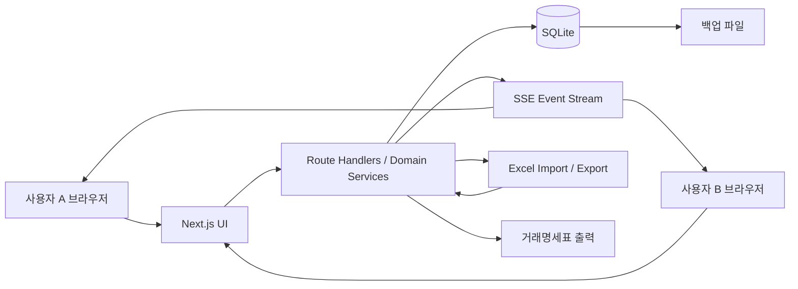

# 스마트 건설안전 매출·청구 관리 시스템 구현 계획

## 1. 문서 정보

- 문서 상태: 주요 업무 의사결정 반영, 구현 착수 가능
- 기준일: 2026-07-10
- 기존 화면 초안: `Smart_Construction_App.html`
- 목표 기술 스택: Next.js, TypeScript, Tailwind CSS, shadcn/ui
- 기본 운영 형태: 지정된 Windows PC 한 대에서 서버 실행, 사내 네트워크의 팀원이 브라우저로 공동 사용

### 1.1 확정된 구현 기준

2026-07-10 업무 협의 결과를 다음과 같이 확정한다.

| 항목 | 확정 내용 |
|---|---|
| 실시간 협업 | 저장 완료된 변경을 SSE로 다른 사용자 화면에 즉시 반영하고 version 충돌을 방지한다. 입력 중 커서·셀 공유는 제외한다. |
| 데이터베이스 | 단일 Windows 호스트의 Next.js + SQLite 구성을 사용한다. 초기 운영 기준은 동시 사용자 10명 이하이다. |
| 부분 월 매출 | 계약 적용기간과 해당 월이 겹치는 실제 일수를 기준으로 일할 계산한다. |
| 월 집계 기준 | 별도의 청구 기준월을 두지 않고 매출 귀속일이 속한 월로 집계한다. 거래명세표 발행일은 별도 관리한다. |
| 선청구 | 5월분을 5월 20일에 발행하는 것처럼 해당 월이 끝나기 전에도 그 달 전체 계약분을 발행할 수 있다. 발행 후 변동에 따른 취소·재발행 workflow는 초기 범위에서 제외한다. |
| 계약 변경 | 변경 영향을 미리 보여준 뒤 미확정·미발행 미래 자동 매출만 사용자 확인으로 재계산한다. |
| 월 확정 | `작성중 → 확정 → 거래명세표 발행` 순서로 처리하며 발행 데이터는 snapshot으로 보존한다. |
| 예외단가 | 표준단가, 계약단가, 매출 건별 단가를 분리하고 예외단가·직접 금액·음수 조정에는 사유와 권한을 적용한다. |
| 부가세 | 단가는 공급가액 기준이고 VAT 10% 별도이다. 계산 결과는 원 단위로 반올림한다. |
| 업무 코드 | 현장·품목·계약·거래명세표 번호는 시스템이 기본 규칙으로 자동 생성하고 관리자가 수정할 수 있다. |
| Excel 갱신 | 현장코드·품목코드가 같은 행만 수정 후보로 판단한다. 이름만 같은 행은 경고하고 자동 병합하지 않는다. |
| 거래명세표 합산 | 품목·단위·단가가 모두 같을 때만 합산하고, 다른 단가와 자유형 매출은 별도 행으로 표시한다. 출력 시 합산·건별 표시를 선택할 수 있다. |
| 사용자 권한 | `ADMIN`, `MANAGER`, `VIEWER` 3개 역할을 사용한다. |
| 백업 | 매일 자동 백업, 최근 30일 일별 백업, 최근 12개월 월별 백업을 기본 정책으로 한다. |
| 출력 기준 양식 | 제공된 거래명세표 이미지의 상단 수신처·공급자 영역, `품명/규격/수량/단위/단가/금액`, 공급가액 합계, `VAT 별도` 표기를 기준으로 구현한다. |

## 2. 목표

현재 단일 HTML과 브라우저 `localStorage`로 동작하는 화면을 다음 조건을 만족하는 사내 공동 업무 시스템으로 전환한다.

1. 모든 사용자가 하나의 중앙 데이터를 조회하고 편집한다.
2. 한 사용자의 변경 사항이 접속 중인 다른 사용자 화면에 실시간 반영된다.
3. 현장, 품목, 계약, 월별 매출, 월별 메모를 영속적으로 저장한다.
4. 계약으로부터 발생하는 정형 매출과 A/S·추가 작업 등 자유형 매출을 건별 원장으로 관리한다.
5. 현장·품목 마스터는 Excel 파일과 Excel 복사·붙여넣기로 대량 등록할 수 있다.
6. 현장별 월 청구액, 상세 산출 내역, 기간별 합계를 빠르게 조회한다.
7. 현재 실무 양식을 최대한 유지한 거래명세표를 다양한 조건으로 출력한다.
8. 실제 LLM 없이도 현장·품목 마스터를 활용하는 문장형 빠른 입력을 제공한다.
9. 사용자, 변경 시각, 변경 내용을 추적하고 동시 편집 충돌로 인한 덮어쓰기를 방지한다.
10. 별도 외부 서버 없이도 백업과 복구가 가능한 형태로 운영한다.

## 3. 범위

### 3.1 포함 범위

- 사용자 로그인 및 역할별 권한
- 실시간 데이터 변경 알림
- 현장 마스터 CRUD, 검색, 사용 중지, Excel import/export, Excel 붙여넣기
- 품목 마스터 CRUD, 검색, 사용 중지, Excel import/export, Excel 붙여넣기
- 계약 및 계약 품목 관리
- 표준단가, 계약단가, 매출 건별 예외단가 관리
- 계약 기준 월 매출 자동 생성
- 자유형 월 매출 건별 등록, 수정, 취소
- 현장별 월 매출 집계와 상세 내역
- 특정 현장·월의 공유 메모
- 기간·현장·매출 유형별 조회와 Excel export
- 거래명세표 생성, 선택 출력, 일괄 출력, 발행본 보존
- 공급자 정보 관리
- 기존 HTML의 `localStorage` 데이터와 기존 Excel 데이터 이관
- Windows 자동 실행, 사내 IP 접속, 백업 및 복구

### 3.2 초기 범위에서 제외

- 외부 인터넷 공개 및 클라우드 배포
- Google Sheets 또는 사내 워크플레이스와의 양방향 API 연동
- 이미 다운로드된 Excel 파일의 자동 갱신
- 실제 LLM/Gemini/OpenAI API 연동
- 모바일 네이티브 앱과 Electron 패키징
- 회계·ERP 시스템 자동 전표 연동
- 전자세금계산서 발행
- 거래명세표 발행 후 계약 변동을 감지하는 자동 취소·재발행 workflow

제외 항목은 데이터 모델과 API 경계를 해치지 않는 범위에서 후속 단계로 확장할 수 있게 설계한다.

## 4. 현재 초안 분석과 전환 원칙

### 4.1 현재 상태

- React, ReactDOM, Babel, Tailwind CSS, XLSX를 CDN에서 직접 로딩한다.
- 품목, 계약, 공급자 정보를 브라우저 `localStorage`에 저장한다.
- 현장마스터가 없고 계약의 현장명 문자열에서 현장 목록을 만든다.
- 계약에는 품목 ID, 수량, 시작일, 종료일만 저장한다.
- 월 매출과 이익은 조회 시점의 품목마스터 단가로 다시 계산한다.
- 스마트 입력은 일부 품목 ID와 현장 키워드를 하드코딩한 정규식 방식이다.
- 월별 상세 툴팁과 거래명세표 인쇄 화면은 이미 존재하므로 새 시스템에서도 사용자 경험을 계승한다.

### 4.2 전환 원칙

1. 브라우저 상태가 아니라 서버 데이터베이스를 데이터의 단일 기준으로 사용한다.
2. 현장명·품목명을 관계 키로 사용하지 않고 불변 ID와 업무 코드를 사용한다.
3. 단가는 품목 표준단가, 계약 적용단가, 매출 실제 적용단가를 분리한다.
4. 월 합계를 직접 저장하기보다 건별 매출 원장을 합산한다.
5. 확정되거나 거래명세표에 발행된 과거 매출은 원본 계약이 바뀌어도 자동 변경하지 않는다.
6. 삭제가 업무 이력을 없애지 않도록 중요 데이터는 사용 중지 또는 취소 상태로 전환한다.
7. 대량 입력은 저장 전 미리보기와 검증을 반드시 거친다.
8. 실시간 동기화와 동시 편집 충돌 제어를 별개 문제로 다룬다.

## 5. 권장 기술 구성

### 5.1 애플리케이션

- Next.js App Router
- TypeScript strict mode
- React Server Components는 초기 데이터 로딩에 사용
- 사용자 상호작용이 많은 표, 폼, 실시간 화면은 Client Component로 구성
- Tailwind CSS
- shadcn/ui
- React Hook Form + Zod: 폼 상태와 서버·클라이언트 공통 검증
- TanStack Query: 조회 캐시, 변경 후 무효화, 실시간 이벤트 수신 후 재조회
- date-fns: 월·기간·날짜 계산
- SheetJS(`xlsx`): Excel import/export

### 5.2 서버 및 데이터베이스

- Next.js Route Handler 기반 JSON API
- SQLite: 초기 사내 소규모 운영 데이터베이스
- Prisma ORM: 스키마, 마이그레이션, 트랜잭션, 타입 안전 접근
- SQLite WAL 모드와 `busy_timeout` 적용
- 애플리케이션 서버만 DB 파일에 접근
- 사용자 PC가 공유 폴더의 SQLite 파일을 직접 열지 않도록 금지

동시 쓰기가 크게 늘거나 서버를 여러 대로 확장해야 하면 PostgreSQL로 이전한다. 도메인 서비스와 API가 ORM 경계에 의존하도록 구성해 이전 범위를 제한한다.

### 5.3 실시간 처리

- Server-Sent Events(SSE) 엔드포인트: `/api/events`
- 단일 서버 프로세스 내부 이벤트 버스
- 데이터 변경 트랜잭션 커밋 후 도메인 이벤트 발행
- 클라이언트는 이벤트 수신 후 관련 TanStack Query 캐시만 무효화
- SSE heartbeat, 자동 재접속, 마지막 이벤트 이후 전체 재동기화 지원

이번 운영은 단일 Next.js 인스턴스를 전제로 한다. 복수 인스턴스로 확장할 경우 이벤트 버스를 Redis Pub/Sub 또는 PostgreSQL 알림 방식으로 교체한다.

### 5.4 운영

- `next build` 후 production server 실행
- 호스트: `0.0.0.0`
- 기본 포트: `3000` 또는 사내 협의 포트
- Windows 작업 스케줄러 또는 NSSM으로 부팅 시 자동 실행
- 서버 PC는 고정 IP 또는 DHCP 예약 사용
- Windows 방화벽은 사내 서브넷에서 지정 포트만 허용
- 외부 인터넷 라우터 포트 포워딩 금지

## 6. 전체 아키텍처



## 7. 권한 모델

### 7.1 역할

| 역할 | 주요 권한 |
|---|---|
| `ADMIN` | 사용자·설정·모든 업무 데이터 관리, 백업·복구 |
| `MANAGER` | 마스터, 계약, 매출, 메모, 거래명세표 등록·수정·출력 |
| `VIEWER` | 조회, 허용된 Excel export와 출력 |

### 7.2 기본 정책

- 모든 변경 데이터에 `createdBy`, `updatedBy`, `createdAt`, `updatedAt`을 기록한다.
- 마스터 삭제는 원칙적으로 `isActive = false`로 처리한다.
- 발행된 거래명세표와 확정 매출은 일반 수정 권한으로 직접 변경하지 못한다.
- 확정 데이터 수정은 취소 또는 조정 건 추가 방식으로 처리한다.
- 사용자 비밀번호는 평문 저장하지 않는다.
- 로그인 세션은 HTTP-only, SameSite 쿠키로 관리한다.

## 8. 데이터 모델

모든 금액은 원 단위 정수로 저장한다. 수량은 소수 가능성을 고려한 decimal 타입을 사용한다. 별도의 청구 기준월은 저장하지 않으며 월별 집계는 `revenueDate`가 속한 `YYYY-MM`을 사용한다. 거래명세표 발행일은 매출 귀속일과 별도로 관리한다.

### 8.1 사용자와 세션

#### `users`

- `id`
- `loginId` unique
- `name`
- `passwordHash`
- `role`: `ADMIN | MANAGER | VIEWER`
- `isActive`
- `lastLoginAt`
- `createdAt`, `updatedAt`

#### `sessions`

- `id`
- `userId`
- `tokenHash`
- `expiresAt`
- `createdAt`

### 8.2 현장 마스터

#### `sites`

- `id`
- `code` unique: Excel 중복 판단과 업무 식별 기준
- `name`
- `customerName`
- `address`
- `managerName`
- `managerContact`
- `startDate`, `endDate`
- `isActive`
- `memo`
- `version`: 동시 편집 충돌 확인
- 감사 필드

#### `site_aliases`

- `id`
- `siteId`
- `alias` unique

별칭은 문장형 빠른 입력에서 `송도A`, `송도 A현장`처럼 다른 표현을 동일 현장으로 인식하는 데 사용한다.

### 8.3 품목 마스터

#### `items`

- `id`
- `code` unique
- `name`
- `unit`
- `standardSalesPrice`
- `standardCostPrice`
- `isActive`
- `memo`
- `version`
- 감사 필드

#### `item_aliases`

- `id`
- `itemId`
- `alias` unique

### 8.4 계약

#### `contracts`

- `id`
- `contractNo` unique
- `siteId`
- `title`
- `startDate`
- `endDate`
- `status`: `DRAFT | ACTIVE | ENDED | CANCELED`
- `memo`
- `version`
- 감사 필드

#### `contract_lines`

- `id`
- `contractId`
- `itemId`
- `description`
- `quantity`
- `unit`
- `standardSalesPriceSnapshot`
- `appliedSalesPrice`
- `standardCostPriceSnapshot`
- `appliedCostPrice`
- `priceOverrideReason`
- `revenueStartDate`, `revenueEndDate`
- `isActive`
- 감사 필드

계약 한 건에 여러 품목을 넣을 수 있게 헤더와 품목 행을 분리한다. 계약단가는 품목 표준단가를 최초 제안하되 사용자가 수정할 수 있다.

### 8.5 매출 원장

#### `revenue_entries`

- `id`
- `siteId`
- `revenueDate`: 매출 귀속일이며 월별 집계 기준
- `servicePeriodStart`, `servicePeriodEnd`: 계약 자동 매출의 일할 계산 근거 기간
- `sourceType`: `CONTRACT | MANUAL | ADJUSTMENT`
- `contractId` nullable
- `contractLineId` nullable
- `itemId` nullable
- `title`
- `description`
- `quantity` nullable
- `unit` nullable
- `standardSalesPriceSnapshot` nullable
- `appliedSalesPrice` nullable
- `salesAmount`: 최종 매출액
- `prorationDays` nullable: 해당 월에 실제 적용된 일수
- `daysInMonth` nullable: 해당 월의 전체 일수
- `standardCostPriceSnapshot` nullable
- `appliedCostPrice` nullable
- `costAmount` nullable
- `priceOverrideReason` nullable
- `status`: `DRAFT | CONFIRMED | CANCELED`
- `generatedKey` nullable unique: 계약 자동 매출 중복 생성 방지
- `version`
- 감사 필드

#### 금액 계산 규칙

- 수량과 적용단가가 있는 경우 기본 매출액은 `quantity × appliedSalesPrice`이다.
- 계약 자동 매출의 부분 월 금액은 `quantity × appliedSalesPrice × prorationDays ÷ daysInMonth`로 계산하고 원 단위 반올림한다.
- 자유 입력 건은 제목과 `salesAmount`만으로도 등록할 수 있다.
- 계산 금액을 직접 덮어쓸 경우 예외 사유를 필수로 입력한다.
- 할인·정산 조정은 `ADJUSTMENT` 유형과 음수 금액을 허용한다.
- 이익은 `salesAmount - costAmount`로 조회 시 계산한다.
- 확정 또는 발행된 원장 건은 직접 수정하지 않고 취소·조정 이력을 추가한다.

### 8.6 월별 메모

#### `monthly_memos`

- `id`
- `siteId`
- `month`: 메모 대상월 `YYYY-MM`
- `content`
- `version`
- 감사 필드
- unique: `(siteId, month)`

현재 메모는 현장·월별 한 건으로 유지하되 모든 변경은 감사 로그에 남긴다. 여러 댓글형 협업이 필요해지면 `monthly_memo_comments`를 후속 추가한다.

### 8.7 거래명세표

#### `invoice_documents`

- `id`
- `invoiceNo` unique
- `siteId`
- `periodStart`, `periodEnd`: 선택된 매출 귀속기간
- `issueDate`
- `status`: `DRAFT | ISSUED`
- 공급자·공급받는자 정보 snapshot
- `subtotal`, `taxAmount`, `totalAmount`
- `issuedBy`, `issuedAt`
- `memo`
- 감사 필드

#### `invoice_lines`

- `id`
- `invoiceDocumentId`
- `revenueEntryId` nullable
- 품목명·설명·단위·수량·단가·공급가액·세액 snapshot
- `sortOrder`

발행본은 snapshot으로 보존한다. 이후 현장명, 품목명, 단가 또는 원장 데이터가 바뀌어도 발행 당시 문서는 변하지 않는다.

### 8.8 기타

#### `company_settings`

- 공급자 등록번호, 상호, 대표자, 주소, 업태, 종목
- 거래명세표 기본 문구와 직인 이미지 경로

#### `audit_logs`

- `id`
- `userId`
- `entityType`, `entityId`
- `action`: `CREATE | UPDATE | CANCEL | CONFIRM | IMPORT | EXPORT | ISSUE`
- `beforeJson`, `afterJson`
- `createdAt`

#### `import_batches`

- 가져오기 유형, 원본 파일명 또는 붙여넣기 여부
- 전체·성공·실패 행 수
- 실행 사용자와 실행 시각
- 오류 요약

## 9. 핵심 업무 규칙

### 9.1 계약 자동 매출 생성

1. 활성 계약 품목의 매출 시작일과 종료일 사이에 포함되는 월을 계산한다.
2. 월마다 `contractLineId + revenueDate의 YYYY-MM` 기반 `generatedKey`를 만든다.
3. 동일 키가 있으면 중복 생성하지 않는다.
4. 품목 수량과 계약 적용단가를 원장 snapshot으로 복사한다.
5. 자동 생성 건도 사용자가 확인한 뒤 확정한다.
6. 계약 자동 매출의 `revenueDate`는 해당 귀속월의 1일로 저장하고, 실제 적용 구간은 `servicePeriodStart`, `servicePeriodEnd`에 보존한다.
7. 거래명세표를 월말 전에 발행해도 발행일 이후를 포함한 해당 월 전체 계약 적용구간으로 일할 계산한다.

### 9.2 계약 변경 시 처리

- 미확정·미발행 자동 매출: 변경된 계약 내용으로 재계산 가능
- 확정 또는 발행된 자동 매출: 변경 금지
- 과거 정산 차이: 별도 `ADJUSTMENT` 건으로 보정
- 직접 입력한 `MANUAL` 건: 계약 변경과 무관하게 유지
- 계약 취소: 미래 미확정 자동 매출만 취소 대상으로 제안하고 사용자 확인 후 반영

### 9.3 부분 월 계약

부분 월 계약은 일수 기준으로 일할 계산한다.

```text
적용일수 = 해당 월과 계약 적용기간이 겹치는 날짜의 수(시작일·종료일 포함)
월일수 = 해당 월의 전체 날짜 수
일할 매출 = 수량 × 계약 적용단가 × 적용일수 ÷ 월일수
일할 매입 = 수량 × 계약 적용 매입단가 × 적용일수 ÷ 월일수
```

- 시작일과 종료일을 모두 포함한다.
- 윤년과 월별 일수 차이를 반영한다.
- 계산 결과는 원 단위로 반올림한다.
- 월 전체가 계약기간에 포함되면 전액을 계산한다.
- 거래명세표 발행일이 월말 이전이어도 해당 월의 계약 종료일까지를 기준으로 계산한다.
- 사용자가 금액을 직접 수정하면 일할 계산 결과를 snapshot으로 남기고 예외 사유를 필수 입력한다.

예: 계약기간이 2026-03-20부터 2026-04-10이면 3월은 12/31, 4월은 10/30 비율을 적용한다.

### 9.4 월 마감

- 월별 화면에서 현장 단위 또는 전체 현장 단위로 확정한다.
- 확정 전 누락 단가, 0원, 미확정 예외단가를 경고한다.
- 확정 후 수정은 취소 또는 조정 권한을 가진 사용자만 수행한다.
- 거래명세표 발행 대상은 원칙적으로 확정 매출만 허용한다.

## 10. 화면 및 사용자 흐름

### 10.1 공통 레이아웃

- 좌측 또는 상단 내비게이션
- 현재 사용자와 실시간 연결 상태 표시
- 저장 성공·실패 toast
- 다른 사용자의 변경 알림
- 반응형 레이아웃
- 키보드 접근과 포커스 표시

### 10.2 라우트 구성

| 라우트 | 기능 |
|---|---|
| `/login` | 로그인 |
| `/` | 대시보드, 이번 달 현장별 청구액 |
| `/masters/sites` | 현장 마스터 |
| `/masters/items` | 품목 마스터 |
| `/contracts` | 계약 목록과 등록·수정 |
| `/revenues` | 매출 원장 건별 관리 |
| `/reports/monthly` | 현장×월 매출·매입·이익 현황 |
| `/invoices` | 거래명세표 생성·발행·재출력 |
| `/settings/company` | 공급자 및 출력 설정 |
| `/settings/users` | 사용자와 권한 |
| `/settings/audit` | 변경 이력 |

### 10.3 현장·품목 마스터 화면

- 검색, 정렬, 사용 여부 필터
- 신규 등록 drawer/dialog
- 행 선택 후 수정
- 사용 중 계약이 있는 마스터의 삭제 차단
- Excel 가져오기, 붙여넣기, 내보내기 버튼
- 대량 처리 결과와 오류 행 표시

### 10.4 계약 화면

- 계약 헤더와 다중 품목 행 편집
- 품목 선택 시 표준단가 자동 제안
- 단가 수정 시 시각적 예외 표시와 사유 입력
- 계약기간과 매출 적용기간 검증
- 저장 전 생성 예정 월 매출 미리보기
- 기존 자동 매출에 미치는 영향 미리보기

### 10.5 매출 원장 화면

- 기본 필터: 시작일, 종료일, 매출 귀속월, 현장, 출처, 상태
- 건별 목록: 발생일, 현장, 유형, 내용, 수량, 단가, 금액, 상태, 작성자
- 계약 자동 매출과 직접 입력 매출을 badge로 구분
- 자유형 등록은 제목과 금액만으로 저장 가능
- 수량·단가 입력 시 금액 자동 계산
- 계산 금액 직접 수정 시 예외 사유 요구
- 여러 건 선택 후 확정, 취소, 거래명세표 대상 지정

### 10.6 월별 현황 화면

- 시작월~종료월 직접 지정
- 행: 현장, 열: 월, 값: 선택된 매출·매입·이익
- 현장별 합계와 월별 합계
- 금액 hover 시 상세 HoverCard
- 키보드 또는 터치 환경에서는 클릭 Popover
- 상세 내용: 자동/직접/조정 구분, 품목, 수량, 단가, 금액
- 현장·월 셀에서 매출 원장과 월별 메모로 이동
- 월별 메모 존재 여부를 아이콘으로 표시

### 10.7 월별 메모

- 현장과 메모 대상월이 화면에서 명확히 보이게 표시
- 자동 저장 대신 명시적 저장 버튼 사용
- 작성자와 마지막 수정 시각 표시
- 다른 사용자가 먼저 수정했으면 충돌 안내 후 최신 내용 비교

### 10.8 거래명세표

- 현장별 지정 출력
- 월별 지정 출력
- 전체 현장 일괄 출력
- 매출 원장에서 원하는 항목만 선택 출력
- 출력 전 항목 순서, 표시명, 수량, 단가, 세액 미리보기
- 실무 양식과 동일한 인쇄용 CSS
- A4 페이지 나눔, 반복 header, 긴 현장명과 품목명 대응
- 발행 후 발행번호와 snapshot 보존
- 발행본 재출력

## 11. Excel import/export와 복사·붙여넣기

### 11.1 현장 마스터 양식

필수 열:

- 현장코드
- 현장명

선택 열:

- 거래처
- 주소
- 담당자
- 연락처
- 시작일
- 종료일
- 사용 여부
- 메모
- 별칭

### 11.2 품목 마스터 양식

필수 열:

- 품목코드
- 품목명
- 단위

선택 열:

- 표준 매출단가
- 표준 매입단가
- 사용 여부
- 메모
- 별칭

### 11.3 가져오기 흐름

1. Excel 파일을 선택하거나 Excel 범위를 복사해 import dialog에 붙여넣는다.
2. 파일은 첫 시트를 기본 대상으로 사용하고 시트가 여러 개면 사용자가 선택한다.
3. 붙여넣기는 tab과 newline으로 TSV를 파싱한다.
4. 열 이름을 자동 매핑하고 불명확한 열은 사용자가 지정한다.
5. 각 행을 `신규`, `수정`, `변경 없음`, `오류`로 분류한다.
6. 오류 셀, 오류 이유, 중복 코드를 표시한다.
7. 신규·수정 예정 값을 미리 비교한다.
8. 사용자가 확정하면 하나의 DB 트랜잭션으로 저장한다.
9. 결과를 `import_batches`와 감사 로그에 남긴다.
10. 실패 행을 Excel로 다시 내려받을 수 있게 한다.

### 11.4 중복과 갱신 정책

- 현장코드와 품목코드를 업무상 고유 키로 사용한다.
- 동일 코드가 있으면 기본 동작은 수정 후보로 표시한다.
- 이름이 같고 코드가 다른 경우 자동 병합하지 않고 경고한다.
- 빈 셀로 기존 값을 지울지 유지할지는 import 화면에서 정책을 선택한다.
- 코드가 없는 기존 Excel은 최초 이관 시 코드 생성 규칙을 별도로 적용한다.

### 11.5 내보내기

#### 현장·품목 마스터

- 전체 또는 현재 필터 결과
- import 가능한 동일 열 구조
- 코드와 사용 여부 포함

#### 월별 매출

- 필터: 시작일, 종료일, 현장, 출처, 상태
- `월별요약` 시트: 현장별·월별 매출, 매입, 이익
- `매출상세` 시트: 건별 원장 전체 열
- `월별특이사항` 시트: 현장, 대상월, 메모, 최종 수정자, 수정일
- 통화·날짜 형식과 header 고정
- 파일명 예: `월별매출_2026-01_2026-06.xlsx`

### 11.6 Excel 보안과 제한

- 허용 확장자와 MIME type 검증
- 파일 크기와 최대 행 수 제한
- 수식은 실행하지 않고 계산된 값만 읽는 것을 기본으로 한다.
- export 문자열이 `=`, `+`, `-`, `@`로 시작하면 Excel 수식 주입 방지 처리한다.
- 서버와 클라이언트 양쪽에서 필수 열과 데이터 형식을 검증한다.

## 12. 문장형 빠른 입력

### 12.1 원칙

- 실제 AI 또는 LLM으로 표현하지 않는다.
- 버튼명은 `문장으로 빠른 입력`으로 한다.
- 파싱 결과를 자동 저장하지 않고 미리보기 후 폼에 적용한다.
- 현장·품목과 각 별칭을 DB에서 조회해 동적으로 매칭한다.
- 여러 후보가 있거나 신뢰도가 낮으면 사용자에게 선택을 요구한다.

### 12.2 지원 대상

- 계약 입력
- 자유형 매출 입력
- 현장명과 별칭
- 품목명과 별칭
- 수량과 단위
- 표준단가 또는 수기단가
- 시작일·종료일 또는 시작월·종료월
- 매출 제목과 금액

### 12.3 처리 단계

1. 공백, 쉼표, 통화기호, 날짜 구분자를 정규화한다.
2. 가장 긴 현장명·별칭을 우선 매칭한다.
3. 가장 긴 품목명·별칭을 우선 매칭한다.
4. `5대`, `수량 5`, `5 EA` 등의 수량을 파싱한다.
5. `2026년 3월`, `26.3`, `2026-03`을 같은 월로 정규화한다.
6. `3월부터 8월까지`, `3~8월`의 기준 연도를 문맥에서 결정한다.
7. `단가 8만원`, `총 40만원`을 구분한다.
8. 필드별 성공·불명확·실패 상태를 표시한다.
9. 사용자가 확인한 값만 실제 폼에 적용한다.

### 12.4 예시

입력:

```text
송도 A현장 CCTV 5대, 26년 3월부터 8월까지, A/S 단가 8만원
```

미리보기:

- 현장: 송도 A현장
- 품목: 이동형 CCTV
- 수량: 5대
- 기간: 2026-03-01 ~ 2026-08-31
- 적용단가: 80,000원
- 예외 사유: A/S 단가

## 13. API 설계

### 13.1 기본 규칙

- 요청·응답 스키마를 Zod로 검증한다.
- 목록 API는 pagination, sort, filter를 지원한다.
- 변경 API는 현재 `version`을 요구한다.
- version 불일치 시 HTTP 409와 최신 데이터를 반환한다.
- DB 트랜잭션 커밋 후 실시간 이벤트를 발행한다.
- 오류 응답은 사용자 메시지와 추적용 오류 코드를 분리한다.

### 13.2 주요 엔드포인트

- `GET/POST /api/sites`
- `GET/PATCH /api/sites/:id`
- `POST /api/sites/import/preview`
- `POST /api/sites/import/commit`
- `GET /api/sites/export`
- `GET/POST /api/items`
- `GET/PATCH /api/items/:id`
- `POST /api/items/import/preview`
- `POST /api/items/import/commit`
- `GET /api/items/export`
- `GET/POST /api/contracts`
- `GET/PATCH /api/contracts/:id`
- `POST /api/contracts/:id/revenue-preview`
- `POST /api/contracts/:id/revenue-generate`
- `GET/POST /api/revenues`
- `PATCH /api/revenues/:id`
- `POST /api/revenues/confirm`
- `POST /api/revenues/cancel`
- `GET /api/reports/monthly`
- `GET /api/reports/monthly/export`
- `GET/PUT /api/sites/:siteId/months/:month/memo`
- `GET/POST /api/invoices`
- `POST /api/invoices/:id/issue`
- `GET /api/events`

## 14. 실시간 협업과 동시 편집

### 14.1 이벤트 형식

```ts
type DomainEvent = {
  id: string;
  type:
    | 'site.changed'
    | 'item.changed'
    | 'contract.changed'
    | 'revenue.changed'
    | 'monthlyMemo.changed'
    | 'invoice.changed';
  entityId: string;
  occurredAt: string;
  actor: { id: string; name: string };
};
```

이벤트에는 민감한 전체 데이터 대신 변경 식별 정보만 포함하고, 클라이언트가 권한에 따라 API에서 최신 데이터를 다시 조회한다.

### 14.2 충돌 처리

1. 편집 시작 시 레코드의 `version`을 폼에 보관한다.
2. 저장 시 `id + version` 조건으로 갱신한다.
3. 갱신된 행이 0개면 다른 사용자가 먼저 수정한 것으로 판단한다.
4. 서버는 409와 최신 레코드를 반환한다.
5. UI는 `내 입력`, `현재 서버 값`을 비교해 보여준다.
6. 사용자가 최신 값을 기준으로 다시 편집한다.

초기 버전에서는 셀 단위 공동 편집 커서나 입력 중 잠금은 구현하지 않는다. 저장 완료된 변경을 실시간 동기화하고 충돌 시 안전하게 중단하는 수준을 목표로 한다.

### 14.3 연결 장애

- SSE 연결 상태를 화면에 표시한다.
- 연결이 끊기면 지수 backoff로 재연결한다.
- 재연결 후 주요 query를 다시 조회한다.
- 서버 저장이 실패한 변경을 성공으로 표시하지 않는다.
- 오프라인 임시 편집과 자동 병합은 초기 범위에서 제외한다.

## 15. 거래명세표 상세 구현

### 15.1 생성 흐름

1. 현장과 매출 귀속월 또는 날짜 범위를 선택하고 거래명세표 발행일을 입력한다.
2. 확정된 미발행 매출을 조회한다.
3. 전체 선택 또는 원하는 건만 체크한다.
4. 동일 품목 통합 여부를 선택한다.
5. 공급가액, VAT 10%, 합계를 계산한다. 기본 출력 양식에는 공급가액 합계와 `VAT 별도` 문구를 표시한다.
6. 인쇄 미리보기에서 표시명과 순서를 확인한다.
7. 발행하면 문서와 행 snapshot을 트랜잭션으로 저장한다.
8. 브라우저 인쇄 기능으로 현장별 또는 일괄 출력한다.

### 15.2 출력 옵션

- 단일 현장·단일 월
- 복수 현장·단일 월
- 단일 현장·기간 범위
- 전체 현장 일괄
- 선택한 매출 건만 출력
- 현장별 새 페이지 시작
- 품목별 합산 또는 원장 건별 표시

### 15.3 검증

- 기존 실무 거래명세표와 필드·행 순서 비교
- A4 인쇄와 PDF 저장 결과 확인
- 긴 현장명, 긴 품목명, 많은 행, 페이지 나눔 테스트
- 전체 일괄 인쇄 시 현장 간 데이터 혼입 방지

### 15.4 제공된 참조 양식 반영

- 상단 중앙에 `거래명세표` 제목을 표시한다.
- 좌측에는 발행일, 수신 현장 또는 회사명, `귀하`, 공급 안내 문구를 배치한다.
- 우측 공급자 영역에는 등록번호, 상호(법인명), 성명, 사업장 주소, 업태, 종목, 전화번호를 표시한다.
- 본문 열은 `품명`, `규격`, `수량`, `단위`, `단가`, `금액` 순서를 사용한다.
- 품목군 제목 행과 실제 품목 상세 행을 구분할 수 있게 한다.
- 하단에 `공급가액 합계`와 금액을 표시한다.
- 최하단에 `(원/VAT 별도)` 문구를 표시한다.
- 공급가액을 출력 금액의 기준으로 하고 VAT 금액 및 총액의 추가 표시는 설정으로 확장할 수 있게 한다.
- 발행 후 남은 기간의 계약 변동에 대한 자동 취소·재발행 처리는 초기 범위에서 제외한다.

## 16. 데이터 이관

### 16.1 기존 HTML 데이터

기존 키:

- `scs_master_items_v15_local`
- `scs_master_contracts_v15_local`
- `scs_master_supplier_v15_local`

이관 절차:

1. 기존 HTML에 JSON 내보내기 도구를 임시 제공한다.
2. 새 시스템의 이관 화면에서 JSON을 읽는다.
3. 계약의 고유 현장명으로 현장마스터 후보를 생성한다.
4. 현장코드와 품목코드 생성 규칙을 적용한다.
5. 품목마스터 현재 단가를 계약단가 snapshot으로 복사한다.
6. 이관 미리보기에서 중복과 누락을 수정한다.
7. 하나의 트랜잭션으로 저장한다.
8. 이관 결과와 원본 JSON을 백업한다.

기존 데이터에는 단가 변경 이력이 없으므로 과거 당시 단가를 복원할 수 없다. 이관 시점의 단가를 적용했다는 표시를 감사 로그에 남긴다.

### 16.2 기존 업무 Excel

- 실제 사용 중인 Excel 파일을 확보한다.
- 시트, 열, 병합 셀, 수식, 날짜·통화 형식을 분석한다.
- 시스템 표준 열과 매핑표를 작성한다.
- 반복 header, 합계 행, 빈 행은 import에서 제외한다.
- 대표 샘플 파일로 회귀 테스트 fixture를 만든다.

## 17. 보안 및 안정성

- 사내망이라도 로그인 없이 접근시키지 않는다.
- 모든 변경 API에서 역할을 검사한다.
- 입력값은 클라이언트와 서버에서 모두 검증한다.
- SQL은 ORM parameter binding을 통해 실행한다.
- 로그인 반복 실패 제한과 세션 만료를 적용한다.
- 감사 로그에서 비밀번호와 세션 토큰을 제외한다.
- 업로드 파일 크기와 행 수를 제한한다.
- DB 파일과 백업 폴더의 Windows 접근 권한을 제한한다.
- 애플리케이션 오류 로그에 개인정보와 전체 업로드 데이터를 남기지 않는다.

## 18. 백업과 복구

### 18.1 백업

- SQLite online backup 방식 또는 안전한 snapshot 사용
- 매일 자동 백업
- 중요 import·월 마감 전 수동 백업
- 최근 일별 백업과 월별 장기 백업 보관 정책 설정
- DB, 업로드 자산, 설정 파일을 함께 백업
- 백업 파일명에 생성 시각과 스키마 버전 포함

### 18.2 복구

- 관리자만 복구 실행 가능
- 복구 전 현재 DB를 추가 백업
- 서버 쓰기 요청을 잠시 차단한 뒤 복구
- 복구 후 DB 무결성 검사와 스키마 버전 확인
- 샘플 조회와 로그인 검증 후 서비스 재개
- 운영 전 실제 복구 훈련 1회 수행

## 19. 테스트 전략

### 19.1 단위 테스트

- 금액, 세액, 이익 계산
- 계약기간의 대상 월 계산
- 시작일·종료일 포함 일할 계산, 윤년과 월말 경계
- 자동 매출 `generatedKey` 중복 방지
- 계약 변경 시 확정·미확정 원장 분리
- 날짜와 문장형 입력 파서
- TSV 붙여넣기 파서
- Excel 열 매핑과 행 검증
- export 수식 주입 방지

### 19.2 통합 테스트

- 현장·품목 import preview와 commit이 같은 결과인지 확인
- import 전체 트랜잭션 rollback
- 계약 저장과 자동 매출 생성
- 월 확정과 거래명세표 발행
- version 충돌 시 409 반환
- 권한별 API 접근 제어
- 감사 로그 생성

### 19.3 E2E 테스트

- 현장·품목 등록 → 계약 등록 → 자동 매출 생성 → 월 확정 → 거래명세표 출력
- 자유형 매출 등록과 예외단가 적용
- Excel 붙여넣기 → 오류 수정 → 저장
- 두 브라우저 세션에서 변경 사항 실시간 반영
- 두 사용자가 같은 메모를 수정할 때 충돌 안내
- 기간·현장 필터와 Excel export 결과
- 현장별·월별·전체·선택 거래명세표 출력

### 19.4 시각·인쇄 검증

- 주요 화면 desktop/tablet viewport 확인
- 월별 표 sticky header/column 확인
- HoverCard가 화면 경계를 벗어나지 않는지 확인
- 실제 프린터 또는 PDF로 거래명세표 페이지 검증
- 기존 참조 HTML·Excel 양식과 업무 담당자 확인

## 20. 로깅과 운영 관찰

- 서버 시작·종료 로그
- DB 마이그레이션 결과
- 로그인 성공·실패 요약
- import/export 실행 결과
- 매출 확정·취소와 거래명세표 발행·재출력
- API 오류 코드와 요청 추적 ID
- SSE 접속 수와 재연결 오류
- 로그 파일 크기 제한과 순환 보관

## 21. 권장 프로젝트 구조

```text
smart-construction/
├─ app/
│  ├─ (auth)/login/
│  ├─ (main)/
│  │  ├─ masters/sites/
│  │  ├─ masters/items/
│  │  ├─ contracts/
│  │  ├─ revenues/
│  │  ├─ reports/monthly/
│  │  ├─ invoices/
│  │  └─ settings/
│  └─ api/
├─ components/
│  ├─ ui/
│  ├─ data-table/
│  ├─ excel-import/
│  ├─ revenue/
│  └─ invoice/
├─ features/
│  ├─ sites/
│  ├─ items/
│  ├─ contracts/
│  ├─ revenues/
│  ├─ monthly-memos/
│  └─ invoices/
├─ lib/
│  ├─ auth/
│  ├─ db/
│  ├─ excel/
│  ├─ realtime/
│  ├─ validation/
│  └─ money/
├─ prisma/
│  ├─ schema.prisma
│  └─ migrations/
├─ scripts/
│  ├─ backup/
│  └─ migration/
├─ tests/
│  ├─ unit/
│  ├─ integration/
│  ├─ e2e/
│  └─ fixtures/
└─ data/
   ├─ app.db
   └─ backups/
```

실제 운영에서는 `data` 경로를 소스 코드와 분리할 수 있게 환경변수로 지정하고, 설정되지 않으면 명확하게 시작을 실패시킨다.

## 22. 단계별 구현 계획

### Phase 0. 업무 규칙과 참조 파일 확정

작업:

- 실제 현장·품목 Excel 샘플 확보
- 제공된 거래명세표 이미지의 치수·서체·인쇄 여백 확인
- 가능하면 거래명세표 원본 Excel 파일 확보
- 자동 생성 코드가 기존 업무 코드와 충돌하는지 확인
- 기존 데이터 이관 대상 브라우저와 파일 확인

완료 조건:

- 확정된 업무 규칙과 잔여 운영 정보가 구분되어 기록됨
- Excel 열 매핑 초안과 거래명세표 비교표가 존재함

### Phase 1. 프로젝트와 운영 기반 — 완료 (2026-07-10)

작업:

- Next.js, TypeScript, Tailwind CSS 구성
- shadcn/ui 초기화와 디자인 token 설정
- Prisma와 SQLite 연결
- 환경변수 검증
- 기본 레이아웃, 오류 화면, toast
- 테스트 runner와 lint/typecheck 구성

완료 조건:

- [x] 개발·production build 실행 가능
- [x] DB 마이그레이션과 health check 성공
- [x] 외부 CDN 없이 기본 화면이 동작함

### Phase 2. 인증·권한·감사 — 완료 (2026-07-10)

작업:

- 사용자와 세션 스키마
- 로그인·로그아웃
- 역할별 route/API guard
- 감사 로그 공통 모듈
- 관리자 사용자 관리

완료 조건:

- [x] 권한별 허용·차단 통합 테스트 통과
- [x] 데이터 변경 시 사용자와 변경 시각이 기록됨

### Phase 3. 현장·품목 마스터 — 완료 (2026-07-10)

작업:

- 현장·품목 CRUD
- 검색, 정렬, pagination, 사용 중지
- 별칭 관리
- Excel template/export
- Excel 파일 import preview/commit
- Excel 복사·붙여넣기 preview/commit

완료 조건:

- [x] 같은 검증 규칙으로 파일과 붙여넣기 입력 가능
- [x] 오류 행을 설명하고 정상 데이터만 의도대로 저장 가능
- [x] 코드 중복과 이름 충돌 시 자동 덮어쓰지 않음

### Phase 4. 계약과 단가 예외 — 완료 (2026-07-10)

작업:

- 계약 헤더와 다중 품목 행
- 표준단가 자동 제안
- 계약단가 수기 수정과 사유
- 계약기간 검증
- 계약 변경 영향 미리보기

완료 조건:

- [x] 품목 표준단가 변경이 기존 계약단가를 바꾸지 않음
- [x] 계약단가 예외 사유와 수정자가 추적됨

### Phase 5. 매출 원장 — 완료 (2026-07-10)

작업:

- 계약 월 매출 preview와 idempotent 생성
- 계약 적용일수 기준 월별 일할 계산
- 자유형 매출 등록
- 수량×단가 계산과 직접 금액 입력
- 조정·음수 금액
- 기간·현장·출처·상태 필터
- 확정·취소 workflow

완료 조건:

- [x] 자동·직접·조정 매출을 한 원장에서 구분 가능
- [x] 같은 계약 월 매출이 중복 생성되지 않음
- [x] 확정 과거 매출이 계약 변경으로 바뀌지 않음

### Phase 6. 월별 현황과 메모 — 완료 (2026-07-10)

작업:

- 현장×월 matrix 집계
- 매출·매입·이익 전환
- 상세 HoverCard/Popover
- 현장·월별 메모
- 월 확정 전 검증

완료 조건:

- [x] 원장 합계와 월별 표·상세 합계가 일치함
- [x] 메모가 실시간 갱신되고 충돌을 안전하게 처리함

### Phase 7. 실시간 협업 — 완료 (2026-07-10)

작업:

- SSE 이벤트 endpoint와 연결 상태 UI
- 변경 후 query 무효화
- heartbeat와 재접속
- version 기반 optimistic concurrency control
- 두 사용자 동시 작업 E2E 테스트

완료 조건:

- [x] 사용자 A 저장 후 사용자 B 화면에 새로고침 없이 반영
- [x] 같은 레코드 동시 수정 시 마지막 저장이 무조건 덮어쓰지 않음
- [x] 연결 복구 후 최신 데이터와 일치함

### Phase 8. Excel 매출 export

작업:

- 월별요약, 매출상세, 월별특이사항 시트
- 기간·현장·출처·상태 필터 반영
- 통화·날짜 서식
- 대용량 export와 수식 주입 방지

완료 조건:

- 화면 필터와 Excel 결과가 일치함
- 각 시트 합계가 DB 원장 합계와 일치함

### Phase 9. 거래명세표

작업:

- 기존 양식 이관
- 제공된 참조 이미지의 공급자 영역과 본문 열 구성 반영
- 현장·월·전체·개별 선택 출력
- 발행 snapshot과 발행번호
- 발행본 재출력
- A4 인쇄 CSS와 일괄 페이지 분리

완료 조건:

- 요구된 네 가지 출력 조건 지원
- 발행 후 원본 데이터가 바뀌어도 발행본이 유지됨
- 실무 담당자가 출력 양식을 승인함

### Phase 10. 문장형 빠른 입력

작업:

- 현장·품목 별칭 matcher
- 수량·단가·날짜·기간 parser
- 필드별 분석 결과와 불명확 후보 UI
- 계약·자유형 매출 폼 적용
- 실제 업무 문장 fixture 테스트

완료 조건:

- 하드코딩된 품목 ID 없이 마스터 기반으로 동작
- 결과 확인 없이 데이터가 저장되지 않음
- 정의된 대표 문장 회귀 테스트 통과

### Phase 11. 데이터 이관과 운영 전환

작업:

- `localStorage` JSON export/import
- 기존 Excel 이관
- 중복·누락 검증 보고서
- Windows 자동 실행
- 방화벽과 고정 IP
- 자동 백업·복구 도구
- 사용자 교육용 간단 매뉴얼

완료 조건:

- 이관 전후 건수와 합계 대조 완료
- 재부팅 후 서비스 자동 시작
- 다른 팀원 PC에서 IP 접속 성공
- 백업 파일로 복구 훈련 성공

## 23. 요구사항 추적표

| ID | 요구사항 | 구현 영역 | 검증 |
|---|---|---|---|
| R-01 | 여러 사용자 동시 접속 | Next.js 중앙 서버 | 복수 브라우저 E2E |
| R-02 | 변경 사항 실시간 반영 | SSE, Query invalidation | 사용자 A/B 테스트 |
| R-03 | Excel 레이아웃 활용 | import mapping, UI | 실제 샘플 검증 |
| R-04 | Excel 복사·붙여넣기 | TSV parser, preview | 붙여넣기 E2E |
| R-05 | 현장 마스터 import/export | Excel module | 재가져오기 비교 |
| R-06 | 품목 마스터 import/export | Excel module | 재가져오기 비교 |
| R-07 | 수기 단가와 A/S 예외 | 계약·원장 snapshot | 단가 예외 테스트 |
| R-08 | 사용자 지정 기간 조회 | 매출·보고서 필터 | 경계 날짜 테스트 |
| R-09 | 현장별 월 청구액 | 월별 집계 | 원장 합계 대조 |
| R-10 | 금액 상세 툴팁 | HoverCard/Popover | 시각·E2E 테스트 |
| R-11 | 거래명세표 세부 출력 | invoice snapshot | PDF/인쇄 검증 |
| R-12 | 현장·월·전체·선택 출력 | 출력 선택 UI | 네 가지 시나리오 |
| R-13 | 특정 월 메모 | monthly_memos | CRUD·충돌 테스트 |
| R-14 | 자유형 매출 건별 입력 | revenue_entries | 수기 매출 테스트 |
| R-15 | 월별 매출 Excel export | 3개 시트 export | 화면·Excel 합계 대조 |
| R-16 | 실제 LLM 없는 스마트 입력 | deterministic parser | 문장 fixture 테스트 |
| R-17 | 부분 월 일할 계산 | revenue calculation | 월말·윤년 경계 테스트 |
| R-18 | 청구 기준월 없이 귀속월 집계 | revenueDate, issueDate | 5월분 5월 20일 발행 시나리오 |
| R-19 | 제공된 거래명세표 양식 유지 | invoice print layout | A4 PDF 비교 검증 |

## 24. 주요 인수 조건

1. 두 명 이상이 동시에 로그인해 같은 중앙 데이터를 사용할 수 있다.
2. 한 사용자가 매출을 저장하면 다른 사용자의 관련 목록과 월 합계가 새로고침 없이 갱신된다.
3. 같은 데이터를 동시에 수정해도 후발 저장이 선행 저장을 조용히 덮어쓰지 않는다.
4. 현장·품목은 Excel 파일과 Excel 복사·붙여넣기로 등록할 수 있다.
5. import 전에 신규·수정·오류를 확인할 수 있다.
6. 표준단가와 다른 계약·A/S 단가를 사유와 함께 입력할 수 있다.
7. 계약 자동 매출과 자유형 매출을 현장·월별 여러 건으로 등록할 수 있다.
8. 과거 확정 매출은 품목 표준단가 또는 계약 변경으로 바뀌지 않는다.
9. 원하는 날짜 또는 월 범위와 현장으로 조회할 수 있다.
10. 현장별 월 청구액과 산출 내역을 표와 상세 팝업에서 확인할 수 있다.
11. 현장별, 월별, 전체, 선택 항목 거래명세표 출력이 가능하다.
12. 특정 현장·월에 메모를 저장하고 수정자와 수정 시각을 확인할 수 있다.
13. 월별요약·매출상세·월별특이사항이 포함된 Excel을 내려받을 수 있다.
14. 서버 PC 재부팅 후 서비스가 자동으로 다시 실행된다.
15. 백업으로 DB를 복원하고 주요 합계가 일치함을 확인할 수 있다.
16. 부분 월 계약은 시작일과 종료일을 포함한 실제 적용일수로 일할 계산된다.
17. 5월분 거래명세표를 5월 20일에 발행해도 5월 매출로 집계되고 발행일만 별도로 표시된다.
18. 거래명세표가 제공된 참조 양식의 주요 필드, 열 순서, 공급가액 합계와 VAT 별도 표기를 유지한다.

## 25. 구현 중 확인할 잔여 운영 정보

핵심 업무 규칙은 확정되어 구현 착수가 가능하다. 다음 정보는 관련 단계에 도달하기 전까지 확인한다.

1. 실제 업무용 현장·품목 Excel 파일과 열 구성
2. 가능하면 거래명세표 원본 Excel 파일과 실제 인쇄 용지·여백
3. 최초 관리자와 초기 사용자 명단
4. 기존 `localStorage` 데이터가 있는 PC와 브라우저
5. Windows 서버 PC, 고정 IP 또는 DHCP 예약 정보
6. 실제 데이터 저장 경로와 백업 저장 경로

## 26. 위험과 대응

| 위험 | 영향 | 대응 |
|---|---|---|
| 기존 Excel 형식이 사용자마다 다름 | import 오류 | 표준 template, 열 매핑, preview, fixture 확대 |
| 일할 계산 경계 오류 | 월 합계 불일치 | 시작·종료일 포함 규칙, 윤년·월말 단위 테스트 |
| 여러 사용자의 동시 수정 | 데이터 덮어쓰기 | version 충돌 검사, 409 비교 UI |
| SQLite 파일을 공유 폴더에서 직접 사용 | 잠금·손상 | 서버 로컬 디스크 저장, API로만 접근 |
| 서버 PC 종료 | 전체 사용자 접속 불가 | 전용 또는 상시 운영 PC, 자동 시작, 상태 안내 |
| 발행 후 원본 데이터 변경 | 문서 재현 불가 | invoice snapshot 저장 |
| Excel 수식 주입 | export 파일 보안 문제 | 위험 접두문자 escaping |
| 기존 `localStorage` 데이터에 이력 없음 | 과거 단가 복원 불가 | 이관 시점 단가 사용 표시와 원본 백업 |
| SSE 연결 끊김 | 화면 갱신 지연 | 연결 표시, 자동 재접속, 재연결 후 전체 재조회 |

## 27. 구현 착수 기준

핵심 의사결정이 반영되었으므로 Phase 1 구현을 시작할 수 있다. 다음 운영 정보는 관련 단계 전까지 확보한다.

- Windows 호스트 PC와 데이터 저장 경로 결정
- 실제 업무 Excel 확보
- 가능하면 거래명세표 원본 Excel 확보
- 최초 관리자와 사용자 명단 결정

## 28. 구현 진행 현황

### 28.1 Phase 1 완료 결과

- Next.js 16.2.10 App Router와 TypeScript strict mode 구성
- Tailwind CSS 4.3.2와 shadcn/ui 4.13.0 구성
- Prisma ORM 7.8.0과 `@prisma/adapter-better-sqlite3` 기반 SQLite 연결
- `.env` 및 Zod 기반 서버 환경변수 검증
- SQLite 저장 폴더·파일 준비 스크립트
- SQLite WAL, `busy_timeout = 5000`, foreign key pragma 초기화
- `SystemSetting` 최소 기반 모델과 `20260710020416_phase1_foundation` migration
- 반응형 공통 header/sidebar와 Phase 현황 대시보드
- 공통 toast provider, loading, 404, route error, global error 화면
- DB 연결을 포함하는 `GET /api/health`
- ESLint, TypeScript, Vitest, Prisma generate, production build npm scripts
- 사내 접속용 `dev:lan`, `start:lan` npm scripts
- 운영·개발 실행 방법을 README에 기록

### 28.2 Phase 1 검증 결과

| 검증 | 결과 |
|---|---|
| `npm run env:check` | 성공 |
| Prisma schema validate | 성공 |
| Prisma migration status | 1개 migration 적용, 최신 상태 |
| `npm run lint` | 성공 |
| `npm run typecheck` | 성공 |
| `npm test` | 1개 파일, 3개 테스트 성공 |
| `npm run build` | 성공 |
| production `/` | HTTP 200, 앱 제목 확인 |
| production `/api/health` | HTTP 200, DB connected |
| SQLite CLI 무결성 검사 | `ok` |
| `npm audit` | 취약점 0건 |

### 28.3 SQLite 운영 메모

- 애플리케이션은 내장 `better-sqlite3` 드라이버를 사용하므로 외부 SQLite 설치에 의존하지 않는다.
- 로컬 `D:\SQLite\sqlite3.exe` 3.53.3 설치를 확인했으며 운영 진단과 무결성 검사에 사용할 수 있다.
- DB 파일은 `data/app.db`에 저장하고 사용자 PC가 네트워크 공유로 직접 열지 않게 한다.
- Prisma 7 migration 실행 전에 `db:prepare`가 DB 폴더와 파일을 준비해 Windows의 초기 파일 생성 실패를 방지한다.

### 28.4 Phase 2 완료 결과

- DB 기반 opaque session과 HTTP-only, SameSite cookie 적용
- 최초 실행 시 단 한 번 ADMIN을 만드는 `/setup` 흐름
- 로그인·로그아웃·현재 사용자 API
- `ADMIN`, `MANAGER`, `VIEWER` 역할과 API 인가 검사
- ADMIN 전용 사용자 생성·역할 변경·비활성화·비밀번호 재설정
- version 기반 사용자 수정 충돌 방지
- 마지막 활성 ADMIN 비활성화·강등 차단
- 비활성화 사용자 세션 일괄 삭제
- 인증 및 사용자 변경 감사 로그와 ADMIN 조회 화면
- 인증 화면을 request-time rendering으로 강제해 빌드 시 DB 상태 고정 방지
- `20260710023230_phase2_auth` migration

### 28.5 Phase 2 검증 결과

| 검증 | 결과 |
|---|---|
| lint / typecheck / production build | 성공 |
| Vitest | 2개 파일, 6개 테스트 성공 |
| 미인증 사용자 관리 API | HTTP 401 |
| 최초 ADMIN 설정 | HTTP 201 |
| ADMIN의 사용자 생성·수정 | HTTP 201 / 200 |
| VIEWER 로그인 | HTTP 200 |
| VIEWER의 사용자 관리 API | HTTP 403 |
| 로그아웃 후 현재 사용자 API | HTTP 401 |
| 감사 로그 | SETUP, LOGIN, CREATE, UPDATE 기록 확인 |

### 28.6 Phase 2 회고

- 잘된 점: UI 표시 권한과 별도로 모든 관리 API가 DB session과 역할을 재검증한다.
- 잘된 점: 평문 비밀번호와 session token은 DB 및 감사 로그에 저장하지 않는다.
- 발견·개선: Prisma create에 검증 입력 전체를 전달해 평문 password 필드가 섞인 오류를 실제 HTTP 검증에서 발견했고, 허용 필드만 명시 매핑하도록 수정했다.
- 발견·개선: 마지막 ADMIN 보호 count를 transaction 밖에서 읽던 경쟁 가능성을 발견해 조회·검사·수정을 한 transaction으로 묶었다.
- 발견·개선: SQLite 동기 드라이버 조회가 인증 화면을 정적 생성할 수 있어 `connection()`으로 request-time rendering을 명시했다.
- 다음 Phase 적용: 모든 업무 mutation은 동일한 DAL 권한 검사, version 충돌, transaction 감사 로그 패턴을 재사용한다.

### 28.7 Phase 3 완료 결과

- 현장·품목 마스터와 별칭, 업무 코드 순번, import batch 모델 및 `20260710030235_phase3_masters` migration
- ADMIN·MANAGER의 현장·품목 생성·수정과 VIEWER 포함 전체 사용자의 조회·Excel export
- 코드·이름·별칭 검색, 사용 상태 필터, 정렬, pagination
- 코드 미입력 시 `SITE-0001`, `ITEM-0001` 형식 자동 생성
- 이름·별칭 정규화와 다른 코드 간 충돌 차단
- version 기반 수정 충돌 감지와 변경 전·후 감사 로그
- 현장·품목 Excel 양식 다운로드와 전체 export
- `.xlsx` 파일 및 Excel TSV 복사·붙여넣기의 공통 preview·commit 처리
- import 행별 CREATE·UPDATE·UNCHANGED·ERROR 분류와 오류 사유 표시
- 정상 행만 저장하거나 오류 시 전체 취소하는 두 가지 import 모드
- Excel export 문자열의 수식 주입 방지와 업로드 5MB·5,000행 제한

### 28.8 Phase 3 검증 결과

| 검증 | 결과 |
|---|---|
| migration | Phase 3 migration 적용 및 10개 테이블 확인 |
| `git diff --check` / lint / typecheck | 성공 |
| Vitest | 4개 파일, 12개 테스트 성공 |
| production build | 22개 route 빌드 성공 |
| `npm audit` | 취약점 0건 |
| 현장 생성·수정 | HTTP 201 / 200, 자동 코드 `SITE-0001` 확인 |
| 중복 현장명 | HTTP 409, 자동 덮어쓰기 차단 |
| 품목 생성 | HTTP 201 |
| Excel 붙여넣기 preview·commit | HTTP 200, 정상 1건 저장·충돌 1건 제외 |
| Excel 양식 export | HTTP 200, 정상 `.xlsx` 생성 |
| Excel 파일 preview·commit | HTTP 200, 신규 품목 1건 저장 |
| 현장 전체 Excel export | HTTP 200, 7,185 bytes |
| VIEWER 현장 조회 | HTTP 200 |
| VIEWER 품목 생성 | HTTP 403 |

실제 HTTP 검증은 운영 DB와 분리한 `data/phase3-http.db`에서 수행했다. 실행 중인 개발 서버가 SQLite를 점유하면 migration이 잠길 수 있으므로 운영 migration은 애플리케이션 중지 후 수행해야 한다.

### 28.9 Phase 3 회고

- 잘된 점: 파일 업로드와 복사·붙여넣기가 입력 해석 단계만 다르고 동일한 행 검증·preview·transaction commit을 재사용한다.
- 잘된 점: import commit은 클라이언트 preview 결과를 신뢰하지 않고 원본 파일·붙여넣기 내용을 다시 해석하며, version 충돌과 DB 고유키 충돌을 명시적으로 차단한다.
- 잘된 점: 직접 CRUD와 대량 import 모두 감사 로그를 같은 transaction 안에서 기록해 데이터와 이력이 어긋나지 않는다.
- 발견·개선: 최초 구현은 한 import 파일 안의 서로 다른 코드가 같은 신규 이름을 사용하는 경우를 놓쳤다. preview 중 입력 이름·별칭을 즉시 예약하도록 수정해 두 번째 행을 ERROR로 분류한다.
- 발견·개선: 직접 입력 검증과 Excel 검증의 길이·코드 문자 규칙이 달랐다. Excel에도 코드, 이름, 단위, 메모, 별칭 개수·길이 제한을 적용했다.
- 발견·개선: PowerShell `Invoke-WebRequest -Form`의 quoted multipart boundary는 Next.js body parser가 거부했다. 브라우저와 동일한 표준 multipart를 보내는 `curl`로 파일 preview·commit을 재검증해 애플리케이션 동작을 확인했다.
- 운영 메모: 현재 C: 여유 공간이 0이므로 검증 도구의 TEMP와 npm cache를 D: 작업공간으로 우회했다. 장기 운영 전 C: 공간을 확보해야 한다.
- 다음 Phase 적용: 계약 품목은 품목 표준단가를 최초 제안값으로만 사용하고, 계약 행에는 실제 적용 단가와 예외 사유를 snapshot으로 저장한다.

### 28.10 Phase 4 완료 결과

- 계약 헤더와 다중 계약 품목 행, 상태, version, 감사 필드를 포함한 `20260710032138_phase4_contracts` migration
- 현장별 계약 목록, 검색, 상태·현장 필터, pagination
- 계약번호 `CONTRACT-0001` 형식 자동 생성과 관리자 입력 지원
- 품목 선택 시 표준 매출·매입단가 제안
- 계약 품목에 표준단가 snapshot과 실제 적용단가를 분리 저장
- 표준단가와 다른 적용단가의 사유, 변경 사용자, 변경 시각 기록
- 계약기간 안에서 품목별 매출 적용기간 검증
- 계약 수정 시 기존 품목 행 ID 유지, 제외 행은 삭제하지 않고 비활성 이력 보존
- 계약 aggregate 단위 transaction과 version 기반 동시 수정 충돌 차단
- 계약 변경 전 헤더·추가·수정·제외 행 및 영향 월 preview
- 계약 등록·수정 화면에서 예외단가 강조와 영향 확인 후 저장 흐름

### 28.11 Phase 4 검증 결과

| 검증 | 결과 |
|---|---|
| migration | Contract·ContractLine 생성 및 FK·index 확인 |
| lint / typecheck / production build | 성공, 24개 route |
| Vitest | 5개 파일, 14개 테스트 성공 |
| 표준단가 계약 생성 | HTTP 201, `CONTRACT-0001` 자동 생성 |
| 품목 표준단가 변경 후 기존 계약 | snapshot 220,000원 유지 |
| 예외단가 사유 누락 | HTTP 400 |
| 예외단가 사유 포함 | HTTP 201, 변경 사용자 기록 |
| 계약 변경 영향 preview | HTTP 200, 2026-03~06 영향 월 확인 |
| 계약 수정 | HTTP 200, version 2 |
| 이전 version 재저장 | HTTP 409 |
| VIEWER 계약 조회 / 생성 | HTTP 200 / 403 |

### 28.12 Phase 4 회고

- 잘된 점: 품목 마스터의 현재 단가와 계약 당시 단가를 분리해 마스터 변경이 과거 계약 금액을 소급 변경하지 않는다.
- 잘된 점: 계약 헤더와 품목 행을 한 aggregate로 검증·저장하고, 감사 로그까지 같은 transaction에 포함했다.
- 잘된 점: 계약 품목을 제거할 때 물리 삭제 대신 비활성화해 Phase 5의 자동 매출과 연결된 뒤에도 참조 이력을 유지할 수 있다.
- 발견·개선: 예외단가가 그대로인 헤더 수정에서도 예외 수정자가 현재 사용자로 바뀔 수 있었다. 적용단가와 사유가 같으면 기존 수정자·시각을 보존하도록 수정했다.
- 발견·개선: 편집 dialog의 행 상태를 effect로 동기화한 초기 구현이 React lint 규칙을 위반했다. dialog를 열 때 editor를 새로 mount하고 lazy state로 초기화해 불필요한 연쇄 render를 제거했다.
- 다음 Phase 적용: 계약 자동 매출은 계약 행 snapshot을 다시 원장 snapshot으로 복사하고, `contractLineId + YYYY-MM` 고유키로 중복 생성을 차단한다.

### 28.13 Phase 5 완료 결과

- 계약·직접·조정 출처와 작성 중·확정·취소 상태를 포함한 `20260710033327_phase5_revenues` migration
- 계약 품목별 매출 적용기간을 월 단위 원장 건으로 preview·generate
- `contractLineId + YYYY-MM` generated key를 이용한 멱등 생성
- 계약·품목·수량·단가·일할 일수·금액의 원장 snapshot
- 시작일·종료일 포함 실제 적용일수, 월별 일수·윤년 반영, 원 단위 반올림
- 계약 변경 시 작성 중 자동 매출만 갱신하고 확정·사용자 취소 매출 보호
- 계약기간 축소로 제외된 작성 중 자동 매출의 이력형 자동 취소
- 제목과 금액만으로 저장 가능한 자유형 매출
- 수량×단가 자동 계산, 직접 금액·예외단가·음수 조정 사유 검증
- 원장 기간·현장·출처·상태·텍스트 필터와 매출·매입·이익 합계
- 작성 중 자유형 매출 수정, 작성 중 매출 확정, 작성 중·확정 매출 취소
- 계약 자동 매출 생성 dialog와 자유형 매출 등록·수정 화면

### 28.14 Phase 5 검증 결과

| 검증 | 결과 |
|---|---|
| migration | RevenueEntry 및 고유키·조회 index 확인 |
| diff / lint / typecheck / production build | 성공, 26개 route |
| Vitest | 6개 파일, 16개 테스트 성공 |
| `npm audit` | 취약점 0건 |
| 2026-03-20~03-31 일할 | 12/31, 120,000원 |
| 2026-04-01~04-10 일할 | 10/30, 103,333원 |
| 최초 자동 생성 | 신규 2건 |
| 같은 계약 재생성 | 변경 없음 2건, 중복 0건 |
| 계약 수량 변경 후 재생성 | 작성 중 1건 갱신, 확정 1건 보호 |
| 확정 3월 매출 | 수량 2·240,000원 유지 |
| 작성 중 4월 매출 | 수량 3·310,000원 갱신 |
| 제목·금액만 자유형 매출 | HTTP 201 |
| 계산 금액 예외 사유 누락 | HTTP 400 |
| 음수 조정 사유 누락 / 포함 | HTTP 400 / 201 |
| 자유형 확정 후 직접 수정 | HTTP 409 |
| 확정 자유형 취소 | HTTP 200 |
| VIEWER 원장 조회 / 등록 | HTTP 200 / 403 |

### 28.15 Phase 5 회고

- 잘된 점: 계약→원장으로 단가와 계산 근거를 다시 snapshot해 계약이 바뀌어도 확정된 과거 매출을 재현할 수 있다.
- 잘된 점: 자동 생성 preview와 commit이 같은 계산 함수를 사용하고 고유 generated key를 DB에서도 보장해 재시도에 안전하다.
- 잘된 점: 계약 변경으로 더 이상 대상이 아닌 작성 중 건은 삭제하지 않고 시스템 사유로 취소하며, 다시 대상이 되면 해당 시스템 취소 건만 복원할 수 있다.
- 발견·개선: 매출 직접 금액의 예외 사유 검증은 있었지만 매입 직접 금액 차이는 최초 검토에서 빠졌다. 계산 매입액과 다른 최종 매입액에도 같은 사유 규칙을 적용했다.
- 검증 메모: PowerShell `ConvertFrom-Json`이 ISO 날짜를 `DateTime`으로 변환해 문자열 `-like` 선택식이 실패했다. API 기간 필터는 원문 HTTP 200과 SQLite 값을 대조했고, 날짜 형식 비교로 바꿔 확정 보호 시나리오를 재검증했다.
- 다음 Phase 적용: 월별 현황과 tooltip은 취소되지 않은 원장의 `salesAmount`를 합산하고, SSE 이벤트는 저장 transaction commit 이후 발행한다.

### 28.16 Phase 6 완료 결과

- 현장·월 고유 메모, version, 감사 필드를 포함한 `20260710035304_phase6_monthly_reports_memos` migration
- 월 범위·현장 필터와 최대 24개월 조회 검증
- 취소되지 않은 원장을 기준으로 현장×월 매출·매입·이익 matrix 집계
- 현장·월·전체 합계와 작성 중·0원 검증 경고
- 셀 hover 요약과 click 상세 원장 목록
- 현장·월별 공유 메모 조회·저장과 수정자·수정 시각 표시
- 메모 version 기반 낙관적 충돌 제어와 사용자 입력 보존 UI
- `SyncEvent`와 `20260710041819_phase6_sync_events` migration
- SQLite event cursor polling 기반 SSE와 20초 heartbeat
- SSE 재접속 cursor, 최근 이벤트 재조회, 프록시 buffering 방지 header
- 메모 commit 이후 `monthlyMemo.changed` 이벤트 기록·전파

### 28.17 Phase 6 검증 결과

| 검증 | 결과 |
|---|---|
| migration | MonthlyMemo·SyncEvent 및 unique·index 확인 |
| lint / typecheck / production build | 성공, 29개 route |
| Vitest | 7개 파일, 18개 테스트 성공 |
| 월별 matrix 매출 / 상세 합계 | 90원 / 90원 일치 |
| 월별 matrix 매입 / 이익 | 40원 / 50원 |
| 취소 원장 | matrix·상세 집계에서 제외 |
| 메모 생성·수정 | HTTP 200, version 증가 |
| stale 메모 저장 | HTTP 409 |
| VIEWER 메모 저장 | HTTP 403 |
| 월별 셀 메모 표시 | `hasMemo = true` |
| 다른 MANAGER 세션 SSE | connected 후 `monthlyMemo.changed` 수신 |
| SSE event payload | 대상 siteId 확인 |
| DB event | SyncEvent 1건, commit 후 기록 확인 |

### 28.18 Phase 6 회고

- 잘된 점: matrix, 월 합계, 전체 합계, 상세가 한 원장 조회 결과에서 만들어져 서로 다른 집계식으로 인한 오차를 제거했다.
- 잘된 점: 메모 충돌 시 편집 중인 내용을 덮어쓰지 않고 저장을 잠근 뒤 사용자가 서버 내용을 다시 불러오게 해 조용한 유실을 막는다.
- 잘된 점: EventSource 재연결 시 마지막 event id 이후를 DB에서 읽을 수 있어 연결이 잠시 끊겨도 변경을 따라잡을 수 있다.
- 발견·개선: 최초 메모리 EventEmitter 방식은 Next.js production Route Handler 실행 context 사이에서 이벤트를 공유하지 못했다. 이벤트를 SQLite에 저장하고 SSE가 id cursor로 polling하도록 바꿔 worker·재연결 경계를 제거했다.
- 발견·개선: SSE 검증 중 앱 종료 전 구버전 서버가 포트를 점유해 새 빌드가 시작되지 않았고, 구버전 connected 응답을 새 코드로 오인할 수 있었다. 최종 검증은 server PID와 stderr, SyncEvent row를 함께 확인했다.
- Next.js 16 확인: 공식 로컬 문서의 Route Handler Web Streams 방식, 동적 GET, `X-Accel-Buffering: no`, `X-Content-Type-Options: nosniff` 권고를 적용했다.
- 다음 Phase 적용: 모든 주요 mutation이 같은 SyncEvent outbox를 기록하도록 확대하고 공통 연결 상태에서 재연결 시 각 화면을 전체 재조회한다.

### 28.19 Phase 7 완료 결과

- 앱 전체에서 하나의 `EventSource`를 소유하는 `RealtimeProvider`와 연결·재연결 상태 표시
- 빠른 연속 이벤트를 놓치지 않는 callback subscriber 방식의 클라이언트 이벤트 분배
- 현장·품목·계약·매출·월별 메모 mutation과 대량 import·자동 매출 생성 transaction 내부의 `SyncEvent` outbox 기록
- 현장·품목·계약·매출 목록과 월별 현황의 이벤트별 자동 재조회
- 연결 epoch를 이용한 SSE 재접속 후 화면 전체 재조회
- 메모 dialog도 공통 SSE를 구독하고 본인 이벤트는 actor ID로 제외
- 다른 사용자의 같은 현장·월 메모 변경은 입력 내용을 보존한 채 충돌 상태로 전환
- 브라우저 기본 자동 재접속, `Last-Event-ID` replay, 20초 heartbeat 유지
- 현장·품목·계약·매출·메모의 version 기반 낙관적 동시성 제어 유지

### 28.20 Phase 7 검증 결과

| 검증 | 결과 |
|---|---|
| `git diff --check` / 변경 파일 lint / typecheck | 성공 |
| 전체 ESLint | 성공 |
| Vitest | 7개 파일, 18개 테스트 성공 |
| npm production build | 성공, 29개 route |
| `npm ci` audit | 취약점 0건 |
| `better-sqlite3` native binding | 메모리 DB `select 1` 성공 |
| 사용자 A 현장 생성 → 사용자 B SSE | `site.changed`와 동일 entity ID 수신 |
| 사용자 B 최신 목록 조회 | 신규 현장 확인 |
| 같은 version으로 A 저장 후 B 저장 | A HTTP 200, B HTTP 409 `VERSION_CONFLICT` |
| 연결 중단 후 `Last-Event-ID` 재연결 | 누락 `site.changed` replay 확인 |
| 재연결 후 B 최신 데이터 | 이름·version 3이 A의 최종 저장값과 일치 |
| 임시 production server 정리 | 포트 3317 listener 종료 확인 |

실제 협업 검증은 운영 DB와 분리한 `data/phase7-http.db`와 독립 session cookie를 가진 ADMIN A·MANAGER B로 수행했다. 브라우저 플러그인은 Windows sandbox 계정 오류 1385로 연결되지 않아 자동 UI 조작은 수행하지 못했지만, production Route Handler·인증 cookie·SSE stream·재조회 API를 사용하는 두 세션 HTTP E2E로 협업 계약을 검증했다.

### 28.21 Phase 7 회고

- 잘된 점: 데이터 변경과 `SyncEvent`를 같은 DB transaction에 넣어 저장은 성공했는데 실시간 알림만 사라지는 이중 쓰기 문제를 제거했다.
- 잘된 점: Provider가 마지막 이벤트 하나를 상태로 덮어쓰지 않고 subscriber에게 모든 이벤트를 즉시 전달해 빠른 연속 변경도 관련 화면이 재조회한다.
- 잘된 점: 재접속 시 cursor replay와 화면 전체 재조회 두 경로를 함께 사용해 event ID가 없는 초기 단절에서도 최신 상태로 복구한다.
- 잘된 점: 메모는 actor ID로 본인 저장 이벤트를 구분하고, 다른 사용자의 이벤트만 현재 입력을 보존한 충돌 안내로 전환한다.
- 발견·개선: 최초 공통 Provider 초안은 마지막 이벤트 하나만 React state로 보관해 batching 중 중간 이벤트를 놓칠 수 있었다. callback subscriber 구조로 바꿨다.
- 발견·개선: Phase 6의 메모 이벤트만 transaction 밖에서 기록하던 경로를 포함해 모든 mutation을 transaction outbox로 통일했다.
- 발견·개선: 일회성 포맷 명령에 pnpm을 사용하면서 npm 기반 `node_modules`가 pnpm layout으로 바뀌어 native SQLite binding이 누락됐다. 생성된 pnpm 메타데이터를 제거하고 `package-lock.json` 기준 `npm ci`로 복원했으며 이후 모든 검증 명령을 npm으로 통일했다.
- 검증 제약: Windows sandbox 1385 오류로 브라우저 자동화는 불가능했다. 두 독립 HTTP session과 실제 SSE stream으로 서버 협업 경로를 검증했고, 수동 브라우저 인수 테스트는 운영 준비 단계 체크리스트에 유지한다.
- 다음 Phase 적용: Excel export는 화면과 동일한 filter parser와 원장 query를 공유하고, 수식 주입 방지·날짜·통화 서식을 workbook 생성 계층에서 일관되게 적용한다.
