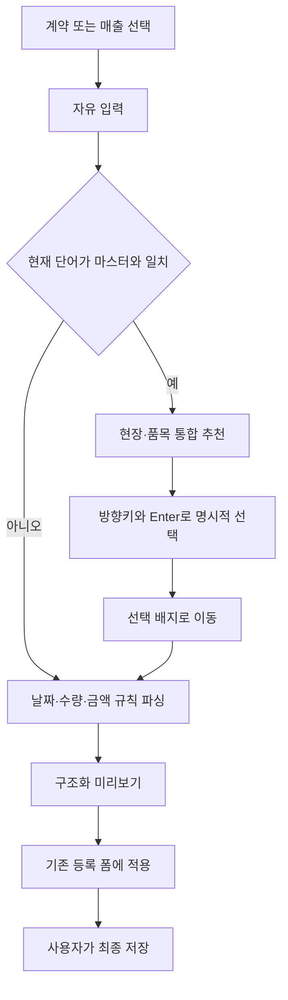
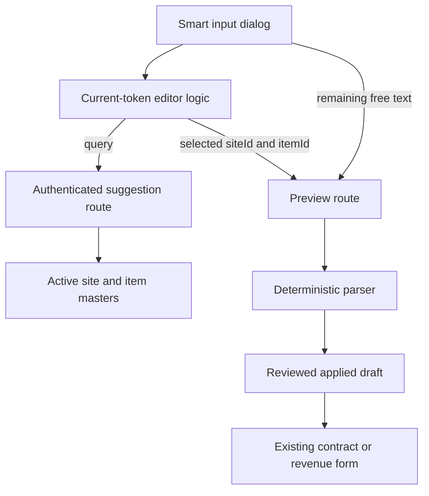

# Smart Input Token Editor - Plan

## Goal Capsule

- **Objective:** 사무실 매출·청구 담당자가 엑셀 수기 입력보다 적은 단계로 계약 또는 매출 한 건을 등록하면서 유사 현장명 선택 오류를 줄인다.
- **Product authority:** 담당자는 등록 대상을 명시적으로 선택하고, 현장·품목 추천을 키보드로 확정하며, 저장 전 구조화 결과를 검토한다.
- **Open blockers:** 없음.
- **Execution profile:** 기존 preview-first 경계를 보존하는 표준 규모의 UI·파서·API 변경이다.
- **Stop conditions:** 자동 선택이나 다건 입력이 필요해지거나 기존 계약·매출 저장 규칙을 변경해야 하면 범위 확장으로 보고 중단한다.
- **Tail ownership:** 구현자는 관련 테스트와 전체 저장소 품질 검사를 통과시키고, 문서와 무관한 변경은 포함하지 않는다.

---

## Product Contract

### Summary

기존 스마트 입력을 선택 배지 영역과 자유 입력 영역이 분리된 단건 입력기로 확장한다. 현장·품목은 현재 단어를 검색해 명시적으로 선택하고, 날짜·수량·단가는 규칙 기반으로 해석한 뒤 기존 등록 폼에 적용한다.

### Problem Frame

현재 업무는 Excel에 수기로 기록되며 새 시스템은 아직 담당자에게 배포되지 않았다. 시스템 전환의 핵심 가치는 입력 시간을 줄이고 계약·매출·거래명세표·현장별 월 메모를 팀이 같은 데이터로 공유하는 데 있다.

현장명은 `판교1`, `판교2`처럼 유사한 경우가 많다. 이름만 빠르게 자동 선택하면 입력 속도는 빨라져도 잘못된 현장으로 등록될 위험이 커진다.

### Actors

- A1. **사무실 매출·청구 담당자:** 계약 또는 매출을 입력하고 분석 결과를 검토해 기존 등록 폼에 적용한다.
- A2. **업무 공유 팀원:** 담당자가 최종 저장한 데이터를 기존 실시간 협업 화면에서 조회한다.

### Key Decisions

- **선택 배지와 자유 문장 분리:** 확정된 현장·품목은 상단 배지 영역에 표시하고 날짜·수량·금액은 하단 자유 입력 영역에 남긴다.
- **명시적 선택 우선:** 추천 결과가 하나뿐이어도 자동 확정하지 않고 사용자가 `Enter`로 선택한다.
- **현재 단어만 검색:** 커서가 위치한 공백 구분 단어만 현장·품목 검색어로 사용하며 문장 전체를 자동 배지화하지 않는다.
- **연도 생략 기본값:** 연도 없는 날짜는 현재 연도로 해석하고 연말을 넘는 기간은 종료일을 다음 해로 해석한다.
- **수량 뒤 금액은 단가:** 수량 표현 바로 뒤의 숫자 또는 통화 단위가 있는 금액은 개당 단가로 해석하며 합계 금액은 `총액` 표현을 요구한다.
- **기존 화면이 대상을 선택한다:** 계약 화면에서 연 입력은 계약, 매출 화면에서 연 입력은 매출로 고정하며 다이얼로그 안에 중복 선택기를 추가하지 않는다.

### Requirements

**입력과 선택**

- R1. 사용자는 계약 또는 매출 화면의 스마트 입력 진입점을 선택해 등록 대상을 명시해야 한다.
- R2. 스마트 입력은 선택된 현장·품목 배지 영역과 날짜·수량·금액을 입력하는 자유 입력 영역을 분리해 제공해야 한다.
- R3. 자유 입력 영역의 현재 단어는 활성 현장과 품목의 이름·코드·별칭을 함께 검색해야 한다.
- R4. 같은 검색어가 현장과 품목 양쪽에 일치하면 하나의 추천 목록에서 각 결과의 구분을 표시해야 한다.
- R5. 현장 추천은 `현장명 · 현장코드 / 현장` 형식으로 표시해야 한다.
- R6. 추천 결과는 키보드 `위·아래 방향키`로 이동하고 `Enter`로 확정할 수 있어야 한다.
- R7. 검색 결과가 하나이거나 이름이 정확히 일치해도 자동 확정하지 않아야 한다.
- R8. 추천 결과를 확정하면 검색에 사용된 현재 단어를 자유 입력에서 제거하고 선택 결과를 배지로 표시해야 한다.
- R9. 사용자는 배지의 삭제 버튼으로 항목을 제거할 수 있으며, 자유 입력이 비어 있고 IME 조합 중이 아닐 때 `Backspace`로 마지막 배지를 제거할 수 있어야 한다.

**규칙 기반 해석**

- R10. 연도 없는 월·날짜는 현재 연도로 해석하고 적용된 연도를 분석 결과에 표시해야 한다.
- R11. 연도 없는 기간의 종료 월일이 시작 월일보다 이르면 종료일을 다음 해로 해석해야 한다.
- R12. 수량 표현 바로 뒤의 숫자 또는 통화 단위가 있는 금액은 개당 단가로 해석하고 `총액`이 명시된 금액만 전체 금액으로 해석해야 한다.
- R13. 선택 배지를 제외한 자유 입력은 날짜·기간·수량·단가·총액 규칙 파싱에 사용해야 한다.

**안전과 기존 흐름**

- R14. 스마트 입력 분석은 데이터를 저장하지 않고 구조화된 미리보기만 만들어야 한다.
- R15. 사용자는 선택한 현장·품목과 해석된 날짜·수량·단가·총액을 등록 폼에 적용하기 전에 확인할 수 있어야 한다.
- R16. 적용 결과는 기존 계약 또는 매출 등록 폼으로 전달되며 실제 저장은 해당 폼의 명시적 제출로만 수행해야 한다.
- R17. 유사한 현장명이 여러 개면 현장코드를 포함한 모든 후보를 보여주고 사용자의 명시적 선택 없이는 진행하지 않아야 한다.
- R18. 마우스 없이 대상 선택 이후 추천 선택과 분석 실행까지 완료할 수 있어야 한다.

### Key Flows

- F1. **단건 계약 입력**
  - **Trigger:** A1이 `계약`을 선택하고 스마트 입력을 연다.
  - **Steps:** 현재 단어로 현장·품목을 검색하고 배지로 확정한 뒤 기간·수량·단가를 입력한다. 분석 결과를 확인하고 기존 계약 폼에 적용한다.
  - **Outcome:** 실제 저장 전 계약 폼에 검토 가능한 초안이 채워진다.
  - **Covered by:** R1-R16, R18
- F2. **단건 매출 입력**
  - **Trigger:** A1이 `매출`을 선택하고 스마트 입력을 연다.
  - **Steps:** 현장·품목을 배지로 확정하고 날짜·수량·단가 또는 총액을 입력한다. 분석 결과를 확인하고 기존 매출 폼에 적용한다.
  - **Outcome:** 실제 저장 전 매출 폼에 검토 가능한 초안이 채워진다.
  - **Covered by:** R1-R18
- F3. **유사 현장명 구분**
  - **Trigger:** 현재 단어가 둘 이상의 유사한 현장에 일치한다.
  - **Steps:** 추천 목록에서 현장명·현장코드를 비교하고 방향키와 `Enter`로 하나를 확정한다.
  - **Outcome:** 선택한 현장만 배지로 표시되고 나머지 후보는 적용되지 않는다.
  - **Covered by:** R3-R9, R17-R18

### Acceptance Examples

- AE1. **기본 키보드 입력 — Covers R2-R3, R6, R10, R12-R13, R18.** `헬멧`을 입력하면 품목 추천이 나타나고 방향키와 `Enter`로 선택하면 `헬멧 / 품목` 배지가 생긴다. 이어 `강남`을 같은 방식으로 선택하고 `07/16 ~ 07/16 5개 5만원`을 분석하면 올해 날짜, 수량 5개, 개당 단가 50,000원으로 표시된다.
- AE2. **입력 순서가 다른 경우 — Covers R3, R8, R12-R13.** `10ea 100000 세종`에서 현재 단어 `세종`을 현장으로 선택하면 앞의 `10ea 100000`은 유지되고 수량 10개와 개당 단가 100,000원으로 해석된다.
- AE3. **현장·품목 동시 일치 — Covers R3-R4, R7.** 하나의 검색어가 현장과 품목에 모두 일치하면 각 추천에 `/ 현장` 또는 `/ 품목`이 표시되고 자동 선택되지 않는다.
- AE4. **유사 현장 — Covers R5-R7, R17.** `판교` 검색 결과에 `판교1 · SITE-0001 / 현장`과 `판교2 · SITE-0002 / 현장`이 함께 표시되며 사용자가 `Enter`로 선택한 결과만 배지가 된다.
- AE5. **정확한 단일 일치 — Covers R7.** 검색 결과가 하나이고 이름이 완전히 같아도 사용자가 `Enter`를 누르기 전에는 배지가 생성되지 않는다.
- AE6. **현재 연도 — Covers R10.** `07/16`은 올해 7월 16일로 해석되고 미리보기에 적용 연도가 표시된다.
- AE7. **연말 교차 — Covers R10-R11.** `12/15 ~ 01/15`는 올해 12월 15일부터 다음 해 1월 15일까지로 해석된다.
- AE8. **총액 구분 — Covers R12.** `5개 5만원`은 단가 50,000원으로 해석하고 `5개 총액 5만원`은 전체 금액 50,000원으로 해석한다.
- AE9. **저장 안전성 — Covers R14-R16.** 분석·배지 선택·등록 폼 적용만으로 계약이나 매출은 생성되지 않으며 기존 폼을 제출해야 저장된다.

### Success Criteria

- 대표 입력 예시를 마우스 없이 완성할 수 있고 기존 Excel 수기 입력보다 입력 단계가 줄어든다.
- 유사 현장명 시나리오에서 현장코드가 항상 노출되고 명시적으로 선택한 현장만 적용된다.
- 모든 날짜·금액 기본값은 미리보기에 표시되어 담당자가 저장 전에 잘못된 해석을 발견할 수 있다.
- 최종 저장 후 기존 실시간 협업 흐름을 통해 A2가 같은 데이터를 조회할 수 있다.

### Scope Boundaries

- 여러 줄을 한 번에 분석하는 초안 인박스는 후속 범위로 둔다.
- 한 입력 안에서 여러 품목을 등록하는 기능은 후속 범위로 둔다.
- 계약·매출 자동 판별과 유일 검색 결과 자동 선택은 지원하지 않는다.
- 사용자 교정을 학습하거나 별칭을 자동 추가하지 않는다.
- 거래명세표 발행과 현장·월별 특이사항 기능 자체는 변경하지 않는다.

### Dependencies / Assumptions

- 현장과 품목 마스터의 이름·코드·별칭이 실제 업무 표현을 포함한다고 가정한다.
- 운영 PC의 현재 날짜와 시간대가 연도 생략 입력의 기준이 된다.
- 기존 계약·매출 등록 폼과 실시간 갱신 흐름은 유지한다.

### Sources / Research

- `src/components/smart-input/smart-input-dialog.tsx`
- `src/lib/smart-input/parser.ts`
- `src/lib/smart-input/service.ts`
- `src/lib/smart-input/draft.ts`
- `src/components/contracts/contract-manager.tsx`
- `src/components/revenues/revenue-manager.tsx`
- `prisma/schema.prisma`
- `docs/ideation/2026-07-11-post-phase11-product-improvements-ideation.html`

---

## Planning Contract

### Key Technical Decisions

- **KTD1. 선택된 마스터 ID를 파서보다 우선한다.** 배지로 확정한 현장·품목은 명시적 ID로 preview 요청에 전달하고, 자유 입력 파서는 선택되지 않은 필드와 날짜·수량·금액만 해석한다. 이름이 비슷하거나 원문에서 제거된 뒤에도 결과가 흔들리지 않는다.
- **KTD2. 추천 검색은 별도 읽기 전용 경로로 제한한다.** 현재 단어가 의미 있는 길이일 때만 활성 현장·품목의 이름·코드·별칭을 검색하고, 화면에는 정렬된 상위 후보만 반환한다. preview 때 모든 활성 마스터를 읽는 기존 경로는 최종 분석 호환성을 위해 유지한다.
- **KTD3. 입력 편집 규칙은 순수 함수로 분리한다.** 현재 단어 추출, 선택 단어 제거, 현장·품목 통합 정렬, 키보드 선택 이동을 UI 밖에서 테스트할 수 있게 한다.
- **KTD4. 날짜·금액 규칙은 결정적으로 확장한다.** 기준 날짜를 주입하는 기존 파서 방식을 유지하며 `MM/DD`, `MM/DD ~ MM/DD`, 단독 금액 단가를 추가한다. `총액` 표시는 기존 명시적 총액 규칙이 항상 우선한다.
- **KTD5. 한국어 IME 조합 중 확정을 막는다.** 조합 중 `Enter`와 방향키를 추천 선택으로 처리하지 않고 조합 완료 후에만 키보드 탐색을 활성화한다.
- **KTD6. 기존 등록 폼이 최종 검증과 저장을 소유한다.** 토큰 편집기는 preview와 초안 적용만 담당하고 계약·매출 API 저장 경로는 변경하지 않는다.
- **KTD7. 오래된 선택 ID는 fail-closed 처리한다.** 선택된 현장·품목이 삭제되었거나 비활성화됐으면 텍스트 재추론으로 대체하지 않고 배지를 제거한 뒤 재선택을 요구한다.
- **KTD8. 계약·매출 화면 컨텍스트를 대상 선택으로 사용한다.** 현재 두 화면의 고정 target을 유지해 다이얼로그 내부 선택기와 잘못된 폼 적용 경로를 만들지 않는다.

### High-Level Technical Design

추천 경로는 사용자 입력 중 읽기만 수행한다. preview 경로는 선택된 ID와 남은 자유 입력을 결합해 기존 `SmartInputPreview`를 만들고, 이후 초안 변환과 기존 폼 제출 흐름은 그대로 둔다.

### Sequencing

1. 파서와 토큰 편집 순수 로직을 테스트로 고정한다.
2. 인증된 추천 검색과 선택 ID 기반 preview를 연결한다.
3. 다이얼로그를 배지 영역과 자유 입력 영역으로 교체한다.
4. 계약·매출 양쪽 적용 흐름과 전체 품질 검사를 실행한다.

### Risks & Dependencies

- 한국어 IME 조합 이벤트를 일반 `Enter`와 혼동하면 글자 입력 중 후보가 선택될 수 있다.
- 단독 숫자 금액은 날짜·수량 숫자와 충돌할 수 있으므로 수량 단위 뒤 금액 또는 통화 단위가 있는 금액으로 범위를 제한해야 한다.
- 현장·품목 추천은 공백이 아닌 현재 단어부터 검색하고 상위 8건으로 제한한다. 입력 변경 시 이전 요청을 취소하고 최신 요청 결과만 표시한다.
- 신규 추천 경로도 기존 preview와 동일한 로그인·역할 검사를 적용해야 한다.

---

## Implementation Units

### U1. 토큰 편집과 파싱 규칙 확장

- **Goal:** 현재 단어 선택과 날짜·금액 신규 문법을 결정적인 순수 로직으로 구현한다.
- **Requirements:** R6-R13, R18; AE1-AE3, AE5-AE8; KTD3-KTD5
- **Files:**
  - Modify `src/lib/smart-input/parser.ts`
  - Modify `src/lib/smart-input/parser.test.ts`
  - Create `src/lib/smart-input/token-editor.ts`
  - Create `src/lib/smart-input/token-editor.test.ts`
- **Approach:** 먼저 신규 예시를 실패 테스트로 추가한다. 현재 커서 단어 추출·제거와 키보드 인덱스 이동을 순수 함수로 두고, 파서는 `MM/DD` 일자와 범위, 수량 단위 뒤 단독 금액을 단가로 인식한다.
- **Test Scenarios:**
  - `07/16 ~ 07/16 5개 5만원`이 올해 단일 기간, 수량 5, 단가 50,000원으로 해석된다.
  - `10ea 100000 세종`에서 현재 단어가 `세종`이고 선택 후 앞 텍스트가 보존된다.
  - `12/15 ~ 01/15` 종료일이 다음 해가 된다.
  - `5개 총액 5만원`은 단가 규칙보다 총액 규칙이 우선한다.
  - 방향키 인덱스가 목록 처음·끝에서 순환하고 조합 중 `Enter`는 확정하지 않는다.
- **Verification:** `npm test -- src/lib/smart-input/parser.test.ts src/lib/smart-input/token-editor.test.ts`

### U2. 마스터 추천과 선택 ID 기반 preview

- **Goal:** 현재 단어로 안전하게 후보를 조회하고 명시적으로 선택한 마스터를 preview의 권위 있는 값으로 사용한다.
- **Requirements:** R3-R8, R14, R17; AE3-AE5; KTD1-KTD2, KTD7
- **Files:**
  - Create `src/app/api/smart-input/suggestions/route.ts`
  - Modify `src/app/api/smart-input/preview/route.ts`
  - Modify `src/lib/smart-input/schemas.ts`
  - Modify `src/lib/smart-input/service.ts`
  - Modify `src/lib/smart-input/types.ts`
  - Create `src/lib/smart-input/suggestions.ts`
  - Create `src/lib/smart-input/suggestions.test.ts`
- **Approach:** 이름·코드·별칭을 정규화해 현장과 품목 후보를 같은 응답으로 반환한다. 선택된 ID는 활성 마스터인지 서버에서 다시 검증하고 parser 결과를 안전하게 고정한다.
- **Test Scenarios:**
  - `판교`가 유사 현장 여러 개를 `현장명·코드·구분` 정보와 함께 반환한다.
  - 현장과 품목이 같은 키워드에 일치하면 두 종류가 모두 반환된다.
  - 비활성 마스터와 존재하지 않는 선택 ID는 텍스트 fallback 없이 오류로 처리되고 재선택을 요구한다.
  - 비로그인 또는 허용되지 않은 역할은 추천과 preview에 접근할 수 없다.
  - 선택 ID가 있으면 자유 입력에 이름이 없어도 preview의 현장·품목이 유지된다.
- **Verification:** `npm test -- src/lib/smart-input/suggestions.test.ts src/lib/smart-input/parser.test.ts src/lib/smart-input/draft.test.ts`

### U3. 배지·자유 입력 분리 UI

- **Goal:** 마우스 없이 후보를 찾고 선택·삭제·분석할 수 있는 단건 입력 화면을 제공한다.
- **Requirements:** R1-R9, R15, R18; F1-F3; AE1-AE5; KTD3, KTD5-KTD6
- **Files:**
  - Modify `src/components/smart-input/smart-input-dialog.tsx`
  - Modify `src/components/workflow-contract.test.ts`
- **Approach:** 선택 배지 영역과 자유 입력 textarea를 분리하고 현재 단어가 바뀔 때 추천을 갱신한다. 추천 상태는 idle, loading, results, empty, error로 구분하며 이전 요청은 취소하고 오래된 응답을 폐기한다. textarea 포커스를 유지하는 editable combobox로 `aria-expanded`, `aria-controls`, `aria-activedescendant`를 listbox·option ID와 연결하고 결과 수·빈 결과·오류·선택 완료를 라이브 영역으로 알린다. 첫 `Escape`는 추천 목록만 닫고 목록이 닫힌 상태에서는 기존 Dialog 동작을 따른다. 분석 버튼은 선택 ID와 남은 텍스트를 preview에 전달한다.
- **Test Scenarios:**
  - 선택 배지에 현장은 이름·코드·구분, 품목은 이름·구분이 표시된다.
  - 정확한 단일 후보도 `Enter` 전에는 배지가 되지 않는다.
  - 배지 삭제 후 같은 항목을 다시 검색할 수 있다.
  - 입력이 비어 있고 조합 중이 아닐 때만 `Backspace`가 마지막 배지를 제거하며 삭제 버튼은 접근 가능한 이름을 가진다.
  - loading, empty, error, stale-response 상태가 구분되고 오류 후 재입력으로 다시 검색할 수 있다.
  - 좁은 화면에서 배지는 여러 줄로 감싸지고 추천 목록은 입력 폭 안에서 내부 스크롤되며 삭제 동작이 화면 밖으로 밀리지 않는다.
  - 선택 대상과 나머지 텍스트가 preview 요청에 함께 포함된다.
  - 기존 설명, 경고, 등록 폼 적용 버튼과 비저장 안내가 유지된다.
- **Verification:** `npm test -- src/components/workflow-contract.test.ts src/lib/smart-input/token-editor.test.ts`

### U4. 계약·매출 통합 회귀 검증

- **Goal:** 두 대상의 기존 초안 적용과 저장 안전성을 보존한 채 대표 사용자 흐름을 고정한다.
- **Requirements:** R1, R14-R18; F1-F2; AE1-AE2, AE8-AE9; KTD6
- **Files:**
  - Modify `src/lib/smart-input/draft.test.ts`
  - Modify `src/components/workflow-contract.test.ts`
- **Approach:** 계약과 매출 대표 입력을 선택 ID 기반 preview부터 기존 폼 초안까지 연결해 검증한다. 실제 저장은 수행하지 않는 계약 테스트를 유지한다.
- **Test Scenarios:**
  - 계약 예시는 현장·품목·기간·수량·단가를 기존 계약 초안으로 전달한다.
  - 매출 예시는 귀속일·수량·단가 또는 명시적 총액을 기존 매출 초안으로 전달한다.
  - preview와 폼 적용만으로 DB 변경 경로가 호출되지 않는다.
- **Verification:** `npm test -- src/lib/smart-input/draft.test.ts src/components/workflow-contract.test.ts`

---

## Verification Contract

| Gate | Command | Done signal |
|---|---|---|
| Smart input focused tests | `npm test -- src/lib/smart-input/parser.test.ts src/lib/smart-input/token-editor.test.ts src/lib/smart-input/suggestions.test.ts src/lib/smart-input/draft.test.ts src/components/workflow-contract.test.ts` | 신규 문법·추천·키보드·초안 회귀 테스트가 모두 통과한다. |
| Full unit suite | `npm test` | 전체 Vitest가 통과한다. |
| Type safety | `npm run typecheck` | TypeScript 오류가 없다. |
| Lint | `npm run lint` | ESLint 오류가 없다. |
| Production build | `npm run build` | Next.js production build가 성공한다. |
| Diff hygiene | `git diff --check` | whitespace 오류가 없다. |
| Manual interaction | 계약과 매출 다이얼로그에서 AE1-AE5 실행 | IME 입력, 방향키·Enter, 로딩·빈 결과·오류, 배지 삭제, 좁은 화면, preview 적용이 마우스 없이 동작한다. |

---

## Definition of Done

- U1-U4의 파일과 테스트 시나리오가 구현되고 각 Verification 명령이 통과한다.
- R1-R18이 구현 단위와 테스트 또는 수동 검증에 연결된다.
- `판교1`·`판교2` 같은 유사 현장은 코드가 노출되고 자동 선택되지 않는다.
- 연도 생략, 연말 교차, 단독 단가, 명시적 총액 예시가 결정적으로 동작한다.
- preview와 폼 적용만으로 데이터가 저장되지 않는 기존 안전 경계가 유지된다.
- 비활성 마스터와 권한 없는 요청이 추천 결과에 노출되지 않는다.
- 한국어 IME와 키보드-only 대표 흐름이 수동 검증된다.
- 실험 중 사용하지 않게 된 코드와 중복 로직이 최종 diff에서 제거된다.
