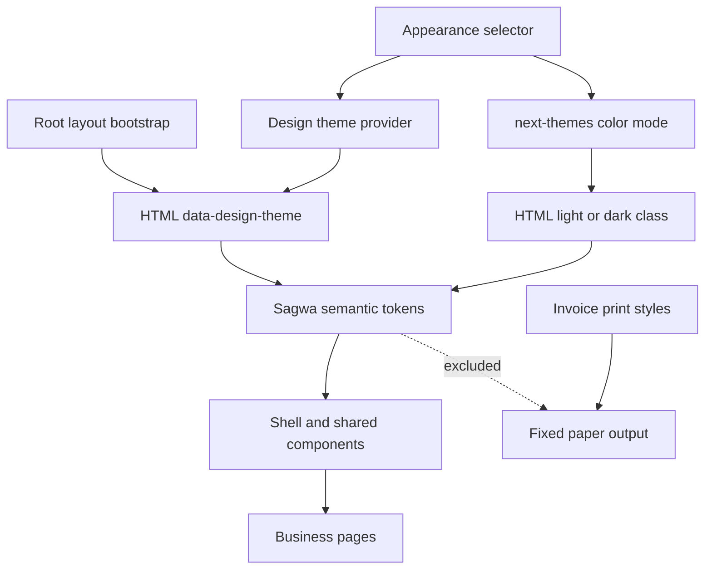

# Sagwa Theme - Plan

## Goal Capsule

- **Objective:** Add a selectable `사과테마` that brings the approved Apple Operational direction to the existing business UI without replacing the current design.
- **Authority:** The user's B-direction selection and `사과테마` naming override external reference terminology; the current repository behavior remains authoritative for workflows and density.
- **Execution profile:** Standard frontend feature with persistent client preferences, global design tokens, shared shell styling, focused contract tests, and browser verification.
- **Stop conditions:** Stop if the implementation requires changing business workflows, database behavior, invoice print output, or adding a new runtime dependency.
- **Tail ownership:** `ce-work` owns implementation, verification, review, and commits on `codex/sagwa-theme`.

---

## Product Contract

### Summary

Add `사과테마` as an optional operational design alongside the current design, while preserving system, light, and dark color modes as an independent preference.

### Problem Frame

The app currently exposes only a light/dark toggle even though its semantic CSS variables and shared components can support a second design language. The approved B direction should make the interface calmer and more polished without reducing the density required for contract, revenue, report, and invoice work.

### Requirements

**Theme choice and persistence**

- R1. Users can choose between the current design and `사과테마` anywhere the existing theme control appears.
- R2. The selected design persists across reloads and applies before first paint to avoid a visible theme flash.
- R3. System, light, and dark color modes remain independently selectable for both designs.
- R4. The default for users with no saved design preference remains the current design with system color mode.

**Design behavior**

- R5. `사과테마` uses a single blue interaction accent, neutral surfaces, softer elevation, larger radii, restrained translucency, and system-first typography.
- R6. `사과테마` preserves the current navigation structure, task order, form behavior, table density, status semantics, and responsive behavior.
- R7. `사과테마` provides coherent light and dark variants rather than treating the gallery-style dark proposal as its dark mode.
- R8. Motion, transparency, and contrast preferences receive accessible fallbacks.

**Scope protection**

- R9. Printed invoice documents keep their fixed paper styling regardless of the selected design or color mode.
- R10. The feature does not change authentication, persistence models, business APIs, calculations, or operational scripts.

### Acceptance Examples

- AE1. Given no saved preferences, when the app first loads, then the current design follows the operating-system color mode.
- AE2. Given `사과테마` and dark color mode are selected, when the page reloads, then both choices are restored before the application paints.
- AE3. Given `사과테마` is active, when the user opens contracts, revenues, monthly reports, or settings, then the same workflows and information density remain available with the new visual tokens.
- AE4. Given reduced transparency or increased contrast is requested by the operating system, when `사과테마` renders floating surfaces, then those surfaces become more solid and clearly separated.
- AE5. Given any theme is active, when an invoice is printed, then its A4 document colors, measurements, and typography remain unchanged.

### Success Criteria

- The appearance control clearly names `기본 테마` and `사과테마` and exposes all three color modes.
- Reloading does not visibly switch from the default design to the saved design.
- The dashboard, app shell, authentication frame, cards, controls, dialogs, and tables visibly adopt the approved B direction in both color modes.
- Existing theme and workflow tests remain green, with new coverage for the two-axis preference contract.

### Scope Boundaries

#### In scope

- Persistent design preference and no-flash initialization.
- A shared appearance selector on main and authentication surfaces.
- `사과테마` light/dark tokens and targeted shared-surface styling.
- Accessibility fallbacks and responsive browser verification.

#### Deferred to Follow-Up Work

- Gesture-driven sheets, spring physics, audio, haptics, or broad animation redesign.
- User-account or server-side synchronization of visual preferences.
- Page-specific redesigns that change information architecture.

#### Outside this feature

- Apple trademarks, logos, proprietary fonts, marketing photography, or public claims of Apple affiliation.
- Changes to invoice print documents or business-domain behavior.

---

## Planning Contract

### Key Technical Decisions

- KTD1. Model design and color as separate preference axes. The existing `next-themes` provider remains responsible for system/light/dark, while a small client provider owns `default`/`sagwa` on `data-design-theme`.
- KTD2. Use the installed Next.js 16 pre-hydration inline-script pattern for the design preference. This applies the saved attribute during HTML parsing and keeps the default server-rendered markup unchanged.
- KTD3. Reuse the existing dialog and button primitives for the appearance selector. This avoids a new dependency and gives the control an accessible focus trap, labels, and keyboard handling.
- KTD4. Implement most visual change through semantic CSS variables and stable data/class hooks. Page markup changes stay limited to hooks needed for the shell, authentication frame, and dashboard hero.
- KTD5. Keep warning, error, success, and invoice-document colors semantic. `사과테마` changes the primary interaction accent without flattening operational status signals.

### High-Level Technical Design

The active appearance is the product of two independent axes:

| Design axis | Color axis | Result |
|---|---|---|
| Current | System, light, or dark | Existing visual behavior |
| Sagwa | System, light, or dark | Operational Sagwa tokens in the resolved color mode |

### Assumptions

- The preference is device/browser-local because the user did not request account synchronization.
- The current design is named `기본 테마` in the UI; internal identifiers remain ASCII and use `default` and `sagwa`.
- The existing compact business layouts are preserved; visual differentiation comes from tokens, surfaces, typography, and motion feedback rather than added whitespace that reduces throughput.
- Existing status colors remain recognizable even when the primary teal accent changes to blue.

### Sources and Patterns

- `src/components/providers.tsx` and `src/components/theme-toggle.tsx` establish the existing color-mode provider and global control.
- `src/app/globals.css` provides semantic Tailwind/shadcn variables and fixed invoice print styling.
- `src/components/app-shell.tsx` and `src/app/(main)/page.tsx` are the primary shared and dashboard surfaces for the approved direction.
- `src/components/theme-contract.test.ts` establishes the repository's source-contract test style for theming.
- Installed Next.js 16 documentation: `node_modules/next/dist/docs/01-app/02-guides/preventing-flash-before-hydration.md` and `node_modules/next/dist/docs/01-app/01-getting-started/05-server-and-client-components.md`.
- External visual references: `https://github.com/emilkowalski/skills/blob/main/skills/apple-design/SKILL.md` and `https://github.com/VoltAgent/awesome-design-md/blob/main/design-md/apple/DESIGN.md`.

---

## Implementation Units

### U1. Persist the design theme without first-paint flash

- **Goal:** Add the independent design preference, pre-hydration application, and provider API.
- **Requirements:** R1, R2, R3, R4; covers AE1 and AE2.
- **Dependencies:** None.
- **Files:** `src/lib/design-theme.ts`, `src/lib/design-theme.test.ts`, `src/components/design-theme-provider.tsx`, `src/components/providers.tsx`, `src/app/layout.tsx`.
- **Approach:** Centralize valid identifiers and the storage key in a server-safe module, apply the saved attribute in the root head, and expose a client context that updates the document and local storage while leaving `next-themes` in charge of color mode.
- **Execution note:** Start with focused tests for normalization and bootstrap-script constraints before wiring the provider.
- **Patterns to follow:** Next.js inline theme script guidance and the existing `ThemeProvider` composition in `src/components/providers.tsx`.
- **Test scenarios:**
  - Covers AE1. Missing or invalid storage values resolve to the current design and do not add the Sagwa attribute.
  - Covers AE2. The saved `sagwa` value produces the expected document attribute before hydration.
  - Updating the provider applies and persists either valid design value without changing the `next-themes` color setting.
  - A storage event from another tab updates the active design value.
- **Verification:** Focused design-theme tests pass and the root layout contains a no-flash bootstrap that shares identifiers with the provider.

### U2. Replace the binary toggle with a two-axis appearance selector

- **Goal:** Let users choose design and color independently from every existing theme-control location.
- **Requirements:** R1, R3, R4; covers AE1 and AE2.
- **Dependencies:** U1.
- **Files:** `src/components/theme-toggle.tsx`, `src/components/theme-contract.test.ts`, `src/components/app-shell.tsx`, `src/app/(auth)/login/page.tsx`, `src/app/(auth)/setup/page.tsx`.
- **Approach:** Keep the existing shared component entry point but change it to an icon-triggered appearance dialog with clearly labeled design and color choices, current-state indicators, and compact responsive presentation.
- **Patterns to follow:** Existing `Dialog`, `Button`, `Label`, `next-themes`, and source-contract tests.
- **Test scenarios:**
  - The control renders `기본 테마` and `사과테마` without using Apple as the user-facing theme name.
  - The color section exposes system, light, and dark rather than a binary resolved-theme flip.
  - Selecting a design calls the design provider, while selecting a color calls `next-themes`.
  - The app shell, login page, and setup page continue to render the shared control.
- **Verification:** Theme contract tests prove the two-axis options and all existing placement contracts.

### U3. Apply the operational Sagwa visual system

- **Goal:** Deliver the approved B direction across shared surfaces in light and dark modes without changing workflow density.
- **Requirements:** R5, R6, R7, R8, R9, R10; covers AE3, AE4, and AE5.
- **Dependencies:** U1, U2.
- **Files:** `src/app/globals.css`, `src/components/app-shell.tsx`, `src/app/(auth)/login/page.tsx`, `src/app/(auth)/setup/page.tsx`, `src/app/(main)/page.tsx`, `src/components/theme-contract.test.ts`.
- **Approach:** Define Sagwa semantic tokens for both color modes, add stable hooks for floating shell and authentication surfaces, restyle the dashboard hero as an operational surface, and add reduced-motion, reduced-transparency, and increased-contrast fallbacks. Keep the invoice CSS outside design-theme overrides.
- **Execution note:** This unit is mostly styling; prefer source-contract checks plus real desktop/mobile browser inspection over brittle visual snapshot tests.
- **Patterns to follow:** Existing semantic variables in `src/app/globals.css`, shadcn data slots, the B visual probe, and the fixed `.invoice-*` print rules.
- **Test scenarios:**
  - Covers AE3. Sagwa light and dark token blocks both exist and target shared semantic variables.
  - Covers AE4. Reduced-transparency, increased-contrast, and reduced-motion queries define legible fallbacks.
  - Covers AE5. Theme overrides do not target `.invoice-page`, and the print block retains fixed white paper and black text.
  - The current design selectors remain unchanged when `data-design-theme` is absent.
- **Verification:** Source-contract tests pass; desktop and mobile browser checks show no clipping, overlap, unreadable contrast, or workflow loss in current/Sagwa and light/dark combinations.

---

## Verification Contract

| Gate | Applies to | Done signal |
|---|---|---|
| `npm test -- src/lib/design-theme.test.ts src/components/theme-contract.test.ts` | U1-U3 | Focused preference and source contracts pass |
| `npm test` | All units | Full Vitest suite passes |
| `npm run typecheck` | All units | TypeScript completes without errors |
| `npm run lint` | All units | ESLint completes without errors |
| `npm run build` | All units | Next.js production build succeeds |
| Browser desktop and mobile inspection | U2-U3 | Current and Sagwa themes work in light and dark modes without layout regressions |
| `git diff --check` | All units | No whitespace errors remain |

---

## Definition of Done

- U1-U3 verification outcomes are satisfied and the branch contains no unrelated changes.
- The appearance selector persists independent design and color preferences and works on main, login, and setup surfaces.
- `사과테마` light and dark modes match the operational B direction while retaining existing information density and workflows.
- Accessibility media-query fallbacks are present and manually inspected.
- Invoice print styling remains fixed and outside the design-theme overrides.
- Full tests, typecheck, lint, build, browser checks, and code review pass.
- Experimental or abandoned styling and temporary visual-probe artifacts are not left in the repository diff.
