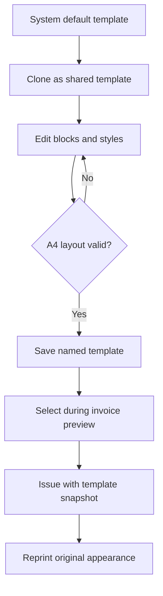
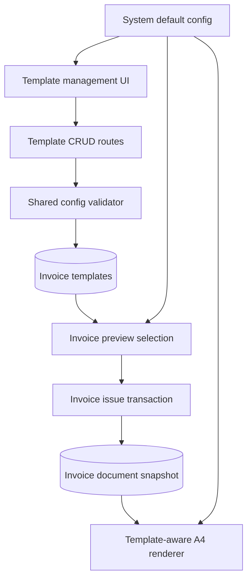
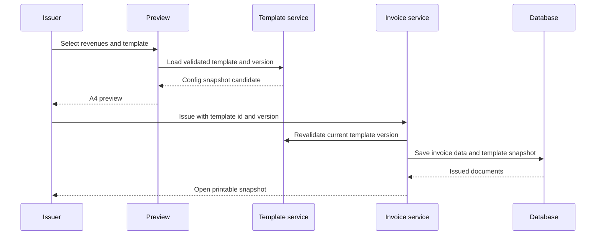

# Invoice Template Editor - Plan

## Goal Capsule

- **Objective:** 공통 Excel에서 데이터를 갈아 끼우는 반복 작업을 없애고, 시스템 안에서 재사용 가능한 거래명세표 양식을 편집·선택·발행한다.
- **Product authority:** 관리자와 매니저가 함께 관리하는 공용 템플릿이며, 발행본은 발행 당시 양식을 보존한다.
- **Open blockers:** 없음.
- **Execution profile:** 영속 데이터, 권한, 편집 UI, 발행·재출력 경로를 함께 변경하는 표준 깊이의 코드 작업이다.
- **Tail ownership:** 기능 브랜치에서 검증 가능한 단위로 커밋하며, 원격 push와 PR 생성은 별도 요청 전까지 수행하지 않는다.

---

## Product Contract

### Summary

거래명세표의 주요 블록을 격자 안에서 배치하고 폰트·색상·표 열 구성을 조정할 수 있는 공용 템플릿 편집기를 제공한다.
여러 템플릿을 이름 붙여 저장하고 발행 시 선택하되, 기존 양식은 변경 불가능한 시스템 기본 템플릿으로 유지한다.

### Problem Frame

현재 실무에서는 공통 Excel 양식에 거래 데이터를 매번 갈아 끼워 거래명세표를 만든다.
업체 BI 색상처럼 가끔 필요한 표현 변경도 Excel에서 직접 처리해야 하므로 시스템에 저장된 발행 데이터와 실제 출력 작업이 분리되어 있다.
자유로운 문서 디자인보다 반복 교체 작업을 시스템 안에서 끝내고 A4 출력 안정성을 유지하는 것이 우선이다.

### Key Decisions

- **제한형 블록 편집:** 빈 캔버스의 자유 좌표 편집 대신 제목, 수신처, 공급자, 품목표, 합계, 메모 블록을 격자에 맞춰 이동하고 크기를 조절한다.
- **안전한 A4 경계:** 블록의 A4 이탈과 겹침을 저장 전에 차단한다.
- **가독성 우선 페이지 분할:** 한 페이지에 맞추기 위해 글자나 행을 자동 축소하지 않고, 넘치는 품목은 다음 페이지로 자동 분할한다.
- **불변 기본 양식:** 현재 거래명세표 양식은 수정할 수 없는 시스템 기본 템플릿으로 보존하며, 사용자는 이를 복제해 새 템플릿을 만든다.
- **발행 시점 보존:** 템플릿을 나중에 수정해도 과거 발행본의 재출력 결과는 바뀌지 않는다.

### Actors

- A1. **관리자:** 공용 템플릿을 생성, 복제, 수정, 삭제하고 발행에 사용한다.
- A2. **매니저:** 관리자와 동일하게 공용 템플릿을 관리하고 발행에 사용한다.
- A3. **조회 사용자:** 템플릿과 발행본을 조회하거나 재출력할 수 있지만 템플릿을 변경하지 않는다.

### Requirements

**Template management**

- R1. 관리자와 매니저는 여러 공용 템플릿을 이름 붙여 저장하고 발행 시 선택할 수 있어야 한다.
- R2. 시스템 기본 템플릿은 수정·삭제할 수 없어야 하며 복제해서 사용자 템플릿을 만들 수 있어야 한다.
- R3. 조회 사용자는 템플릿 생성, 복제, 수정, 삭제 작업을 수행할 수 없어야 한다.
- R4. 템플릿 목록에서 기본 템플릿과 사용자 템플릿을 구분하고 마지막 수정 정보를 확인할 수 있어야 한다.

**Layout and styling**

- R5. 편집 대상은 제목, 수신처, 공급자, 품목표, 합계, 메모의 여섯 블록으로 제한해야 한다.
- R6. 각 블록은 A4 격자 안에서 이동하고 크기를 조절할 수 있어야 한다.
- R7. 블록이 A4 경계를 벗어나거나 다른 블록과 겹치는 배치는 저장할 수 없어야 한다.
- R8. 사용자는 전체 또는 블록별 폰트 종류, 크기, 굵기를 변경할 수 있어야 한다.
- R9. 사용자는 글자, 배경, 테두리 색상을 변경할 수 있어야 한다.
- R10. 사용자는 품목표 열의 순서, 너비, 표시 여부를 변경할 수 있어야 한다.
- R11. 편집기는 변경 결과를 A4 미리보기로 즉시 보여주고 저장 전 유효성을 알려야 한다.

**Issuance and preservation**

- R12. 거래명세표 발행자는 발행 미리보기 전에 사용할 템플릿을 선택할 수 있어야 한다.
- R13. 품목 행이 템플릿의 현재 페이지 용량을 넘으면 다음 A4 페이지로 자동 분할해야 한다.
- R14. 분할된 각 페이지는 문서 제목, 수신처·공급자 영역과 품목표 머리글을 반복하고 합계는 마지막 페이지에 표시해야 한다.
- R15. 발행본은 선택한 템플릿의 배치와 스타일을 발행 데이터와 함께 보존해야 한다.
- R16. 과거 발행본은 원본 템플릿이 수정되거나 삭제되어도 발행 당시 모습으로 재출력할 수 있어야 한다.
- R17. 기존 발행본과 템플릿을 선택하지 않은 기존 발행 흐름은 시스템 기본 템플릿으로 동일하게 출력되어야 한다.

### Key Flows

- F1. **공용 템플릿 작성**
  - **Trigger:** 관리자 또는 매니저가 거래명세표 템플릿 관리 화면을 연다.
  - **Actors:** A1, A2
  - **Steps:** 시스템 기본 템플릿을 복제하거나 기존 사용자 템플릿을 열고, 블록·폰트·색상·표 열을 조정한 뒤 유효한 배치를 저장한다.
  - **Outcome:** 발행 시 선택할 수 있는 이름 있는 공용 템플릿이 생성 또는 갱신된다.
  - **Covered by:** R1-R11
- F2. **템플릿을 사용한 발행**
  - **Trigger:** 발행자가 확정된 미발행 매출을 선택해 거래명세표 미리보기를 만든다.
  - **Actors:** A1, A2
  - **Steps:** 템플릿을 선택하고 A4 미리보기와 자동 페이지 분할을 확인한 뒤 발행한다.
  - **Outcome:** 거래 데이터와 템플릿 상태가 함께 고정된 발행본이 생성된다.
  - **Covered by:** R12-R15
- F3. **과거 발행본 재출력**
  - **Trigger:** 사용자가 발행 이력에서 재출력을 선택한다.
  - **Actors:** A1, A2, A3
  - **Steps:** 시스템이 발행 시점에 저장된 데이터와 템플릿 상태를 사용해 문서를 렌더링한다.
  - **Outcome:** 현재 템플릿 상태와 무관하게 원래 발행 모습이 재현된다.
  - **Covered by:** R15-R17

### Acceptance Examples

- AE1. **Covers R2.** 시스템 기본 템플릿의 편집·삭제 동작은 비활성화되고, 복제를 선택하면 별도 이름의 사용자 템플릿이 생성된다.
- AE2. **Covers R3.** 조회 사용자가 템플릿 변경 동작을 요청하면 저장되지 않고 권한 부족으로 처리된다.
- AE3. **Covers R7.** 블록을 A4 경계 밖이나 다른 블록 위에 놓으면 미리보기가 충돌을 표시하고 저장을 허용하지 않는다.
- AE4. **Covers R10.** `규격` 열을 숨기고 `금액` 열을 앞으로 이동해 저장하면 발행 미리보기와 출력에 같은 열 구성이 적용된다.
- AE5. **Covers R13, R14.** 조정된 블록 크기로 첫 페이지에 8행만 들어갈 때 9번째 품목은 다음 페이지로 이동하고, 합계는 마지막 페이지에만 표시된다.
- AE6. **Covers R15, R16.** 발행 후 원본 템플릿의 색상과 폰트를 바꾸거나 삭제해도 기존 발행본은 발행 당시 색상과 폰트로 재출력된다.
- AE7. **Covers R17.** 기능 도입 전에 발행된 문서와 템플릿을 지정하지 않은 새 발행은 기존 시스템 기본 양식으로 출력된다.

### Success Criteria

- 공통 Excel을 열지 않고 템플릿 선택부터 A4/PDF 발행까지 시스템 안에서 완료할 수 있다.
- 관리자와 매니저가 같은 공용 템플릿을 재사용할 수 있다.
- 지원되는 모든 편집 결과가 A4 경계, 블록 비겹침, 자동 페이지 분할 규칙을 만족한다.
- 과거 발행본의 재출력 모습이 이후 템플릿 변경과 무관하게 유지된다.

### Scope Boundaries

- 업체별 색상을 자동 저장하거나 수신 업체에 따라 템플릿을 자동 선택하지 않는다.
- 로고와 직인 이미지 업로드·배치는 후속 범위로 미룬다.
- 요소를 임의 좌표에 놓는 완전 자유 캔버스는 제공하지 않는다.
- 사용자의 개인 전용 템플릿은 제공하지 않는다.
- 전자세금계산서나 외부 문서 편집기 연동은 포함하지 않는다.

### Dependencies and Assumptions

- 브라우저 인쇄의 A4 100% 배율을 공식 출력 기준으로 유지한다.
- 현재 거래명세표 데이터 스냅샷과 발행 권한 정책을 그대로 유지하면서 템플릿 상태를 추가로 보존한다.
- 폰트 선택지는 운영 Windows PC와 브라우저에서 안정적으로 사용할 수 있는 목록으로 제한할 수 있다.

### Sources and Research

- `src/components/invoices/invoice-document.tsx` — 현재 고정 거래명세표 구조와 12행 페이지 분할.
- `src/app/globals.css` — 현재 A4 크기, 서체, 열 너비와 인쇄 규칙.
- `src/components/invoices/invoice-manager.tsx` — 현재 발행 미리보기와 재출력 흐름.
- `prisma/schema.prisma` — 공급자 설정, 발행 문서와 발행 행 스냅샷.
- `IMPLEMENTATION_PLAN.md` — 기존 거래명세표 필드·순서·인쇄 승인 기준.
- `OPERATIONS_GUIDE.md` — 실제 A4/PDF 수동 인수 항목.

---

## Planning Contract

### Product Contract Preservation

Product Contract unchanged.

### Key Technical Decisions

- KTD1. **시스템 기본 템플릿은 코드에서 제공한다.** 현재 인쇄 양식을 표준 설정 객체로 정의하고 DB에는 사용자가 복제해 만든 템플릿만 저장해 초기 데이터 삽입과 기본 양식 삭제 위험을 없앤다.
- KTD2. **템플릿 설정은 스키마 버전이 있는 JSON 문서로 저장한다.** Prisma SQLite에서 이미 사용하는 문자열 JSON 패턴을 따르고, 읽기와 쓰기 경계에서 버전별 Zod 검증을 거쳐 잘못된 배치가 렌더러에 도달하지 않게 한다.
- KTD3. **A4 배치는 24×34 정수 격자로 정규화한다.** 여섯 블록은 격자 좌표와 크기를 가지며, 공통 검증기가 경계와 직사각형 충돌을 검사해 편집기와 서버가 같은 규칙을 사용한다.
- KTD4. **페이지 용량은 템플릿 값으로 결정한다.** 품목표 블록 높이와 행 높이 설정으로 페이지당 행 수를 계산해 서버 렌더링과 브라우저 출력이 DOM 측정 없이 같은 페이지 분할을 만든다.
- KTD5. **발행 요청은 템플릿 ID와 버전을 고정한다.** 시스템 기본은 고정 ID와 설정 버전을 사용하고, 미리보기 이후 공유 템플릿이 변경되면 발행을 거부해 새 미리보기를 요구한다.
- KTD6. **발행 문서는 템플릿 이름과 전체 설정 스냅샷을 소유한다.** 원본 템플릿과의 관계에 의존하지 않으며, 스냅샷이 없는 기존 문서는 시스템 기본 설정으로 렌더링한다.
- KTD7. **기존 역할과 낙관적 버전 패턴을 확장한다.** 조회는 인증 사용자에게 허용하고 생성·수정·삭제는 관리자와 매니저만 허용하며, 공유 편집 충돌은 버전 불일치로 처리한다.
- KTD8. **편집기는 새 드래그 라이브러리 없이 구현한다.** 제한된 여섯 블록과 정수 격자는 Pointer Events와 키보드 이동으로 처리해 의존성 추가 없이 마우스·키보드 접근성을 함께 제공한다.

### Assumptions

- 시스템 기본 템플릿은 목록에서 항상 첫 번째로 보이며 템플릿을 고르지 않은 발행의 기본값이다.
- 품명과 금액 열은 거래명세표의 최소 의미를 유지하기 위해 숨길 수 없고, 나머지 열만 표시 여부를 바꿀 수 있다.
- 사용자 템플릿은 삭제할 수 있으며 삭제 전 발행 문서는 독립 스냅샷으로 재출력한다.
- 지원 폰트는 운영 Windows 환경에서 검증 가능한 허용 목록으로 제한하고 임의 폰트 이름 입력은 받지 않는다.
- 템플릿 이름은 앞뒤 공백과 대소문자를 정규화한 별도 키로 중복을 차단한다.

### High-Level Technical Design

### System-Wide Impact

- **Data lifecycle:** 새 템플릿은 수정·삭제 가능한 공유 자산이지만 발행 문서의 템플릿 스냅샷은 기존 공급자·수신처 스냅샷과 같이 불변 기록으로 취급한다.
- **Authorization:** 거래명세표 조회 권한은 유지하고 템플릿 변경 API와 UI만 관리자·매니저 역할에 제한한다.
- **Concurrency:** 템플릿 편집과 발행 모두 저장된 버전을 비교해 다른 사용자의 변경을 덮어쓰거나 미리보기와 다른 양식을 발행하지 않는다.
- **Printing:** A4 크기와 브라우저 100% 배율 계약은 유지하되 고정 CSS 값을 검증된 템플릿 변수로 전환한다.
- **Backward compatibility:** 마이그레이션 전 발행 문서와 템플릿 미지정 요청은 현재 고정 양식과 같은 시스템 기본 설정을 사용한다.

### Risks and Mitigations

| Risk | Mitigation |
|---|---|
| 저장 설정과 렌더러 해석이 달라져 출력이 깨짐 | 편집기와 서버 렌더러가 하나의 설정 타입, 기본값, 경계·충돌 검증기를 공유한다. |
| 템플릿 변경이 과거 문서에 전파됨 | 발행 트랜잭션에 전체 템플릿 설정 스냅샷을 저장하고 재출력은 원본 템플릿을 조회하지 않는다. |
| 폰트와 행 높이 차이로 페이지가 잘림 | 허용 폰트와 크기 범위를 제한하고 페이지당 행 수를 설정에서 결정하며 실제 A4/PDF 수동 검증을 유지한다. |
| 공유 템플릿 동시 편집으로 변경이 유실됨 | 버전 비교 업데이트·삭제와 충돌 안내를 적용한다. |
| 기존 출력 회귀 | 시스템 기본 설정을 현재 마크업·CSS의 기준값으로 만들고 기존 정적 마크업 테스트를 호환성 테스트로 확장한다. |
| 향후 설정 형식 변경으로 과거 스냅샷을 읽지 못함 | 설정에 `schemaVersion`을 저장하고 사용된 버전의 decoder를 유지한다. |
| additive migration이 운영 SQLite에 적용되지 않음 | 기존 데이터가 있는 disposable SQLite에 migration을 적용하고 기존 문서 조회를 검증한다. |

### Sequencing

템플릿 설정 계약과 영속화를 먼저 만들고 CRUD 경계를 연결한다.
편집 UI가 같은 계약을 사용하도록 한 뒤 발행 스냅샷과 인쇄 렌더러를 연결한다.
마지막에 전체 흐름을 브라우저와 A4/PDF 기준으로 검증한다.

---

## Implementation Units

### U1. Define the template contract and persistence

- **Goal:** 시스템 기본 설정, 템플릿 검증 규칙, 사용자 템플릿 저장소와 발행 스냅샷 필드를 만든다.
- **Requirements:** R2, R5-R10, R15-R17; AE1, AE3, AE4, AE6, AE7.
- **Dependencies:** 없음.
- **Files:**
  - Modify `prisma/schema.prisma`.
  - Create `prisma/migrations/<timestamp>_invoice_templates/migration.sql`.
  - Create `src/lib/invoice-templates/config.ts`.
  - Create `src/lib/invoice-templates/schemas.ts`.
  - Create `src/lib/invoice-templates/config.test.ts`.
  - Modify generated Prisma client artifacts through the repository generation command.
- **Approach:** 사용자 템플릿 모델에는 이름, 정규화 이름, 설정 JSON, 레코드 버전, 작성자·수정자와 시각을 저장한다. 설정 JSON은 별도 `schemaVersion`을 포함한다. 발행 문서에는 선택 템플릿 이름과 설정 JSON 스냅샷을 nullable 필드로 추가해 기존 행을 그대로 유효하게 둔다. 기본 설정과 격자·색상·폰트·열 검증은 순수 모듈로 제공한다.
- **Execution note:** 설정 검증과 기존 기본 양식 호환 테스트를 먼저 실패시키고 스키마·기본값을 구현한다.
- **Patterns to follow:** `src/lib/company/schemas.ts`, `src/lib/masters/schemas.ts`, `prisma/schema.prisma`의 `version` 필드와 문자열 JSON 저장 패턴.
- **Test scenarios:**
  - Covers AE3. 여섯 블록이 24×34 경계 안에 있고 겹치지 않는 기본 설정은 유효하다.
  - Covers AE3. 경계 밖 블록, 너비·높이가 0인 블록, 서로 겹치는 두 블록은 각각 거부된다.
  - Covers AE4. 허용된 열 순서·너비·표시 조합은 정규화되고 중복 열, 누락 열, 잘못된 너비 합계는 거부된다.
  - 허용 목록 밖 폰트, 크기 범위 밖 값, 잘못된 색상 문자열은 거부된다.
  - 대소문자와 앞뒤 공백만 다른 템플릿 이름은 같은 정규화 키가 되어 중복으로 거부된다.
  - 알려진 v1 설정과 v1 발행 스냅샷은 버전 decoder를 통해 같은 결과로 해석된다.
  - 스냅샷 필드가 없는 기존 발행 문서는 기본 설정으로 해석된다.
- **Verification:** 템플릿 설정 테스트가 기본값, 경계, 충돌, 스타일과 열 규칙을 모두 통과하고 Prisma client가 새 모델과 필드를 생성한다.

### U2. Add shared template CRUD and authorization

- **Goal:** 인증 사용자가 템플릿을 조회하고 관리자·매니저가 사용자 템플릿을 생성, 복제, 수정, 삭제하게 한다.
- **Requirements:** R1-R4; AE1, AE2.
- **Dependencies:** U1.
- **Files:**
  - Create `src/lib/invoice-templates/service.ts`.
  - Create `src/lib/invoice-templates/service.test.ts`.
  - Create `src/app/api/invoice-templates/route.ts`.
  - Create `src/app/api/invoice-templates/[id]/route.ts`.
  - Modify `src/lib/events/bus.ts` and `src/components/realtime-provider.tsx` only if list refresh needs a template event.
- **Approach:** 목록 응답은 가상 시스템 기본 템플릿과 DB 사용자 템플릿을 같은 뷰 모델로 합친다. 변경 서비스는 버전 비교와 감사 로그를 사용하고 API 변경 경계는 관리자·매니저 역할을 요구한다. 시스템 기본 ID는 변경 서비스가 받지 않는다.
- **Execution note:** 서비스 테스트에서 권한 바깥 동작, 시스템 기본 변경, 버전 충돌을 먼저 증명한다.
- **Patterns to follow:** `src/lib/company/service.ts`, `src/app/api/company-settings/route.ts`, `src/app/api/sites/route.ts`, `src/lib/audit/record.ts`.
- **Test scenarios:**
  - Covers AE1. 기본 템플릿이 목록 첫 항목으로 조회되고 복제 결과는 새 이름과 버전 1의 사용자 템플릿이다.
  - Covers AE2. 조회 사용자의 생성·수정·삭제 요청은 저장 없이 거부된다.
  - 같은 이름 생성, 존재하지 않는 템플릿 수정, 오래된 버전 수정·삭제는 각각 명확한 실패로 처리된다.
  - 사용자 템플릿 삭제 후에도 발행 문서 스냅샷은 참조 무결성 오류 없이 남는다.
  - 생성, 수정, 삭제는 변경 전후 내용을 감사 로그에 남긴다.
- **Verification:** CRUD 서비스와 API 권한 경계가 시스템 기본 불변성, 낙관적 동시성, 감사 기록을 만족한다.

### U3. Build the constrained template editor

- **Goal:** 공용 템플릿 목록과 24×34 격자 기반 A4 편집기를 거래명세표 영역에 제공한다.
- **Requirements:** R1, R2, R4-R11; F1; AE1, AE3, AE4.
- **Dependencies:** U1, U2.
- **Files:**
  - Create `src/app/(main)/invoices/templates/page.tsx`.
  - Create `src/components/invoices/template-manager.tsx`.
  - Create `src/components/invoices/template-editor.tsx`.
  - Create `src/components/invoices/template-preview.tsx`.
  - Create `src/components/invoices/template-editor.test.ts` for pure interaction reducers and validation state.
  - Modify `src/components/invoices/invoice-manager.tsx` to expose the template management entry point.
- **Approach:** 목록, 복제·이름 변경·삭제, 속성 패널과 A4 미리보기를 한 작업공간에 둔다. 블록은 포인터 드래그·리사이즈와 키보드 방향키로 격자 단위 이동하며, 유효하지 않은 후보는 화면에 표시하되 저장 요청은 막는다. 표 열은 순서 이동, 너비, 표시 토글로 편집한다. 저장 실패는 편집 내용을 유지하고, 저장되지 않은 변경이 있는 상태에서 다른 템플릿으로 이동할 때는 폐기 확인을 거친다.
- **Execution note:** 좌표 변경과 열 편집을 순수 상태 전이로 분리해 키보드·포인터가 같은 테스트 가능한 로직을 사용하게 한다.
- **Patterns to follow:** `src/components/company/company-settings-form.tsx`, `src/components/masters/master-manager.tsx`, 기존 shadcn UI 입력·Dialog·Table 사용 방식.
- **Test scenarios:**
  - Covers AE1. 기본 템플릿을 열면 변경·삭제가 비활성화되고 복제 후 편집 상태로 전환된다.
  - Covers AE3. 마우스와 키보드 이동 모두 격자에 맞고 경계·충돌 상태에서는 저장이 비활성화된다.
  - Covers AE4. 열 이동, 너비 변경, 표시 토글이 미리보기 헤더와 셀에 같은 순서로 반영된다.
  - 폰트 종류·크기·굵기와 글자·배경·테두리 색상 변경이 선택 블록에 즉시 반영된다.
  - 저장 중에는 중복 저장을 막고, 저장 성공은 최신 버전으로 전환하며, 실패 시 편집 내용과 오류 안내를 유지한다.
  - 저장하지 않은 변경이 있을 때 템플릿 전환이나 페이지 이탈을 시도하면 폐기 확인을 제공한다.
  - Viewer에게는 목록과 미리보기만 보이고 변경 컨트롤은 제공되지 않는다.
- **Verification:** 데스크톱에서 블록과 스타일 편집이 가능하고, 좁은 화면에서는 속성 패널과 A4 미리보기를 스크롤해 사용할 수 있으며, 키보드만으로도 블록을 이동할 수 있다.

### U4. Bind template versions to preview and issuance

- **Goal:** 발행 미리보기와 발행 트랜잭션이 같은 템플릿 버전을 사용하고 발행 문서에 전체 설정을 보존하게 한다.
- **Requirements:** R12, R15-R17; F2, F3; AE6, AE7.
- **Dependencies:** U1, U2.
- **Files:**
  - Modify `src/lib/invoices/schemas.ts`.
  - Modify `src/lib/invoices/service.ts`.
  - Create `src/lib/invoices/template-snapshot.test.ts`.
  - Modify `src/components/invoices/invoice-manager.tsx`.
  - Modify `src/app/(main)/invoices/page.tsx`.
  - Modify `src/app/(main)/invoices/print/page.tsx`.
- **Approach:** 발행 입력에 시스템 기본 또는 사용자 템플릿 선택과 버전을 포함한다. 미리보기는 검증된 설정을 사용하고 발행 트랜잭션은 현재 버전을 다시 확인한 뒤 이름과 설정 JSON을 문서에 저장한다. 기존 문서와 선택 없는 요청은 기본 설정으로 정규화한다.
- **Execution note:** 미리보기 후 템플릿 변경, 삭제, 기존 문서 fallback을 서비스 수준 실패 테스트로 먼저 고정한다.
- **Patterns to follow:** `src/lib/invoices/service.ts`의 공급자·수신처 스냅샷과 원장 중복 발행 방지, `src/lib/company/service.ts`의 버전 충돌 처리.
- **Test scenarios:**
  - 시스템 기본 템플릿과 사용자 템플릿이 발행 미리보기에 각각 적용된다.
  - 미리보기 후 사용자 템플릿 버전이 바뀌면 발행이 중단되고 새 미리보기가 필요하다.
  - Covers AE6. 사용자 템플릿으로 발행하면 이름과 전체 설정이 문서에 저장되고 원본 수정·삭제 후에도 스냅샷이 유지된다.
  - Covers AE7. 템플릿 선택이 없는 요청과 기존 문서는 시스템 기본 설정을 사용한다.
  - VIEWER는 템플릿을 선택해도 발행 API를 사용할 수 없다.
- **Verification:** 발행 트랜잭션이 매출 링크와 템플릿 스냅샷을 함께 원자적으로 저장하고, 변경된 템플릿 버전으로는 발행하지 않는다.

### U5. Make the print renderer template-aware

- **Goal:** 검증된 템플릿 배치와 스타일로 A4 문서를 렌더링하고 템플릿별 페이지 용량을 결정한다.
- **Requirements:** R5-R11, R13-R17; F2, F3; AE3-AE7.
- **Dependencies:** U1, U4.
- **Files:**
  - Modify `src/components/invoices/invoice-document.tsx`.
  - Modify `src/components/invoices/invoice-document.test.tsx`.
  - Modify `src/app/globals.css`.
- **Approach:** 여섯 블록을 정규화된 격자 좌표로 배치하고 허용된 스타일을 CSS 변수·인라인 값으로 적용한다. 표시 열 배열로 헤더와 본문을 함께 생성하고, 품목표 높이와 행 높이에서 페이지당 행 수를 계산한다. 스냅샷이 없거나 유효하지 않으면 안전한 시스템 기본 설정으로 복구한다.
- **Execution note:** 현재 12행·두 페이지 마크업 테스트를 기본 템플릿 호환성 증거로 유지한 채 사용자 템플릿 사례를 추가한다.
- **Patterns to follow:** `src/components/invoices/invoice-document.tsx`, `src/components/invoices/invoice-document.test.tsx`, `src/app/globals.css`의 `.invoice-page` 인쇄 계약.
- **Test scenarios:**
  - Covers AE5. 표 블록 용량이 8행인 설정에서 9번째 행은 두 번째 페이지로 이동하고 합계는 마지막 페이지만 표시된다.
  - Covers AE4. 숨김 열은 헤더와 모든 본문 행에서 제거되고 순서·너비는 페이지마다 동일하다.
  - 폰트와 색상 설정은 허용된 값만 렌더링되고 문서 데이터가 CSS 문자열로 주입되지 않는다.
  - Covers AE6. 저장된 스냅샷을 사용한 재출력은 현재 템플릿과 다른 스타일을 유지한다.
  - Covers AE7. 스냅샷이 없는 기존 문서는 현재 기본 양식의 12행 분할과 필드 순서를 유지한다.
  - v1 스냅샷은 현재 사용자 템플릿 모델이 바뀌거나 삭제되어도 v1 decoder로 렌더링된다.
- **Verification:** 정적 마크업 테스트가 기본·사용자·다중 페이지 문서를 검증하고 A4 인쇄 CSS가 페이지 경계와 반복 블록을 보존한다.

### U6. Verify the complete operator workflow

- **Goal:** 템플릿 작성부터 발행·PDF 저장·재출력까지 실제 사용자 흐름과 운영 안내를 마무리한다.
- **Requirements:** R1-R17; F1-F3; AE1-AE7.
- **Dependencies:** U2-U5.
- **Files:**
  - Modify `USER_GUIDE.md`.
  - Modify `OPERATIONS_GUIDE.md`.
  - Modify `src/components/workflow-contract.test.ts` if navigation labels become part of the workflow contract.
- **Approach:** 관리자·매니저와 조회 사용자의 UI를 확인하고, 기본 템플릿 복제, 사용자 템플릿 저장, 발행 선택, 다중 페이지 출력, 템플릿 수정 후 재출력을 브라우저에서 검증한다. 실제 PDF는 A4·100% 배율로 육안 확인 항목을 기록한다.
- **Execution note:** 브라우저 검증은 대표 성공 흐름과 권한·동시성 오류 흐름을 모두 확인하고, 자동화할 수 없는 인쇄 결과는 수동 인수 기준으로 남긴다.
- **Patterns to follow:** `USER_GUIDE.md`의 화면별 안내와 `OPERATIONS_GUIDE.md`의 거래명세표 수동 인수 목록.
- **Test scenarios:**
  - 관리자가 기본 템플릿을 복제해 색상과 열 구성을 바꾸고 저장한 뒤 해당 템플릿으로 발행한다.
  - 매니저가 같은 템플릿을 수정하면 관리자 화면이 최신 목록을 다시 불러온다.
  - 조회 사용자는 템플릿을 볼 수 있지만 변경하거나 발행할 수 없다.
  - 1페이지와 2페이지 문서를 PDF로 저장했을 때 잘림, 겹침, 잘못된 합계 위치가 없다.
  - 원본 템플릿 변경·삭제 후 과거 발행본이 원래 모습으로 열린다.
- **Verification:** 브라우저 사용자 흐름, 전체 자동 테스트, 타입 검사, lint와 production build가 모두 통과하고 남은 실제 프린터 확인 항목이 운영 문서에 명시된다.

---

## Verification Contract

| Gate | Applies to | Command or evidence | Pass condition |
|---|---|---|---|
| Template contract | U1 | `npm test -- src/lib/invoice-templates/config.test.ts` | 기본값, 격자, 충돌, 스타일, 열 설정 검증 통과 |
| Template service | U2 | `npm test -- src/lib/invoice-templates/service.test.ts` | CRUD, 버전 충돌, 시스템 기본 불변성과 감사 경계 통과 |
| Editor state | U3 | `npm test -- src/components/invoices/template-editor.test.ts` | 포인터·키보드 공통 상태 전이와 저장 차단 규칙 통과 |
| Issue snapshot | U4 | `npm test -- src/lib/invoices/template-snapshot.test.ts` | 미리보기 버전 고정, snapshot 저장, 기존 문서 fallback 통과 |
| Print markup | U5 | `npm test -- src/components/invoices/invoice-document.test.tsx` | 기본·사용자·다중 페이지 마크업 통과 |
| Full unit suite | U1-U6 | `npm test` | 전체 Vitest 회귀 없음 |
| Static quality | U1-U6 | `npm run typecheck` and `npm run lint` | TypeScript와 ESLint 오류 없음 |
| Production integration | U1-U6 | `npm run build` | Prisma 생성과 Next.js production build 성공 |
| Migration compatibility | U1, U4 | Apply migrations to a disposable SQLite database containing pre-feature rows | 기존 발행 문서가 유지되고 nullable snapshot 필드와 사용자 템플릿 저장소가 추가됨 |
| Browser workflow | U3-U6 | In-app browser at desktop and narrow widths | 편집·선택·발행·재출력·권한 흐름이 겹침과 overflow 없이 동작 |
| Print acceptance | U5-U6 | Browser print preview or A4 PDF at 100% | 1·2페이지 문서가 잘림 없이 분리되고 합계가 마지막 페이지에만 표시 |

---

## Definition of Done

- U1-U5의 행동 변경은 기존 테스트를 확인하고 필요한 실패 증거를 먼저 만든 뒤 구현되어 있다.
- 시스템 기본 템플릿과 사용자 템플릿이 같은 검증·렌더링 계약을 사용한다.
- 관리자와 매니저는 공용 템플릿을 관리할 수 있고 조회 사용자는 변경할 수 없다.
- 미리보기와 발행 사이 템플릿 버전 변경이 감지되며 발행 문서는 전체 템플릿 설정을 보존한다.
- 기존 발행 문서와 템플릿 미지정 발행이 현재 기본 양식으로 계속 출력된다.
- 블록, 폰트, 색상과 표 열 설정이 A4 경계·비겹침·자동 페이지 분할 규칙을 만족한다.
- `npm test`, `npm run typecheck`, `npm run lint`, `npm run build`가 모두 통과한다.
- 데스크톱·좁은 화면 브라우저 흐름과 A4/PDF 출력이 검증된다.
- 사용자·운영 문서가 새 템플릿 관리와 인수 절차를 설명한다.
- 실패한 시도에서 남은 임시 코드, 사용하지 않는 타입, 중복 스타일과 생성물 변경이 최종 diff에 남아 있지 않다.
