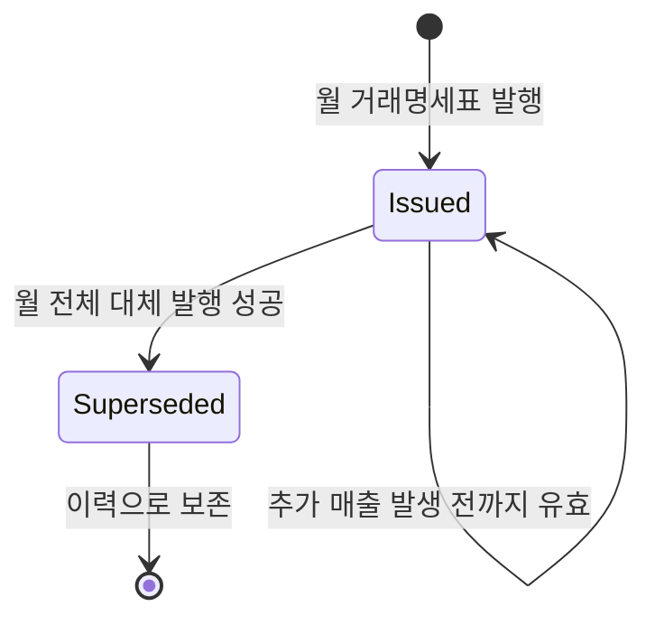
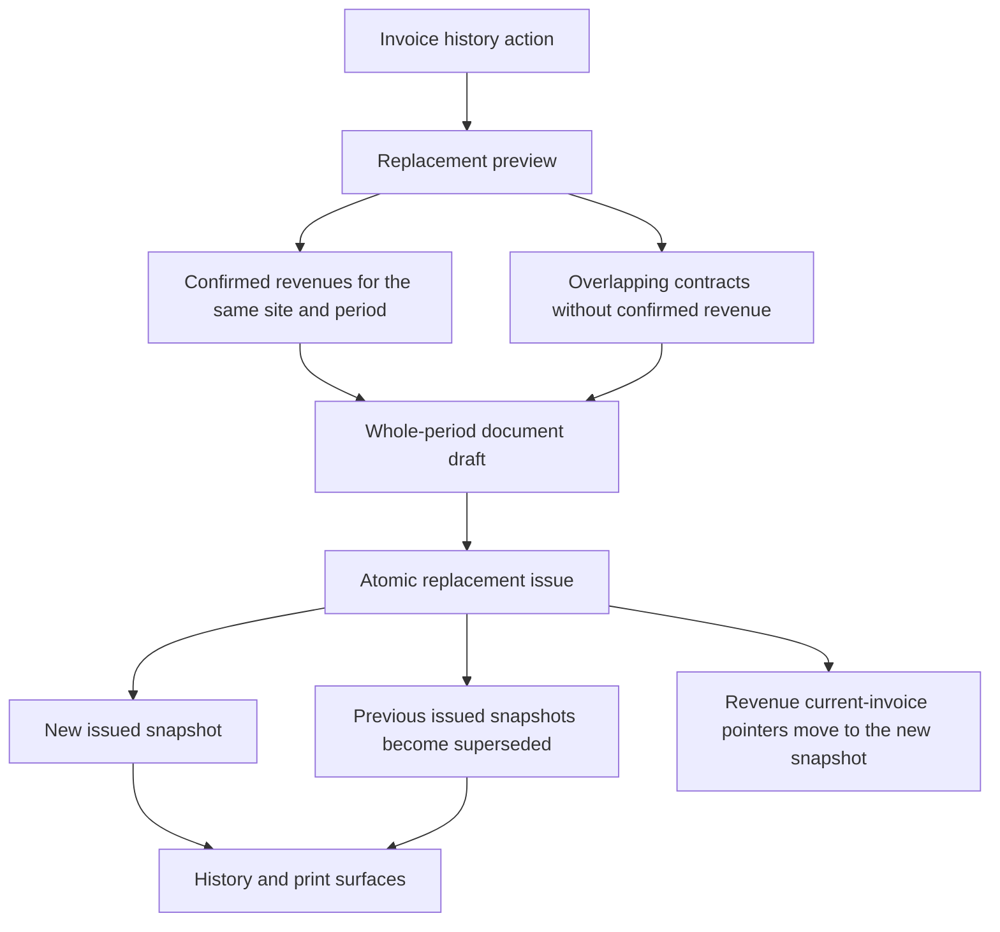
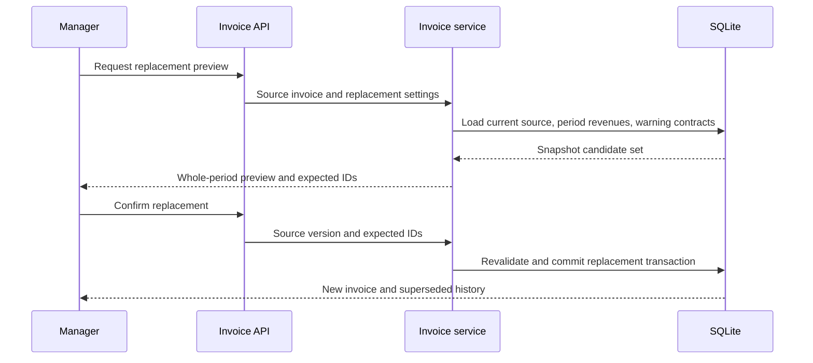

# Monthly Invoice Replacement Reissue - Plan

## Goal Capsule

- **Objective:** 월 중간에 거래명세표를 발행한 뒤 추가 계약 매출이 생겨도, 같은 현장과 귀속월의 확정 매출 전체를 포함한 최신 거래명세표를 다시 발행한다.
- **Product authority:** 관리자와 매니저가 대체 발행을 수행하며, 기존 발행본은 삭제하지 않고 대체 이력으로 보존한다.
- **Execution profile:** 영속 데이터 마이그레이션, 발행 트랜잭션, API, 발행 이력 UI와 인쇄 표시를 함께 변경하는 표준 깊이의 코드 작업이다.
- **Open blockers:** 없음.
- **Stop conditions:** 확정 매출을 거치지 않고 계약을 직접 발행하거나, 과거 발행 snapshot을 변경해야 한다면 구현을 중단하고 Product Contract를 다시 확인한다.
- **Tail ownership:** 구현자는 마이그레이션 호환성, 대체 발행 회귀 테스트, 인쇄 표시와 전체 품질 검사를 완료한 뒤 논리 단위로 커밋한다.

---

## Product Contract

### Summary

발행 이력의 거래명세표를 기준으로 같은 현장·같은 귀속기간의 확정 매출 전체를 다시 모아 새 발행번호로 대체 발행한다.
이전 발행본은 `대체됨` 이력으로 남기고 가장 최근 발행본만 유효한 문서로 취급한다.

### Problem Frame

실무에서는 보통 매월 20일 무렵 해당 월 거래명세표를 만들지만, 20일부터 말일까지 추가 계약이 발생할 수 있다.
Excel에서는 기존 문서 아래에 행을 추가해 월 전체 문서를 다시 만들 수 있지만, 현재 시스템에서는 한번 발행된 매출이 다음 발행 후보에서 제외되어 기존분과 추가분을 합친 문서를 만들 수 없다.
추가분만 별도 발행하면 거래처가 같은 월의 여러 문서를 합산해야 하고 어느 문서가 최종본인지 혼동할 수 있다.

### Key Decisions

- **불변 이력과 대체 발행:** 발행된 문서를 직접 수정하거나 삭제하지 않고 새 문서가 이전 문서를 대체하게 한다.
- **월 전체 자동 포함:** 사용자가 행을 다시 고르지 않아도 같은 현장·같은 귀속기간의 확정 매출 전체를 포함한다.
- **확정 매출 경계 유지:** 계약을 거래명세표에 직접 연결하거나 재발행 과정에서 매출을 자동 생성·확정하지 않는다.
- **새 발행번호:** 대체 발행본은 새 번호를 받고 이전 번호와의 관계를 이력에서 확인할 수 있다.

### Actors

- A1. **관리자:** 발행 이력을 확인하고 거래명세표를 대체 발행한다.
- A2. **매니저:** 관리자와 같은 대체 발행 흐름을 수행한다.
- A3. **조회 사용자:** 유효본과 대체된 과거본을 구분해 조회하고 재출력한다.

### Requirements

**대체 발행 준비**

- R1. 관리자와 매니저는 발행 이력의 거래명세표에서 대체 발행을 시작할 수 있어야 한다.
- R2. 대체 발행 대상은 선택한 문서와 같은 현장·같은 귀속기간의 확정 매출 전체여야 한다.
- R3. 기존 발행본에 포함됐던 매출도 대체 발행 후보에 다시 포함되어야 한다.
- R4. 최초 발행 뒤 새로 생성·확정된 매출은 별도 선택 없이 대체 발행본에 포함되어야 한다.
- R5. 귀속기간과 겹치는 진행 계약 중 확정 매출로 반영되지 않은 계약이 있으면 미리보기 전에 누락 가능성을 경고해야 한다.
- R6. 대체 발행은 기존 신규 발행과 동일하게 최종 문서 전체를 미리 보여줘야 한다.

**발행과 유효성**

- R7. 대체 발행본에는 기존 문서와 다른 새 발행번호를 부여해야 한다.
- R8. 대체 발행이 완료되면 직전 유효본은 `대체됨`이 되고 새 문서만 유효한 발행본이 되어야 한다.
- R9. 새 문서 생성과 이전 문서의 대체 처리는 함께 성공하거나 함께 실패해야 한다.
- R10. 대체된 문서는 발행 당시 내용 그대로 이력에 남아야 한다.
- R11. 대체된 문서를 조회하거나 재출력할 때는 현재 유효하지 않은 문서임을 분명히 표시해야 한다.
- R12. 이미 대체 발행한 문서에 추가 매출이 생기면 현재 유효본을 기준으로 다시 대체 발행할 수 있어야 한다.

**운영과 권한**

- R13. 조회 사용자는 대체 발행을 실행할 수 없어야 한다.
- R14. 발행 이력은 대체된 문서와 최신 유효본의 관계를 한눈에 구분할 수 있어야 한다.
- R15. 동시 작업으로 대상 매출이나 현재 유효본이 바뀌면 오래된 미리보기로 발행하지 않고 새로 확인하도록 안내해야 한다.
- R16. 대체 발행 이력에는 실행자, 실행 시각, 이전 발행번호, 새 발행번호가 남아야 한다.

### Document Lifecycle

한 현장·귀속기간에는 여러 과거본이 존재할 수 있지만 유효본은 하나만 존재한다.

### Key Flows

- F1. **추가 계약 매출을 포함한 대체 발행**
  - **Trigger:** A1 또는 A2가 발행 이력의 현재 유효본에서 대체 발행을 선택한다.
  - **Actors:** A1 또는 A2
  - **Steps:** 시스템이 같은 현장·귀속기간의 확정 매출 전체를 모으고 누락 가능 계약을 점검한다. 사용자가 전체 문서를 미리 본 뒤 발행한다.
  - **Outcome:** 새 번호의 월 전체 거래명세표가 유효본이 되고 이전 문서는 `대체됨`으로 남는다.

- F2. **대체 이력 확인과 재출력**
  - **Trigger:** A1, A2 또는 A3가 발행 이력을 조회한다.
  - **Actors:** A1, A2, A3
  - **Steps:** 최신 유효본과 대체된 과거본을 구분하고 발행번호 관계를 확인한다. 필요한 문서를 연다.
  - **Outcome:** 최신본은 정상 출력되고 과거본은 대체된 문서임이 표시된 상태로 확인된다.

### Acceptance Examples

- AE1. **Covers R2-R4.** 7월 20일 발행본에 확정 매출 3건이 포함된 뒤 7월 25일 추가 계약 매출 1건이 확정되면, 대체 발행 미리보기에는 같은 현장의 7월 확정 매출 4건이 모두 나온다.
- AE2. **Covers R5.** 7월 귀속기간과 겹치는 진행 계약에 확정 매출이 없으면, 시스템은 해당 계약이 거래명세표에서 빠질 수 있음을 발행 전에 알린다.
- AE3. **Covers R7-R11.** 대체 발행이 성공하면 새 번호의 문서만 유효하게 표시되고 기존 번호의 문서는 내용이 유지된 채 `대체됨`으로 표시된다.
- AE4. **Covers R9.** 새 문서 저장 또는 이전 문서 상태 변경 중 하나라도 실패하면 둘 다 반영되지 않는다.
- AE5. **Covers R12.** 첫 대체 발행 후 같은 달의 확정 매출이 다시 추가되면 현재 유효본에서 같은 절차를 반복해 월 전체 최신본을 만들 수 있다.
- AE6. **Covers R13.** 조회 사용자는 대체 이력과 문서를 볼 수 있지만 대체 발행 동작은 사용할 수 없다.
- AE7. **Covers R15.** 미리보기 이후 다른 사용자가 대체 발행하거나 대상 매출을 변경하면 발행을 중단하고 최신 상태로 다시 미리보게 한다.

### Success Criteria

- 월 중간 발행 후 추가 계약 매출이 생겨도 Excel에서 수작업으로 합본하지 않고 시스템에서 월 전체 최신본을 발행할 수 있다.
- 발행 이력에서 거래처에 전달해야 할 최신 유효본을 즉시 구분할 수 있다.
- 과거 발행 내용과 대체 관계가 삭제되지 않아 운영자가 발행 경위를 추적할 수 있다.

### Scope Boundaries

- 재발행 과정에서 계약 매출을 자동 생성하거나 확정하지 않는다.
- 발행된 거래명세표의 행, 금액, 귀속기간을 직접 수정하지 않는다.
- 기존 발행본을 삭제하거나 같은 발행번호로 덮어쓰지 않는다.
- 대체된 과거본과 최신본을 동시에 유효한 문서로 취급하지 않는다.
- 계약·매출 생성 규칙과 거래명세표 템플릿 편집 기능 자체는 변경하지 않는다.

### Dependencies / Assumptions

- 거래명세표에 포함될 추가 계약은 해당 월의 매출 생성과 확정이 먼저 완료되어야 한다.
- 대체 발행은 기존 문서의 현장과 귀속기간을 그대로 사용한다.
- 공급자 정보, 표시 방식, 메모와 출력 템플릿은 대체 발행 미리보기에서 현재 발행 설정을 사용한다.

### Sources / Research

- `src/lib/invoices/service.ts` — 현재 미발행 확정 매출만 후보로 조회하고 발행 매출의 중복 연결을 방지한다.
- `src/components/invoices/invoice-manager.tsx` — 현재 신규 발행, 미리보기, 발행 이력과 재출력 흐름을 제공한다.
- `prisma/schema.prisma` — 발행 문서, 발행 행, 원장 연결과 현재 발행 상태를 정의한다.
- `docs/plans/2026-07-12-002-feat-invoice-template-editor-plan.md` — 발행 당시 데이터와 템플릿을 보존하는 기존 계획을 정의한다.

---

## Planning Contract

### Product Contract Preservation

Product Contract unchanged.

### Key Technical Decisions

- KTD1. **현재 유효 발행본과 과거 포함 이력을 분리한다.** 매출은 현재 유효한 거래명세표를 가리키는 단일 연결을 갖고, 발행 행의 원장 연결은 문서별 snapshot 이력으로 중복 보존한다.
- KTD2. **대체 관계는 이전 문서가 새 문서를 가리킨다.** 같은 현장·귀속기간에 기존 유효본이 여러 개 있더라도 하나의 새 월 전체 문서가 모두를 대체할 수 있고, 반복 대체 발행은 자연스럽게 이력 체인을 만든다.
- KTD3. **대체 발행은 하나의 트랜잭션에서 수행한다.** 최신 유효본과 예상 매출 집합을 다시 확인하고, 새 문서·행·이력 연결 생성, 현재 연결 이동, 이전 문서 상태 변경과 감사 기록을 함께 반영한다.
- KTD4. **미리보기의 매출 ID 집합과 원본 문서 버전을 발행 시 재검증한다.** 미리보기 뒤 매출이나 유효본이 달라지면 자동으로 포함하거나 덮어쓰지 않고 새 미리보기를 요구한다.
- KTD5. **누락 가능 계약 경고는 비차단 점검이다.** 같은 현장·귀속기간과 겹치는 진행 계약 중 해당 기간의 확정 매출이 없는 계약을 알려주되, 계약 매출 생성과 확정은 기존 매출 화면에서 수행한다.
- KTD6. **대체된 문서는 snapshot 그대로 렌더링한다.** 인쇄 데이터는 수정하지 않고 문서 상태와 대체 발행번호를 별도 안내 영역으로 표시한다.

### High-Level Technical Design

현재 연결은 발행 후보와 대시보드의 미발행 판단에 사용하고, 문서별 원장 연결은 과거본 재출력과 발행 근거 추적에 사용한다.

### Data and Migration Contract

- 거래명세표 상태에 `SUPERSEDED`를 추가하고 과거 문서에서 이를 대체한 새 문서로 이어지는 선택적 관계와 대체 시각을 저장한다.
- 매출에는 현재 유효한 거래명세표를 가리키는 선택적 연결을 추가하고 기존 발행 연결을 기준으로 backfill한다.
- 문서별 원장 연결은 매출당 전역 유일 제약을 제거하고 문서·매출 조합의 유일성을 유지한다.
- 기존 데이터는 모두 현재 유효 발행본으로 간주하며 migration 후 신규 발행 후보와 대시보드 미발행 건수가 이전과 같아야 한다.

### Sequencing

1. 영속 모델과 기존 데이터 backfill을 먼저 적용해 현재 유효본의 단일 출처를 만든다.
2. 신규 발행 경로와 대시보드가 새 현재 연결을 사용하게 바꿔 기존 중복 방지를 유지한다.
3. 대체 발행 미리보기와 원자적 발행 서비스를 추가한다.
4. 발행 이력, 경고, 대체 발행 UI와 과거본 인쇄 표시를 연결한다.
5. 마이그레이션·서비스·UI 회귀 검증과 운영 문서를 마무리한다.

### System-Wide Impact

- **Data lifecycle:** 발행 snapshot은 계속 불변이며 `ISSUED` 문서만 현재 유효본으로 취급한다.
- **Authorization:** 기존 발행과 동일하게 관리자와 매니저만 대체 발행할 수 있고 조회 사용자는 이력과 출력만 사용한다.
- **Cardinality:** 매출 하나는 여러 발행 snapshot 이력에 포함될 수 있지만 현재 유효 발행본 연결은 최대 하나다.
- **Dashboard:** 미발행 확정 매출 판단은 과거 이력 개수가 아니라 현재 유효 발행본 연결 유무를 기준으로 한다.
- **Concurrency:** 원본 버전, 예상 매출 ID 집합과 현재 연결 이동 건수를 모두 검증해 오래된 미리보기를 거부한다.

### Risks & Dependencies

- 기존 발행 연결 backfill이 누락되면 이미 발행된 매출이 신규 후보로 다시 노출될 수 있으므로 disposable SQLite에서 migration 전후 건수를 검증한다.
- 같은 매출이 범위가 다른 유효 거래명세표에 연결된 경우 대체 범위를 자동 확장하지 않고 충돌로 중단한다.
- 인쇄 화면의 대체 안내가 실제 문서 내용을 밀어내거나 페이지 분할을 바꾸지 않도록 안내 영역을 인쇄 문서 바깥 또는 고정 오버레이로 유지한다.
- 기존 거래명세표 템플릿 snapshot과 새 대체 상태 표시는 서로 독립적으로 렌더링한다.

---

## Implementation Units

### U1. Persist current assignment and replacement history

- **Goal:** 과거 발행 이력과 현재 유효 발행본을 함께 표현하고 기존 데이터를 안전하게 backfill한다.
- **Requirements:** R3, R7-R12, R14-R16; AE3-AE5
- **Dependencies:** 없음.
- **Files:** `prisma/schema.prisma`, `prisma/migrations/<timestamp>_invoice_replacement_reissue/migration.sql`, `src/generated/prisma/**`, `src/lib/invoices/replacement-policy.ts`, `src/lib/invoices/replacement-policy.test.ts`
- **Approach:** `SUPERSEDED` 상태, 문서의 대체 관계와 대체 시각, 매출의 현재 유효 문서 연결을 추가한다. 문서별 원장 연결은 복수 snapshot을 허용하되 같은 문서 안의 중복은 막는다. 기존 고유 연결을 현재 연결로 backfill한 뒤 제약과 인덱스를 전환한다.
- **Execution note:** disposable SQLite에 기존 형태의 발행 데이터가 있는 상태에서 migration을 적용하는 검증을 먼저 확보한다.
- **Patterns to follow:** 기존 `InvoiceDocument`, `InvoiceRevenueLink`, nullable snapshot migration과 Prisma 7 SQLite migration 형식.
- **Test scenarios:**
  - 기존 발행 문서와 원장 연결이 있는 데이터에 migration을 적용하면 각 매출의 현재 문서 연결이 원래 발행본으로 채워진다.
  - 같은 매출이 서로 다른 과거·현재 문서 snapshot에 포함될 수 있지만 한 문서 안에서는 중복 연결되지 않는다.
  - 상태 전이 정책은 `ISSUED` 문서만 대체 대상으로 허용하고 `SUPERSEDED` 문서의 직접 재대체를 거부한다.
- **Verification:** 생성된 Prisma client가 새 관계와 상태를 제공하고 migration 전후 기존 발행 후보 수가 변하지 않는다.

### U2. Add atomic replacement preview and issue services

- **Goal:** 월 전체 확정 매출을 미리보고 오래된 상태를 거부하며 새 유효본으로 원자적으로 교체한다.
- **Requirements:** R1-R10, R12, R13, R15, R16; F1; AE1-AE7
- **Dependencies:** U1
- **Files:** `src/lib/invoices/schemas.ts`, `src/lib/invoices/service.ts`, `src/lib/invoices/service.test.ts`, `src/lib/invoices/template-snapshot.test.ts`, `src/app/api/invoices/[id]/replacement-preview/route.ts`, `src/app/api/invoices/[id]/replace/route.ts`, `src/app/api/invoices/route.ts`, `src/app/api/invoices/candidates/route.ts`, `src/app/(main)/page.tsx`
- **Approach:** 원본 문서의 현장·귀속기간으로 확정 매출 전체와 누락 가능 계약을 조회한다. 미리보기는 예상 매출 ID와 원본 버전을 반환하고 발행은 이를 재검증한다. 새 문서를 만든 뒤 같은 현장·귀속기간의 현재 유효본을 `SUPERSEDED`로 바꾸고 모든 현재 매출 연결을 새 문서로 이동한다. 신규 발행과 대시보드는 현재 연결을 기준으로 중복과 미발행을 판단한다.
- **Execution note:** 원본 버전 충돌과 예상 매출 집합 변경을 실패 테스트로 고정한 뒤 트랜잭션을 구현한다.
- **Patterns to follow:** `src/lib/invoices/service.ts`의 발행 snapshot 트랜잭션, `src/lib/invoice-templates/service.ts`의 버전 충돌 처리, API route의 `requireUser` 역할 경계와 `errorResponse`.
- **Test scenarios:**
  - Covers AE1. 기존 3건과 새 확정 매출 1건이 있는 현장·월을 미리보면 4건 전체와 정확한 합계가 나온다.
  - Covers AE2. 기간과 겹치는 진행 계약에 확정 매출이 없으면 경고 목록에 나오지만 미리보기는 생성된다.
  - Covers AE3 / AE4. 대체 발행이 성공하면 새 번호와 snapshot이 생성되고 이전 유효본, 현재 매출 연결과 감사 이력이 같은 트랜잭션에서 갱신된다.
  - Covers AE5. 첫 대체 발행 후 새 확정 매출을 추가하면 현재 유효본 기준으로 다시 대체할 수 있다.
  - 원본이 이미 대체됐거나 원본 버전이 바뀌면 409 충돌로 새 미리보기를 요구한다.
  - 미리보기 후 확정 매출 ID 집합이 추가·취소되면 발행을 거부한다.
  - 범위 안 매출이 다른 귀속기간의 유효 문서에 연결되어 있으면 자동으로 그 문서를 대체하지 않고 충돌을 반환한다.
  - Covers AE6. 조회 사용자의 두 대체 발행 API 요청은 권한 오류가 된다.
- **Verification:** 서비스 테스트가 월 전체 선택, 경고, 원자적 상태 전이, 반복 대체와 충돌 경로를 증명하고 기존 신규 발행 테스트가 통과한다.

### U3. Expose replacement history, preview, and invalid-print marking

- **Goal:** 운영자가 최신본과 과거본을 구분하고 월 전체 미리보기에서 대체 발행을 완료한다.
- **Requirements:** R1, R5-R8, R10-R14; F1, F2; AE1-AE3, AE5-AE7
- **Dependencies:** U2
- **Files:** `src/components/invoices/invoice-manager.tsx`, `src/components/invoices/invoice-document.tsx`, `src/components/invoices/invoice-document.test.tsx`, `src/components/workflow-contract.test.ts`, `src/app/(main)/invoices/page.tsx`, `src/app/(main)/invoices/print/page.tsx`
- **Approach:** 발행 이력에 `유효`와 `대체됨` 상태, 대체 발행번호와 권한별 동작을 표시한다. 현재 유효본에서 대체 발행을 열면 발행일·표시 방식·템플릿·메모를 확인하고 월 전체 미리보기와 누락 가능 계약 경고를 본 뒤 확정한다. 대체된 문서의 화면과 인쇄물에는 유효하지 않은 과거본임을 표시한다.
- **Execution note:** 기존 발행·재출력 UI의 source-contract 테스트를 확장하고 인쇄 markup 회귀 테스트로 대체 안내의 위치를 고정한다.
- **Patterns to follow:** `InvoiceManager`의 신규 발행 preview 상태, `InvoiceDocumentPages`의 snapshot 렌더링, 기존 Badge·Dialog·toast 사용 방식.
- **Test scenarios:**
  - 현재 유효본에는 관리자·매니저용 대체 발행 동작이 보이고 대체된 행과 조회 사용자에게는 보이지 않는다.
  - Covers AE1 / AE2. 대체 미리보기에는 전체 매출 문서와 누락 가능 계약 경고가 함께 표시된다.
  - Covers AE3. 발행 성공 후 기존 행은 `대체됨`과 새 발행번호를 표시하고 새 행은 `유효`로 표시된다.
  - Covers AE5. 새 유효본에서 대체 발행 동작을 다시 시작할 수 있다.
  - Covers AE7. 충돌 응답은 현재 dialog를 확정하지 않고 새 미리보기를 안내한다.
  - 대체된 문서의 재출력에는 상태 안내가 보이지만 A4 본문 행과 템플릿 snapshot은 변하지 않는다.
- **Verification:** 데스크톱과 좁은 화면에서 발행 이력, dialog, 경고와 버튼이 겹치지 않고 과거본 인쇄 표시가 명확하다.

### U4. Complete migration, dashboard, and operator verification

- **Goal:** 신규 발행 회귀를 막고 운영자가 대체 발행 조건과 결과를 이해할 수 있게 마무리한다.
- **Requirements:** R2-R5, R8, R11, R14-R16; Success Criteria
- **Dependencies:** U1-U3
- **Files:** `src/lib/dashboard/action-desk.ts`, `src/lib/dashboard/action-desk.test.ts`, `USER_GUIDE.md`, `OPERATIONS_GUIDE.md`
- **Approach:** 대시보드의 미발행 확정 매출 집계를 현재 유효 문서 연결 기준으로 전환한다. 사용자 안내에는 추가 계약의 매출 생성·확정 선행 조건, 대체 발행 순서, 최신본 식별과 과거본 처리 방식을 추가한다.
- **Patterns to follow:** `USER_GUIDE.md`의 화면별 절차, `OPERATIONS_GUIDE.md`의 거래명세표 인수 점검, `action-desk`의 순수 요약 테스트.
- **Test scenarios:**
  - 과거 snapshot 연결만 있고 현재 문서 연결이 없는 확정 매출은 미발행으로 집계된다.
  - 현재 문서 연결이 있는 확정 매출은 과거 snapshot 수와 관계없이 미발행에서 제외된다.
  - 운영 안내는 추가 계약 등록만으로 재발행에 포함되지 않고 해당 월 매출 생성·확정이 필요함을 설명한다.
  - 인수 절차는 첫 발행, 추가 매출 대체 발행, 반복 대체, 과거본 재출력과 조회 사용자 권한을 포함한다.
- **Verification:** 대시보드 집계 테스트와 문서 검사가 통과하고 운영자가 Excel 합본 없이 end-to-end 절차를 수행할 수 있다.

---

## Verification Contract

| Gate | Units | Command or check | Expected result |
|---|---|---|---|
| Prisma generation | U1-U2 | `npm run db:generate` | 새 상태와 관계가 생성 client에 반영된다. |
| Migration compatibility | U1, U4 | 기존 발행 데이터가 있는 disposable SQLite에 `npm run db:deploy` | 기존 발행 매출의 현재 연결이 backfill되고 후보 수가 유지된다. |
| Invoice service tests | U1-U2 | `npm test -- src/lib/invoices/replacement-policy.test.ts src/lib/invoices/service.test.ts src/lib/invoices/calculation.test.ts src/lib/invoices/template-snapshot.test.ts` | 대체 발행, 충돌, 기존 발행 계산이 모두 통과한다. |
| UI and print tests | U3 | `npm test -- src/components/invoices/invoice-document.test.tsx src/components/workflow-contract.test.ts` | 상태 표시, 권한 동작과 인쇄 snapshot 계약이 통과한다. |
| Dashboard tests | U4 | `npm test -- src/lib/dashboard/action-desk.test.ts` | 현재 연결 기준 미발행 집계가 통과한다. |
| Static quality | U1-U4 | `npm run lint` and `npm run typecheck` | lint와 TypeScript 오류가 없다. |
| Production build | U1-U4 | `npm run build` | Next.js production build가 성공한다. |
| Browser workflow | U3-U4 | 관리자·매니저·조회 사용자로 `/invoices` 흐름 확인 | 월 전체 대체 발행, 최신본 식별, 과거본 재출력과 권한이 요구사항대로 동작한다. |
| Diff hygiene | U1-U4 | `git diff --check` | 공백 오류와 충돌 표식이 없다. |

---

## Definition of Done

- U1-U4가 요구사항과 연결된 테스트 시나리오를 만족한다.
- 기존 발행 데이터 migration 후 이미 발행된 매출이 신규 후보나 미발행 대시보드에 다시 나타나지 않는다.
- 같은 현장·귀속기간의 확정 매출 전체가 새 발행번호의 거래명세표에 포함된다.
- 대체 발행 성공 시 이전 유효본은 `SUPERSEDED`, 새 문서는 `ISSUED`가 되고 현재 매출 연결은 모두 새 문서를 가리킨다.
- 대체된 과거본의 snapshot은 변경되지 않고 화면과 인쇄에서 유효하지 않음이 표시된다.
- 오래된 미리보기, 다른 기간 유효본 충돌과 권한 오류가 안전하게 거부된다.
- lint, typecheck, 관련 테스트, production build와 browser workflow가 통과한다.
- 사용자·운영 문서가 추가 계약의 매출 확정 선행 조건과 대체 발행 절차를 설명한다.
- 실패한 접근에서 남은 코드, 임시 데이터와 사용하지 않는 migration 산출물이 diff에 남지 않는다.
- 변경사항이 문서·영속/서비스·UI/운영처럼 검토 가능한 논리 단위로 커밋된다.
