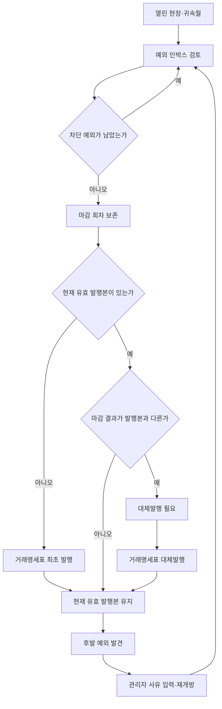
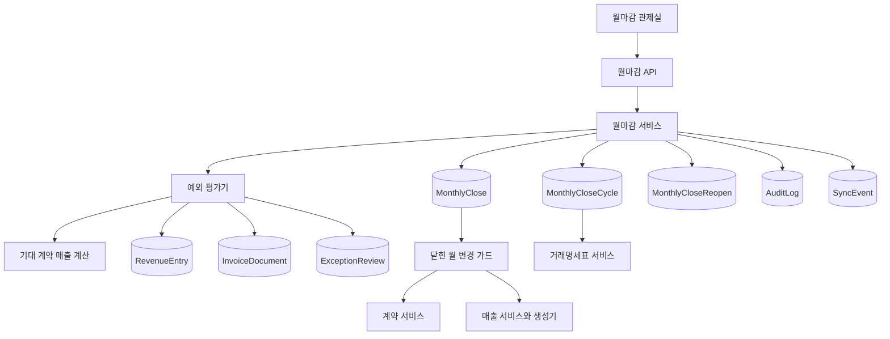
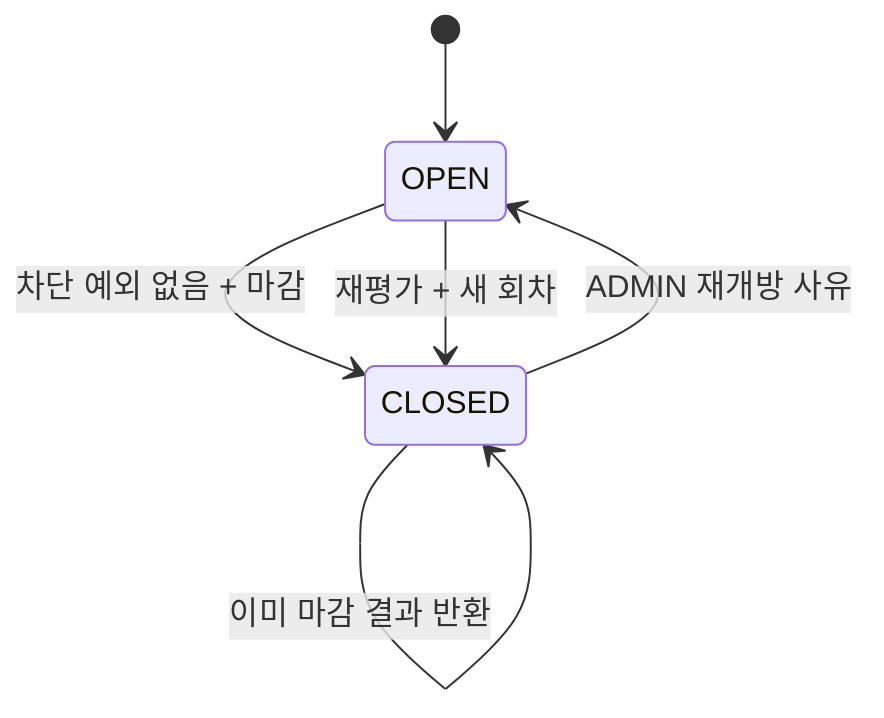

# 월마감 관제실 - Plan

## Goal Capsule

- **Objective:** 계약 기준에서 벗어난 매출과 발행 변화를 월마감 전에 인지하고, 현장별 또는 전체 월 단위로 검토·마감·재개방·거래명세표 발행을 통제한다.
- **Product authority:** 이 문서의 Product Contract가 월마감 관제실의 사용자 동작, 상태 경계, 권한, 마감과 거래명세표의 관계를 결정한다.
- **Technical authority:** Planning Contract의 KTD와 Implementation Units가 구현 경계와 순서를 결정하며, 충돌 시 Product Contract를 우선한다.
- **Execution profile:** 데이터 모델, 서비스 경계, API, 전용 관제 화면, 기존 거래명세표 연계를 포함하는 Deep 코드 계획이다.
- **Stop conditions:** 마감된 월을 우회해 변경하거나 발행할 수 있는 경로, 과거 마감 회차를 덮어쓰는 설계, 실행 시점 재검증이 없는 설계가 발견되면 구현을 중단하고 계획을 다시 확인한다.
- **Tail ownership:** 마지막 구현 단위가 전체 회귀 검증, 운영 문서, 마이그레이션 검증, 수동 브라우저 시나리오와 미사용 실험 코드 정리를 책임진다.
- **Open blockers:** 없음.
- **Product Contract preservation:** ce-brainstorm에서 확정한 R/A/F/AE ID와 의미를 유지하고, 구현 계획 확인에서 확정된 동작만 R25-R29 및 AE7-AE8로 추가했다.

---

## Product Contract

### Summary

월마감 관제실은 기존 계약 매출 생성, 월별 집계, 거래명세표 발행 흐름을 연결하는 전용 업무 화면으로 구현한다.
정상 매출은 기본적으로 숨기고 계약·원장 금액 차이, 직접 입력, 작성 중 매출, 대체발행 이력을 중심으로 검토·마감·재개방·재발행 판단을 수행한다.

### Problem Frame

현재 제품은 계약별 자동 매출 생성, 건별 확정, 월별 작성 중·0원 예외, 거래명세표 최초·대체발행을 각각 지원한다.
그러나 담당자가 한 달을 마감할 때 계약 기준과 다른 단가·금액, 계약에 연결되지 않은 직접 입력, 발행 후 대체발행 이력을 한 작업 흐름에서 인지할 수 없다.

특히 월 중 거래명세표를 발행한 뒤 예외 매출이 발생할 수 있으므로 마감은 되돌릴 수 없는 잠금이 될 수 없다.
동시에 재개방이 과거 마감과 발행 이력을 덮어쓰면 월별 금액이 왜 바뀌었는지 설명할 수 없다.

### Key Decisions

- **예외 인박스 중심:** 정상 건은 기본 목록에서 숨기고 사용자가 판단해야 하는 건만 노출한다.
- **선별 차단:** 설명 없는 계약·원장 금액 차이, 사유 미확인 직접 입력, 작성 중 매출이 마감을 막으며 대체발행 이력과 0원 자체는 마감을 막지 않는다.
- **단일 마감과 통제된 재개방:** 청구 마감과 최종 마감을 분리하지 않고 하나의 마감 행위를 사용한다.
- **마감 회차 보존:** 재개방과 재마감은 이전 마감 결과를 수정하지 않고 새로운 회차로 남긴다.
- **부분 성공 일괄 마감:** 전체 마감은 닫을 수 있는 현장만 마감하고 차단된 현장은 열린 상태로 유지한다.
- **닫힌 월 변경 차단:** 마감된 현장·귀속월에 영향을 주는 계약·매출 변경은 관리자 재개방 전까지 거부한다.
- **현재 발행본 유지:** 재개방해도 기존 거래명세표는 대체발행 전까지 유효하며 관제실이 실제 차이가 있을 때만 대체발행 필요 상태를 표시한다.

### Actors

- A1. **매니저** — 예외를 검토·해결하고 현장별 또는 전체 마감을 실행하며 거래명세표를 발행한다.
- A2. **관리자** — 매니저의 권한을 모두 가지며 사유를 입력해 닫힌 현장을 재개방한다.
- A3. **조회 사용자** — 마감 상태, 예외, 마감 회차, 거래명세표 이력을 조회하지만 변경하지 않는다.

### Requirements

**예외 인지와 해결**

- R1. 관제실은 선택한 귀속월의 현장별 예외를 계약·원장 금액 차이, 직접 입력, 대체발행 이력으로 분류한다.
- R2. 계약 기준과 다른 단가 또는 금액은 계약 기준값, 원장값, 차액, 관련 현장을 함께 보여준다.
- R3. 직접 입력 매출은 연결 계약이 없는 흐름임을 표시하고 검토 사유가 확인되기 전까지 차단 예외로 취급한다.
- R4. 금액 차이는 원장 수정 또는 예외 설명 확인으로 해결할 수 있어야 한다.
- R5. 대체발행 이력은 현재 유효본과 대체된 과거본을 구분해 보여주되 마감을 차단하지 않는다.
- R6. 정상 건은 기본 인박스에서 숨기되 사용자가 전체 건을 별도로 확인할 수 있어야 한다.

**마감 행위와 상태**

- R7. 매니저는 현장 하나를 선택해 해당 현장·귀속월을 마감할 수 있어야 한다.
- R8. 매니저는 선택한 귀속월의 전체 대상 현장에 일괄 마감을 실행할 수 있어야 한다.
- R9. 차단 예외가 남은 현장은 마감할 수 없으며 차단 사유를 사용자에게 보여줘야 한다.
- R10. 전체 마감은 차단 예외가 없는 현장만 마감하고 성공·차단·이미 마감된 현장 결과를 구분해 보고해야 한다.
- R11. 해당 월은 모든 대상 현장이 마감된 경우에만 전체 마감 완료로 표시한다.
- R12. 각 마감 회차는 대상 현장·귀속월, 당시 금액 합계, 예외 확인 결과, 수행자, 수행 시각을 보존한다.

**재개방과 재마감**

- R13. 관리자만 닫힌 현장·귀속월을 재개방할 수 있어야 한다.
- R14. 관리자는 재개방 사유를 반드시 입력해야 하며 해당 사유는 이전 마감 회차와 연결되어야 한다.
- R15. 재개방은 이전 마감 회차를 변경하거나 삭제하지 않아야 한다.
- R16. 재개방된 현장은 열린 상태로 예외를 다시 평가하고 매니저가 새로운 마감 회차를 생성할 수 있어야 한다.

**거래명세표 연결**

- R17. 거래명세표 최초 발행은 마감된 현장·귀속월에서만 시작할 수 있어야 한다.
- R18. 거래명세표가 발행된 현장을 재개방해도 현재 유효본은 그대로 유지되어야 한다.
- R19. 발행된 현장을 재마감하면 관제실은 새로운 마감 결과와 현재 유효본의 차이를 인지해 대체발행 필요 상태를 표시해야 한다.
- R20. 대체발행이 완료되면 새 발행본을 현재 유효본으로, 이전 발행본을 대체된 과거본으로 표시해야 한다.

**권한과 추적성**

- R21. 매니저와 관리자만 예외 확인, 마감, 거래명세표 발행을 수행할 수 있어야 한다.
- R22. 조회 사용자는 관제실의 모든 상태와 이력을 조회할 수 있지만 예외 확인·마감·재개방·발행을 수행할 수 없어야 한다.
- R23. 예외 확인, 마감, 재개방, 재마감, 최초 발행, 대체발행은 수행자와 시각을 추적할 수 있어야 한다.
- R24. 다른 사용자의 변경으로 관제실의 금액·예외·발행 상태가 달라졌다면 실행 전 최신 상태를 다시 확인하고 오래된 작업을 중단해야 한다.

**확정된 구현 경계**

- R25. 마감된 현장·귀속월에 영향을 주는 계약 생성·수정, 계약 매출 재생성, 매출 생성·수정·확정·취소는 관리자 재개방 전까지 차단한다.
- R26. 전체 마감 대상은 해당 월과 겹치는 유효 계약, 취소되지 않은 매출, 거래명세표 또는 기존 마감 이력이 하나라도 있는 현장으로 한정한다.
- R27. 직접 입력 예외는 `MANUAL`과 `ADJUSTMENT` 매출을 모두 포함하며 각각 현재 데이터와 별도의 매니저 검토 기록을 요구한다.
- R28. `DRAFT` 매출은 마감을 차단하고, 0원 매출은 계약 차이 또는 미검토 직접 입력 조건이 없는 한 그 자체로 마감을 차단하지 않는다.
- R29. 재마감 결과의 확정 매출 집합과 금액이 현재 유효 거래명세표와 같다면 대체발행 필요 상태를 표시하지 않는다.

### Key Flows

- F1. 현장별 월마감
  - **Trigger:** 매니저가 귀속월과 현장을 선택한다.
  - **Actors:** A1, A2
  - **Steps:** 관제실이 예외를 분류하고 차단 예외를 해결한 뒤 마감을 실행한다.
  - **Outcome:** 현장·귀속월이 닫히고 당시 합계와 검토 결과가 새 마감 회차로 보존된다.
  - **Covered by:** R1-R7, R9, R12, R21, R23-R29

- F2. 전체 월 일괄 마감
  - **Trigger:** 매니저가 선택한 귀속월에 전체 마감을 실행한다.
  - **Actors:** A1, A2
  - **Steps:** 시스템이 현장별 차단 여부를 다시 계산하고 닫을 수 있는 현장만 마감한다.
  - **Outcome:** 성공·차단·이미 마감 결과가 보고되며 모든 대상 현장이 닫힌 경우에만 월이 완료로 표시된다.
  - **Covered by:** R8-R12, R21, R23-R26, R28

- F3. 마감 재개방과 재마감
  - **Trigger:** 마감 후 계약·단가 차이 또는 직접 입력 예외가 발견된다.
  - **Actors:** A2, 이후 A1 또는 A2
  - **Steps:** 관리자가 사유를 입력해 현장을 재개방하고 매니저가 예외를 해결한 뒤 재마감한다.
  - **Outcome:** 이전 마감 회차는 보존되고 새로운 마감 회차가 추가된다.
  - **Covered by:** R13-R16, R23-R25

- F4. 재마감 후 거래명세표 대체발행
  - **Trigger:** 거래명세표가 발행된 현장이 재개방 후 새로운 결과로 재마감된다.
  - **Actors:** A1, A2
  - **Steps:** 현재 발행본을 유지한 채 대체발행 필요 상태를 확인하고 기존 대체발행 흐름을 수행한다.
  - **Outcome:** 차이가 있으면 새 발행본이 유효본이 되고 이전 발행본은 이력을 유지하며, 차이가 없으면 현재 유효본을 계속 사용한다.
  - **Covered by:** R17-R20, R23-R24, R29

### Acceptance Examples

- AE1. 설명 없는 계약·원장 금액 차이
  - **Covers R2, R4, R9.**
  - **Given:** 계약 기준과 원장 금액이 다르고 확인된 예외 설명이 없다.
  - **When:** 매니저가 해당 현장을 마감한다.
  - **Then:** 마감은 중단되고 계약 기준값, 원장값, 차액과 해결 방법이 표시된다.

- AE2. 사유가 확인된 직접 입력
  - **Covers R3, R9, R27.**
  - **Given:** 계약에 연결되지 않은 직접 입력 매출에 매니저 검토 사유가 확인되었다.
  - **When:** 매니저가 해당 현장을 마감한다.
  - **Then:** 직접 입력은 인지 가능한 예외로 남지만 마감을 차단하지 않는다.

- AE3. 대체발행 이력만 존재
  - **Covers R5, R9, R20.**
  - **Given:** 현장에 현재 유효본과 대체된 과거 거래명세표가 있고 다른 차단 예외는 없다.
  - **When:** 매니저가 해당 현장을 마감한다.
  - **Then:** 대체발행 이력이 표시되며 마감은 허용된다.

- AE4. 일부 현장만 마감 가능한 전체 마감
  - **Covers R8-R11, R26.**
  - **Given:** 열 개 대상 현장 중 두 현장에 차단 예외가 남아 있다.
  - **When:** 매니저가 전체 마감을 실행한다.
  - **Then:** 여덟 현장은 마감되고 두 현장은 차단 사유와 함께 열린 상태로 남으며 월은 완료로 표시되지 않는다.

- AE5. 발행 후 재개방
  - **Covers R13-R19, R25.**
  - **Given:** 현장·귀속월이 마감되고 거래명세표가 발행되었다.
  - **When:** 관리자가 사유를 입력해 재개방하고 매니저가 수정 후 재마감한다.
  - **Then:** 기존 발행본은 계속 유효하고 변경된 경우에만 대체발행 필요 상태가 표시되며 이전 마감 회차도 보존된다.

- AE6. 실행 직전 상태 변경
  - **Covers R24.**
  - **Given:** 매니저가 관제실을 연 뒤 다른 사용자가 관련 매출이나 발행 상태를 변경했다.
  - **When:** 매니저가 마감 또는 발행을 실행한다.
  - **Then:** 오래된 실행은 중단되고 최신 예외와 금액을 다시 확인하도록 안내한다.

- AE7. 작성 중 매출과 0원 매출
  - **Covers R9, R28.**
  - **Given:** 한 현장에는 작성 중 매출이 있고 다른 현장에는 검토가 끝난 0원 직접 입력만 있다.
  - **When:** 매니저가 전체 마감을 실행한다.
  - **Then:** 작성 중 매출이 있는 현장만 차단되고 검토가 끝난 0원 현장은 마감된다.

- AE8. 변경 없는 재개방과 재마감
  - **Covers R18-R19, R29.**
  - **Given:** 거래명세표 발행 후 현장을 재개방했지만 확정 매출 집합과 금액이 바뀌지 않았다.
  - **When:** 매니저가 현장을 재마감한다.
  - **Then:** 현재 유효본은 유지되고 대체발행 필요 상태는 표시되지 않는다.

### Success Criteria

- 차단 예외가 남은 현장은 어떤 마감 API 경로로도 마감되지 않는다.
- 닫힌 현장·귀속월은 관련 계약·매출 서비스 경로에서 변경되지 않는다.
- 전체 마감 결과의 성공·차단·기처리 현장 수가 실제 현장 상태와 일치한다.
- 사용자는 현장·귀속월의 모든 마감 회차와 재개방 사유를 시간순으로 추적할 수 있다.
- 마감된 확정 매출 집합·금액과 최초·대체발행 거래명세표의 관계를 관제실에서 설명할 수 있다.
- 정상 건을 기본적으로 숨겨 담당자가 차단 예외와 발행 후 변경에 집중할 수 있다.

### Scope Boundaries

- 외부 전자세금계산서 발행, 연동, 상태 관리는 포함하지 않는다.
- 청구 마감과 최종 마감을 분리하는 두 단계 마감은 포함하지 않는다.
- 입금·미수금·수금 관리는 포함하지 않는다.
- 자동 이메일·메신저 알림은 포함하지 않는다.
- 대시보드 전체 재설계, 기존 월별 현황 표의 구조 개편, 거래명세표 서식 개편은 포함하지 않는다.
- 마감 이력의 삭제·수정 기능과 강제 우회 발행 기능은 포함하지 않는다.

### Dependencies / Assumptions

- 귀속월은 현재 매출 원장의 `revenueDate` 기준 월을 따른다.
- 계약 기준 차이는 활성 계약과 활성 계약 품목으로 해당 월에 생성될 기대 매출을 다시 계산한 결과를 기준으로 판단한다.
- 거래명세표의 현재 유효본과 대체된 과거본 구분은 기존 `InvoiceDocument.status`, `InvoiceRevenueLink`, `RevenueEntry.currentInvoiceDocumentId`를 권위 있는 기준으로 사용한다.
- 마감은 매출·발행 데이터를 삭제하거나 복제하는 행위가 아니라 검토 결과와 당시 합계를 고정하는 업무 상태다.
- 기존 SQLite WAL과 Prisma 트랜잭션 경계를 유지하며 별도 큐, 분산 잠금, 외부 저장소를 도입하지 않는다.

### Sources / Research

- `IMPLEMENTATION_PLAN.md` — 계약 자동 매출, 월마감, 예외 경고, 확정 후 수정 규칙
- `src/lib/revenues/generator.ts`와 `src/lib/revenues/generation-policy.ts` — 기대 계약 매출, 보호된 확정 매출, 재생성 정책
- `src/lib/contracts/impact.ts`와 `src/lib/contracts/service.ts` — 계약 변경 영향 월 계산과 버전 조건부 갱신
- `src/lib/reports/monthly.ts`와 `src/lib/reports/monthly-exceptions.ts` — 현장×월 집계와 현재 작성 중·0원 신호
- `src/lib/invoices/service.ts`와 `src/lib/invoices/replacement-policy.ts` — 최초·대체발행, 현재 유효본, 매출 집합 및 버전 재검증
- `src/lib/audit/record.ts`, `src/lib/events/bus.ts`, `src/components/realtime-provider.tsx` — 감사 로그와 실시간 갱신 패턴
- [Microsoft Dynamics GP General Ledger](https://learn.microsoft.com/en-us/dynamics-gp/financials/general-ledger) — 닫힌 기간의 입력 차단, 재개방, 조정과 감사 추적 관행
- [Oracle Receivables Opening and Closing Accounting Periods](https://docs.oracle.com/cd/A60725_05/html/comnls/us/ar/opnclose.htm) — 미처리 거래의 사전 점검과 닫힌 기간 입력 제한 관행
- [SAP Opening and Closing Posting Periods](https://help.sap.com/docs/SAP_S4HANA_ON-PREMISE/4444aa0b589b4c0d8cd1f24156e6a684/d152ef09c11b43cfae998b09c8be8095.html) — 예외적 재개방과 원래 처리 시점 추적 관행
- `docs/ideation/2026-07-12-whole-repo-next-directions-ideation.html` — 전체 저장소 재탐색에서 선정한 월마감 관제실 방향

---

## Planning Contract

### Key Technical Decisions

- KTD1. **기대 매출 계산을 재사용 가능한 순수 도메인 계층으로 분리한다.** `src/lib/revenues/generator.ts` 안의 계약별 초안 계산을 `src/lib/revenues/expected.ts`로 추출하고, 기존 미리보기·생성과 월마감 예외 평가가 동일한 결과를 사용하게 한다.
- KTD2. **예외 판정은 현재 데이터를 매번 계산하고 검토 기록만 영속화한다.** 계산된 예외를 별도 테이블에 복제하지 않아 원장과의 이중 진실원을 피하고, `exceptionKey`와 입력 `fingerprint`가 일치하는 검토만 현재 유효한 것으로 본다.
- KTD3. **현재 상태와 불변 이력을 분리한다.** `MonthlyClose`는 현장·월의 현재 OPEN/CLOSED와 버전을 보관하고, `MonthlyCloseCycle`과 `MonthlyCloseReopen`은 마감 스냅샷과 재개방 사유를 append-only로 보존한다.
- KTD4. **마감 스냅샷은 발행 가능한 확정 매출 집합을 고정한다.** 회차에는 확정 매출 ID, 금액 합계, 계약 기대값, 유효 검토, 예외 요약의 canonical JSON과 SHA-256 fingerprint를 저장하며 DRAFT와 CANCELED는 발행 집합에서 제외한다.
- KTD5. **일괄 마감은 현장별 독립 트랜잭션으로 실행한다.** 각 현장을 같은 서비스 함수로 다시 평가하고 닫아 부분 성공을 보장하며, 전체 월을 하나의 트랜잭션으로 감싸지 않는다.
- KTD6. **동시성은 미리보기 fingerprint와 버전 CAS를 함께 사용한다.** 마감·재개방·발행 commit 직전에 입력을 다시 계산하고 `MonthlyClose.version` 조건부 갱신이 실패하거나 fingerprint가 달라지면 오래된 실행을 거부한다.
- KTD7. **닫힌 월 잠금은 UI가 아닌 서비스 경계에서 강제한다.** 계약 생성·수정, 계약 매출 생성, 매출 생성·수정·확정·취소가 영향을 주는 모든 현장·월을 계산해 `assertMonthsOpen`을 통과해야 하며 API 우회도 같은 오류를 받는다.
- KTD8. **거래명세표 최초 발행은 임의 매출 ID가 아니라 최신 마감 회차를 권위로 삼는다.** close-aware 발행 입력은 현장·월별 cycle ID를 전달하고 서버가 snapshot의 확정 매출 전체를 다시 불러오므로 500건 후보 제한이나 부분 선택으로 마감 금액과 문서가 갈라지지 않는다. 기존 임의 기간 발행 UI는 닫힌 월의 미발행 회차를 고르는 형태로 바꾸고 과거 문서 조회·재출력은 유지한다.
- KTD9. **대체발행 필요 여부는 같은 현장·귀속기간의 현재 ISSUED 문서 전체와 최신 마감 회차를 비교한다.** 기존 replacement가 같은 기간의 모든 active document를 한 번에 대체하는 패턴을 유지하고, 확정 매출 ID 집합과 공급가액이 같으면 재개방 이력이 있어도 replacement-required를 만들지 않는다.
- KTD10. **전용 관제 화면을 추가하고 기존 화면은 진입점으로만 확장한다.** `/reports/monthly/close`가 월·현장·예외·이력·마감 조작을 소유하고, 월별 현황과 거래명세표 화면은 query parameter를 이용해 해당 문맥으로 연결한다.
- KTD11. **기존 권한·감사·SSE 패턴을 확장한다.** 조회는 모든 로그인 사용자, 검토·마감은 MANAGER/ADMIN, 재개방은 ADMIN으로 제한하고 모든 mutation과 `monthlyClose.changed` 이벤트를 같은 트랜잭션에 기록한다.

### High-Level Technical Design

마감 조회는 대상 현장을 먼저 계산한 뒤 각 현장의 기대 계약 매출, 실제 비취소 매출, 유효 검토, 현재 마감, 거래명세표 이력을 합성한다.
계약 차이는 계약 품목·월 단위 기대 generated key와 실제 CONTRACT 원장을 맞춰 누락, 추가, 단가·금액 차이를 하나의 유형으로 표준화한다.
MANUAL과 ADJUSTMENT는 각각 현재 `RevenueEntry.version`을 포함한 fingerprint를 만들고 동일 fingerprint에 대한 매니저 검토가 있을 때만 차단을 해제한다.
DRAFT는 검토로 우회할 수 없는 무조건 차단 예외이며 0원은 다른 차단 조건과 함께 있을 때만 차단 사유에 포함한다.

마감 commit은 조회 때 받은 site/month fingerprint를 입력으로 받고 트랜잭션 안에서 다시 계산한다.
차단 예외가 없고 버전이 일치하면 `MonthlyClose`를 CLOSED로 바꾸고 새로운 `MonthlyCloseCycle`을 생성한다.
재개방은 최신 닫힌 회차를 가리키는 `MonthlyCloseReopen`을 추가한 뒤 현재 상태만 OPEN으로 바꾸며 과거 회차와 기존 거래명세표는 수정하지 않는다.

최초 발행은 calendar month 하나에 대응하는 최신 cycle snapshot을 입력 권위로 사용한다.
여러 현장을 일괄 발행할 때도 문서 하나당 cycle 하나를 대응시키고, 각 문서는 site별 독립 결과를 반환한다.
대체발행은 기존 문서의 정확한 period를 유지하되 그 기간에 포함된 모든 site/month가 다시 CLOSED인지 확인하고 현재 ISSUED 문서들의 revenue link union을 최신 cycle snapshot과 비교한다.

### Persistence Contract

- `MonthlyClose`: `id`, `siteId`, `month`, `state`, `latestCycleNo`, `version`, timestamps와 `@@unique([siteId, month])`를 가진 현재 상태 aggregate다.
- `MonthlyCloseCycle`: `monthlyCloseId`, `cycleNo`, 확정 매출·매출/원가 합계, `revenueFingerprint`, `exceptionFingerprint`, `snapshotJson`, 마감자 snapshot, `closedAt`을 가진 불변 회차다.
- `MonthlyCloseReopen`: `monthlyCloseId`, `fromCycleId`, 필수 사유, 관리자 snapshot, `reopenedAt`을 가진 불변 이벤트다.
- `MonthlyCloseExceptionReview`: `siteId`, `month`, `exceptionKey`, `fingerprint`, 사유, 검토자 snapshot, `reviewedAt`을 가지며 동일 예외·fingerprint의 중복 검토를 막는다.
- `InvoiceDocument.monthlyCloseCycleId`는 기존 문서에는 null을 허용하고 신규 최초·대체발행 문서에는 최신 cycle을 연결한다. unique relation으로 같은 cycle의 중복 발행을 막고 문서에서 마감 근거를 역추적한다.
- cycle/reopen/review 레코드는 일반 서비스에 update/delete 함수를 제공하지 않는다.
- snapshot JSON은 정렬된 키와 정렬된 ID 배열로 직렬화하고 fingerprint 생성과 테스트 fixture가 같은 canonicalizer를 사용한다.

### Exception and Target-Site Contract

- 대상 현장 union은 해당 월과 겹치는 ACTIVE 계약, 해당 월 비취소 RevenueEntry, 해당 월을 포함하는 InvoiceDocument 또는 InvoiceRevenueLink, 기존 MonthlyClose 중 하나를 가진 현장이다.
- 계약 차이 예외 key는 계약 품목과 귀속월의 안정 식별자를 사용하며 기대값, 실제 매출 ID·version·상태·금액이 fingerprint를 구성한다.
- 직접 입력 예외 key는 RevenueEntry ID를 사용하며 sourceType, version, status, salesAmount, 사유 필드가 fingerprint를 구성한다.
- 작성 중 예외는 RevenueEntry ID로 식별하고 검토 API 대상에서 제외한다.
- 대체발행 이력과 replacement-required는 정보 예외로 분류하고 마감 blocker 집계에서 제외한다.
- 정상 보기에는 평가된 모든 계약 기대값과 실제 원장을 포함하되 기본 응답과 UI는 exception-only다.

### API and Authorization Contract

- `GET /api/monthly-closes?month=YYYY-MM&siteId=&view=exceptions|all`은 대상 현장, 월 전체 상태, 예외, 현재 마감, 회차·재개방 이력, 발행 상태와 commit fingerprint를 반환한다.
- `POST /api/monthly-closes/reviews`는 MANAGER/ADMIN만 호출하며 site, month, exception key, expected fingerprint, 필수 검토 사유를 받는다.
- `POST /api/monthly-closes/close`는 MANAGER/ADMIN만 호출하며 단일 site 또는 전체 대상 목록과 각 expected fingerprint를 받아 현장별 성공·차단·이미 마감·변경됨 결과를 반환한다.
- `POST /api/monthly-closes/[id]/reopen`은 ADMIN만 호출하며 expected version, latest cycle ID, 필수 재개방 사유를 검증한다.
- GET은 모든 로그인 역할에 허용하고 VIEWER에게 mutation control을 렌더링하지 않으며 서버 권한 검사를 최종 기준으로 삼는다.
- 모든 query/body는 Zod에서 month format, ID 형식, 배열 중복·최대 길이, trim된 사유 길이를 검증하고 서비스에서 ID 존재·현재 상태를 확인한다. 클라이언트가 보낸 actor·금액·상태 snapshot은 신뢰하지 않는다.
- 오류 응답은 기존 `AuthError`와 `errorResponse` 패턴을 사용하고 stale-state, closed-period, blocking-exception, forbidden-reopen을 구분 가능한 code로 제공한다.

### Sequencing

1. 기대 매출 계산과 예외 평가를 순수 함수로 분리해 현재 생성 흐름과 동일 결과임을 고정한다.
2. 마감 aggregate·회차·재개방·검토 스키마와 마이그레이션을 추가한다.
3. 조회·검토·단일/일괄 마감·재개방 서비스와 API를 완성한다.
4. 닫힌 월 변경 가드와 거래명세표 발행/대체발행 판정을 연결한다.
5. 전용 관제 화면과 기존 화면 진입점, 실시간 갱신을 연결한다.
6. 전체 회귀, 마이그레이션, 권한, 동시성, 운영 문서를 검증한다.

### System-Wide Impact

- **데이터 수명주기:** 현재 마감 상태는 변경되지만 회차·재개방·검토와 감사 로그는 append-only다.
- **쓰기 경계:** 계약·매출·발행 서비스에 공통 월 상태 검사가 추가되므로 UI 이외의 기존 API도 영향을 받는다.
- **동시성:** SQLite의 직렬화만 신뢰하지 않고 버전 조건부 갱신과 입력 fingerprint 재검증을 사용한다.
- **실시간성:** 계약·매출·거래명세표·마감 이벤트가 관제실을 다시 조회하게 하며 화면의 오래된 조작을 방지한다.
- **발행 UX:** 기존 매출 행 자유 선택은 닫힌 현장·월 회차 선택으로 바뀌며, 마감 snapshot 전체가 문서 하나의 발행 단위가 된다.
- **실패 전파:** 전체 마감과 여러 현장 발행은 현장별 결과를 보존하고, 하나의 stale cycle이나 문서 충돌이 다른 현장의 성공을 롤백하지 않는다.
- **호환성:** 기존 데이터는 마감 row 없이 OPEN으로 해석하고, 배포 직후 자동으로 과거 월을 닫거나 거래명세표를 무효화하지 않는다.

### Rollout and Recovery

- 배포 전에 `OPERATIONS_GUIDE.md`의 수동 backup 절차로 운영 SQLite backup과 metadata의 quick_check 성공을 확인한다.
- migration은 새 테이블·index·foreign key만 추가하며 기존 RevenueEntry와 InvoiceDocument를 rewrite하거나 backfill하지 않는다.
- 배포 직후 ADMIN, MANAGER, VIEWER 계정으로 빈 OPEN 월 조회, 한 현장 마감, 재개방, 재마감을 smoke test한 뒤 기존 거래명세표 조회·재출력을 확인한다.
- application rollback은 새 테이블을 남긴 채 이전 binary로 되돌릴 수 있어야 한다. 이미 닫힌 월이 존재하면 이전 binary가 잠금을 강제하지 못하므로 운영 입력을 중지하고 복구 여부를 결정한다.
- 데이터 rollback이 필요하면 server를 중지하고 `scripts/restore-database.ps1`의 확인·quick_check 절차로 배포 전 backup을 복원한다.

### Risks and Mitigations

| Risk | Impact | Mitigation |
|---|---|---|
| 기대 계약 매출 계산이 기존 생성기와 달라짐 | 정상 건이 차이 예외로 오탐된다 | 계산 코드를 한 모듈로 추출하고 기존 generator 회귀 fixture와 월마감 evaluator가 같은 결과를 검증한다 |
| 검토 후 원장이 바뀌어도 예외가 해제된 채 남음 | 오래된 승인으로 잘못 마감된다 | 검토 유효성을 exact fingerprint 일치로 제한하고 commit 시 재평가한다 |
| 계약 기간 변경이 닫힌 여러 월을 우회함 | 과거 마감 스냅샷과 원장이 불일치한다 | `buildContractImpact`의 이전·새 영향 월과 site 이동 전후 현장을 모두 잠금 검사한다 |
| 일괄 마감 중 한 현장 충돌이 전체를 롤백함 | 부분 성공 요구를 위반한다 | 대상 목록 snapshot 후 현장별 독립 트랜잭션과 결과 union을 사용한다 |
| 거래명세표 기존 다중 현장 선택 흐름과 마감 경계가 충돌함 | 일부 문서가 열린 월 매출을 포함한다 | preview와 issue 모두 문서별 모든 site/month 회차를 검증하고 누락된 마감은 문서 단위로 차단한다 |
| 후보 API의 500건 제한과 자유 선택이 마감 snapshot을 잘라냄 | 일부 매출만 발행되어 마감 합계와 문서가 달라진다 | 발행 요청은 cycle ID를 전달하고 서버가 snapshot 전체를 로드하며 raw candidate pagination을 권위로 사용하지 않는다 |
| 같은 기간에 여러 ISSUED 문서가 존재함 | 단일 문서만 비교하면 대체발행 필요 여부가 오탐된다 | 기존 replacement context처럼 동일 site/period의 active document revenue link union과 합계를 비교한다 |
| migration 후 기존 데이터가 모두 예외처럼 보임 | 도입 직후 운영 부담이 커진다 | 기존 월은 OPEN 기본값으로 두고 사용자가 선택한 월에서만 마감 데이터를 lazy-create한다 |
| replacement-required 계산이 단순 합계만 비교함 | 같은 합계의 다른 매출 구성이 누락된다 | 확정 매출 ID 집합과 금액 fingerprint를 함께 비교한다 |
| 이전 binary로 application만 rollback함 | 이미 닫힌 월의 변경 잠금이 사라진다 | rollback 중 입력을 중지하고 필요하면 배포 전 backup을 restore한 뒤 운영을 재개한다 |
| 첫 마감 또는 첫 검토를 두 요청이 동시에 생성함 | unique 충돌이 500으로 노출되거나 중복 이력이 생긴다 | unique 위반을 stale/idempotent 결과로 매핑하고 aggregate·review create race를 서비스 테스트로 고정한다 |

---

## Implementation Units

### U1. 기대 계약 매출과 예외 평가 기반

- **Goal:** 계약 매출 생성과 월마감 관제실이 같은 기대값을 사용하고, 현장·월의 blocker와 정보 예외를 결정론적으로 계산한다.
- **Requirements:** R1-R6, R26-R28; AE1-AE3, AE7; KTD1-KTD2.
- **Files:**
  - Modify `src/lib/revenues/generator.ts`.
  - Add `src/lib/revenues/expected.ts` and `src/lib/revenues/expected.test.ts`.
  - Add `src/lib/monthly-close/types.ts`, `src/lib/monthly-close/fingerprint.ts`, `src/lib/monthly-close/evaluator.ts`.
  - Add `src/lib/monthly-close/fingerprint.test.ts` and `src/lib/monthly-close/evaluator.test.ts`.
- **Approach:**
  - 계약별 draft 계산을 DB 조회와 순수 계산으로 나눠 기존 preview/generate output을 유지한다.
  - site/month evaluator는 기대 CONTRACT 매출과 실제 CONTRACT 매출을 stable generated key로 맞추고 누락·추가·단가/금액 차이를 정규화한다.
  - MANUAL/ADJUSTMENT, DRAFT, invoice history, replacement-required를 공통 exception DTO로 만든다.
  - canonical JSON과 SHA-256 fingerprint helper를 하나만 두고 모든 배열 정렬을 강제한다.
- **Test Scenarios:**
  - 기존 generator action CREATE/UPDATE/PROTECTED/CANCEL 결과가 추출 전과 동일하다.
  - 확인되지 않은 계약 차이와 직접 입력, DRAFT는 blocker이고 대체발행 이력과 단독 0원은 blocker가 아니다.
  - 입력 순서가 달라도 fingerprint가 같고 amount/version/status가 바뀌면 달라진다.
  - inactive/no-activity site는 대상에서 빠지고 계약·매출·발행·마감 이력 site는 포함된다.
- **Verification:** `npm test -- src/lib/revenues/expected.test.ts src/lib/monthly-close/fingerprint.test.ts src/lib/monthly-close/evaluator.test.ts`.
- **Dependencies:** 없음.

### U2. 마감 상태와 불변 이력 영속화

- **Goal:** 현재 OPEN/CLOSED 상태, 불변 마감 회차, 재개방, fingerprint 기반 예외 검토를 저장할 스키마와 migration을 추가한다.
- **Requirements:** R12-R16, R23-R24; AE5-AE6; KTD2-KTD4.
- **Files:**
  - Modify `prisma/schema.prisma`.
  - Add `prisma/migrations/<timestamp>_month_close_control_room/migration.sql`.
  - Add `src/lib/monthly-close/snapshot.ts` and `src/lib/monthly-close/snapshot.test.ts`.
  - Add `src/lib/monthly-close/migration.test.ts`.
- **Approach:**
  - Persistence Contract의 네 모델과 필요한 enum, unique/index, Site relation을 추가한다.
  - 기존 row를 backfill하지 않는 additive migration을 작성하고 foreign key와 unique race를 검증한다.
  - cycle snapshot serializer를 별도 모듈에 두고 영속 필드와 fingerprint 입력을 고정한다.
  - 이력 모델에는 update/delete 호출 경로를 만들지 않는다.
- **Test Scenarios:**
  - 같은 site/month aggregate와 같은 cycle number, 같은 exception/fingerprint review가 중복 저장되지 않는다.
  - 재개방 row가 정확한 이전 cycle을 참조하고 과거 cycle payload가 변하지 않는다.
  - migration SQL이 기존 테이블 drop/rebuild나 기존 invoice/revenue 데이터 수정을 포함하지 않는다.
- **Verification:** `npm run db:generate` 후 `npm test -- src/lib/monthly-close/snapshot.test.ts src/lib/monthly-close/migration.test.ts`.
- **Dependencies:** U1.

### U3. 조회·검토·마감·재개방 서비스와 API

- **Goal:** 역할별 권한, stale-state 재검증, 부분 성공을 포함한 월마감 lifecycle을 서버에서 완성한다.
- **Requirements:** R7-R16, R21-R24, R26-R28; AE1-AE7; KTD3-KTD6, KTD11.
- **Files:**
  - Add `src/lib/monthly-close/schemas.ts` and `src/lib/monthly-close/schemas.test.ts`.
  - Add `src/lib/monthly-close/service.ts` and `src/lib/monthly-close/service.test.ts`.
  - Add `src/app/api/monthly-closes/route.ts`.
  - Add `src/app/api/monthly-closes/reviews/route.ts`.
  - Add `src/app/api/monthly-closes/close/route.ts`.
  - Add `src/app/api/monthly-closes/[id]/reopen/route.ts`.
  - Modify `src/lib/events/bus.ts` and `src/components/realtime-provider.tsx`.
- **Approach:**
  - GET composition, review, close-one, close-month, reopen을 각각 서비스 함수로 분리하되 close-month는 close-one의 현장별 트랜잭션을 호출한다.
  - review는 서버가 재계산한 current fingerprint와 입력 fingerprint가 같을 때만 저장한다.
  - close는 blocker zero, current fingerprint, aggregate version을 검증한 뒤 cycle과 audit/event를 같은 트랜잭션에 기록한다.
  - 첫 aggregate와 첫 review의 unique create race는 P2002를 stale 또는 이미 처리됨 결과로 매핑하고 원시 DB 오류를 노출하지 않는다.
  - 이미 CLOSED면 idempotent already-closed 결과를 반환하고 다른 fingerprint를 억지로 새 회차로 만들지 않는다.
  - reopen은 ADMIN, 필수 사유, 최신 cycle, expected version을 확인한 후 OPEN으로 바꾸고 append-only reopen/audit/event를 기록한다.
- **Test Scenarios:**
  - MANAGER가 검토·단일/일괄 마감을 수행하고 VIEWER는 mutation을 거부당하며 MANAGER는 reopen을 거부당한다.
  - stale fingerprint와 stale version은 저장 없이 변경됨 결과를 낸다.
  - 같은 OPEN site/month의 첫 마감 두 요청과 같은 exception review 두 요청이 경합해도 하나만 기록되고 다른 요청은 결정적 결과를 받는다.
  - 일부 현장 blocker/충돌이 있어도 나머지는 닫히고 결과가 성공·차단·기처리·변경됨으로 분리된다.
  - reopen 후 이전 cycle은 그대로이고 reclose가 cycle number를 증가시킨다.
  - mutation transaction마다 audit와 `monthlyClose.changed` event가 함께 생성된다.
- **Verification:** `npm test -- src/lib/monthly-close/schemas.test.ts src/lib/monthly-close/service.test.ts`.
- **Dependencies:** U1, U2.

### U4. 닫힌 월 변경 잠금

- **Goal:** 마감된 현장·월을 모든 계약·매출 mutation 서비스에서 우회할 수 없게 한다.
- **Requirements:** R24-R25; AE5-AE6; KTD7.
- **Files:**
  - Add `src/lib/monthly-close/guard.ts` and `src/lib/monthly-close/guard.test.ts`.
  - Modify `src/lib/contracts/service.ts` and `src/lib/contracts/impact.ts`.
  - Modify `src/lib/revenues/service.ts` and `src/lib/revenues/generator.ts`.
  - Modify `src/lib/migration/service.ts`.
  - Extend `src/lib/monthly-close/workflow-contract.test.ts` or add it if absent.
- **Approach:**
  - transaction client, siteId, month list를 받는 `assertMonthsOpen`을 만들고 CLOSED aggregate가 하나라도 있으면 도메인 오류를 발생시킨다.
  - 계약 create는 새 품목 기간, update는 `buildContractImpact`의 이전·새 site/month 전체를 검사한다.
  - 계약 매출 generate는 preview가 건드릴 month 목록을 검사한 뒤 write한다.
  - 매출 create/update는 이전·새 site/month를, confirm/cancel은 현재 site/month를 검사한다.
  - legacy migration이 직접 생성하는 기존 site의 계약 기간을 commit 전에 모아 같은 guard를 적용하고, 닫힌 월이 하나라도 있으면 전체 migration transaction을 쓰기 전에 거부한다.
  - reopen만 이 guard를 통과시키는 bypass token을 만들지 않고 별도 월마감 서비스 transaction에서 상태를 전환한다.
- **Test Scenarios:**
  - OPEN 월의 기존 계약·매출 동작은 회귀하지 않는다.
  - CLOSED 월에서 create/update/generate/confirm/cancel이 모두 동일한 closed-period 계열 오류로 거부된다.
  - 계약이 site 또는 기간을 옮길 때 이전과 새 월 중 하나라도 닫혀 있으면 거부된다.
  - ADMIN도 reopen 없이 일반 mutation을 우회할 수 없다.
  - legacy migration이 닫힌 기존 site/month에 계약을 직접 생성하지 못하고 새 site 또는 열린 월 이관은 기존 원자성을 유지한다.
- **Verification:** `npm test -- src/lib/monthly-close/guard.test.ts src/lib/monthly-close/workflow-contract.test.ts src/lib/revenues/generation-policy.test.ts`.
- **Dependencies:** U2, U3.

### U5. 거래명세표 마감 게이트와 대체발행 판정

- **Goal:** 최초 발행을 최신 마감 회차에 묶고, 재마감 결과와 현재 유효본의 실제 차이로 대체발행 필요 상태를 계산한다.
- **Requirements:** R17-R20, R23-R24, R29; AE3, AE5-AE6, AE8; KTD8-KTD9.
- **Files:**
  - Modify `src/lib/invoices/schemas.ts`, `src/lib/invoices/service.ts`, `src/lib/invoices/replacement-policy.ts`.
  - Modify `src/lib/invoices/service.test.ts` and `src/lib/invoices/replacement-policy.test.ts`.
  - Modify `src/app/api/invoices/candidates/route.ts`, `src/app/api/invoices/preview/route.ts`, `src/app/api/invoices/route.ts`.
  - Modify `src/components/invoices/invoice-manager.tsx`.
  - Modify `src/app/(main)/invoices/page.tsx`.
- **Approach:**
  - 신규 후보 조회를 닫힌 미발행 site/month cycle 단위로 제공하고, 발행 입력은 cycle ID와 expected close version/fingerprint를 전달한다.
  - issue transaction은 cycle snapshot의 확정 매출 전체를 다시 로드하고 열린 월, stale cycle, 이미 일부 또는 전체 발행된 cycle을 거부한다.
  - 생성한 InvoiceDocument에 cycle relation을 저장하고 동일 cycle unique 충돌을 이미 발행됨 결과로 매핑한다.
  - 여러 cycle 발행은 현장별 독립 transaction과 결과를 사용해 한 현장의 충돌이 다른 현장의 발행을 롤백하지 않게 한다.
  - replacement preview/commit은 원본 문서 period의 모든 관련 site/month가 다시 CLOSED인지 확인한다.
  - replacement-required는 latest cycle의 확정 매출 ID·금액 fingerprint와 같은 site/period의 현재 ISSUED 문서 revenue link union·snapshot 금액을 비교한다.
  - query parameter로 month/site/replacement source를 받아 관제실에서 기존 발행 UI로 진입하고 완료 후 관제실로 돌아갈 수 있게 한다.
  - 기존 문서의 수동 대체발행 action은 latest cycle과 차이가 있을 때만 활성화하고, 신규 문서부터 cycle 근거를 표시한다.
- **Test Scenarios:**
  - 열린 월, stale cycle, cycle snapshot 일부만으로 최초 발행할 수 없다.
  - 500건을 초과하는 cycle도 client 후보 잘림 없이 snapshot 전체로 한 문서를 만든다.
  - 여러 현장 발행 중 한 cycle이 stale이어도 다른 현장 문서는 발행되고 결과가 분리된다.
  - 같은 cycle의 동시 최초 발행 요청은 문서 하나만 만들고 다른 요청은 이미 발행됨 결과를 받는다.
  - preview 후 reopen/reclose, revenue change, close version change가 있으면 commit이 거부된다.
  - 재개방 중에는 기존 current invoice가 ISSUED로 남고 revenue current pointer가 바뀌지 않는다.
  - 같은 기간의 ISSUED 문서가 여러 개여도 union이 최신 cycle과 같으면 replacement-required가 false이고, 같은 합계라도 ID 집합이 다르면 true다.
  - replacement commit 후 새 문서가 current가 되고 이전 문서는 SUPERSEDED이며 관제실 상태가 갱신된다.
- **Verification:** `npm test -- src/lib/invoices/service.test.ts src/lib/invoices/replacement-policy.test.ts`.
- **Dependencies:** U1-U4.

### U6. 월마감 관제실 UI와 기존 화면 연결

- **Goal:** 예외 우선 검토, 현장별/전체 마감, 회차·재개방 이력, 거래명세표 상태를 하나의 전용 화면에서 역할에 맞게 조작한다.
- **Requirements:** R1-R24, R26-R29; F1-F4; AE1-AE8; KTD10-KTD11.
- **Files:**
  - Add `src/app/(main)/reports/monthly/close/page.tsx`.
  - Add `src/components/reports/month-close-control-room.tsx`.
  - Add `src/components/reports/month-close-control-room-state.ts` and `src/components/reports/month-close-control-room-state.test.ts`.
  - Modify `src/components/app-shell.tsx`.
  - Modify `src/components/reports/monthly-report.tsx` and `src/app/(main)/reports/monthly/page.tsx`.
  - Modify `src/components/invoices/invoice-manager.tsx` as needed for return context.
- **Approach:**
  - URL query에 month, selected site, exceptions/all view를 저장해 새로고침과 deep link를 보존한다.
  - 상단에는 월 전체 완료도와 전체 마감, 좌측에는 blocker 우선 현장 목록, 본문에는 예외 탭과 정상 보기, 우측 또는 dialog에는 회차·재개방·발행 이력을 배치한다.
  - 계약 차이는 기대/원장/차액과 원장 수정 링크 또는 검토 사유 action을, 직접 입력은 source type과 별도 검토 action을 제공한다.
  - VIEWER에게 모든 mutation control을 숨기고 ADMIN에게만 reopen dialog를 제공한다.
  - 전체 마감 후 결과를 성공·차단·기처리·변경됨으로 보여주고 실패 현장 필터를 즉시 적용할 수 있게 한다.
  - 관련 SSE event에서 현재 month/site만 재조회하고 사용자가 입력 중인 검토·재개방 사유는 보존하되 submit 전 stale 상태를 표시한다.
  - loading skeleton, 대상 현장 없음, 예외 없음, 조회 실패와 재시도, 전체 마감 중 중복 실행 방지, 부분 성공, stale refresh 상태를 각각 명시적으로 렌더링한다.
  - 좁은 화면에서는 현장 목록과 상세를 순차 pane으로 전환하고 표는 가로 scroll 또는 행 card로 읽을 수 있게 한다.
  - 모든 탭·현장·action은 keyboard로 이동할 수 있게 하고 dialog focus 복귀, field error 연결, bulk result aria-live 알림을 제공한다.
- **Test Scenarios:**
  - 기본 화면이 정상 건을 숨기고 blocker 현장을 우선 정렬하며 all view로 전환할 수 있다.
  - role별 control 노출이 서버 권한 계약과 일치한다.
  - 부분 성공 결과가 네 상태로 렌더링되고 차단 현장으로 이동할 수 있다.
  - 재개방 후 기존 invoice 유효 상태와 새 cycle history가 함께 보인다.
  - query parameter deep link와 SSE refresh가 선택 문맥을 유지한다.
  - loading/empty/error/stale/partial-success 상태와 keyboard focus가 각각 회귀 테스트 또는 VC5 체크리스트로 검증된다.
- **Verification:** `npm test -- src/components/reports/month-close-control-room-state.test.ts`와 수동 브라우저 시나리오 VC5.
- **Dependencies:** U3, U5.

### U7. 회귀 검증과 운영 문서

- **Goal:** 마이그레이션, 권한, 동시성, 기존 매출·거래명세표 회귀를 검증하고 운영자가 월마감과 재개방을 수행할 문서를 남긴다.
- **Requirements:** 모든 R/F/AE; 모든 KTD.
- **Files:**
  - Modify `USER_GUIDE.md`.
  - Modify `IMPLEMENTATION_PLAN.md` if its feature-status section tracks shipped capabilities.
  - Add or update targeted test files identified in U1-U6.
- **Approach:**
  - Windows/SQLite 운영 환경에서 clean migration과 기존 DB deploy migration을 모두 확인한다.
  - 운영 배포 전에 backup과 quick_check를 확인하고, application rollback과 DB restore의 서로 다른 조건을 운영 가이드에 기록한다.
  - 매니저 마감, 관리자 재개방, 조회자 read-only, 부분 성공, stale-state, 발행 후 변경 시나리오를 end-to-end로 수동 검증한다.
  - 사용자 가이드에 예외 의미, blocker 해결, 전체 마감 결과, 재개방 책임, 대체발행 판단을 추가한다.
  - 구현 중 시도했다 폐기한 schema, API, component, fixture를 최종 diff에서 제거한다.
- **Test Scenarios:**
  - 신규 DB와 기존 migration chain 모두 application start와 query를 통과한다.
  - 기존 계약 생성/매출 생성/월별 현황/최초·대체발행 테스트가 모두 통과한다.
  - 모든 AE 시나리오가 자동 테스트 또는 VC5 수동 증거에 연결된다.
- **Verification:** Verification Contract 전체를 실행하고 실패가 없으며 `git diff --check`가 통과한다.
- **Dependencies:** U1-U6.

---

## Verification Contract

| ID | Gate | Command or Evidence | Proves |
|---|---|---|---|
| VC1 | 생성 코드와 정적 타입 | `npm run db:generate`, `npm run typecheck` | Prisma 모델, API DTO, UI props가 일치한다 |
| VC2 | 도메인·서비스 회귀 | `npm test` | 기대 매출, 예외, 마감 lifecycle, 잠금, invoice와 기존 회귀가 통과한다 |
| VC3 | 코드 품질 | `npm run lint`, `git diff --check` | lint 오류, 공백 오류, 충돌 표식이 없다 |
| VC4 | 배포 빌드 | `npm run build` | Next.js 16 App Router와 server/client 경계가 production build에서 유효하다 |
| VC5 | 역할별 브라우저 검증 | MANAGER, ADMIN, VIEWER로 AE1-AE8을 localhost에서 수행하고 결과 screenshot 또는 체크리스트를 남긴다 | 권한, 부분 성공, 재개방, SSE 갱신, 발행 연결의 실제 사용자 흐름이 동작한다 |
| VC6 | 마이그레이션 검증 | 테스트 DB에서 `npm run db:deploy` 후 기존 데이터 조회와 새 마감 생성·재개방을 확인한다 | additive migration과 SQLite FK/unique 제약이 운영 데이터에 안전하다 |

Next.js 관련 코드를 작성하기 전 구현자는 `node_modules/next/dist/docs/`에서 route handler, Server/Client Component, search params에 해당하는 현재 버전 문서를 읽고 사용한 API가 16.2.10 규칙과 일치하는지 확인한다.
`release:validate` 스크립트와 Playwright suite는 현재 저장소에 없으므로 VC1-VC6가 이 계획의 release gate다.

### Acceptance Traceability

| Acceptance Example | Automated Evidence | Browser Evidence |
|---|---|---|
| AE1 | evaluator/service blocker tests | 계약 차이 표시와 마감 거부 |
| AE2 | review fingerprint/service tests | 직접 입력 검토 후 마감 |
| AE3 | replacement-policy/evaluator tests | 대체 이력 정보 표시와 마감 허용 |
| AE4 | bulk close service tests | 부분 성공 결과와 미완료 월 |
| AE5 | reopen/invoice service tests | 현재 유효본 유지와 새 회차 |
| AE6 | stale fingerprint/version tests | 오래된 조작 중단과 재조회 |
| AE7 | evaluator blocker tests | DRAFT 차단과 검토된 0원 허용 |
| AE8 | replacement fingerprint tests | 변경 없는 재마감의 현재본 유지 |

---

## Definition of Done

### Global

- Product Contract의 R1-R29, F1-F4, AE1-AE8이 코드와 검증 증거에 추적된다.
- `artifact_readiness: implementation-ready` 상태에서 launch-blocking open question이 남지 않는다.
- 마감·재개방·검토·발행 mutation이 역할 검사, audit, sync event, stale-state 검증을 갖는다.
- 닫힌 월을 변경하거나 열린 월을 발행하는 서비스/API 우회 경로가 없다.
- 기존 마감 회차, 재개방 사유, 거래명세표 현재본·과거본이 삭제되거나 덮어써지지 않는다.
- VC1-VC6가 통과하고 실패·경고·수동 확인 결과가 handoff에 기록된다.
- 사용하지 않는 실험 코드, 중복 evaluator, 임시 migration, debug log, stale fixture가 최종 diff에 남지 않는다.

### Per Unit

- **U1:** 기존 계약 매출 생성과 월마감 기대값이 동일하고 exception/fingerprint 테스트가 통과한다.
- **U2:** additive migration과 네 persistence model의 unique·append-only 계약이 검증된다.
- **U3:** 조회·검토·단일/일괄 마감·재개방의 권한, 부분 성공, 동시성 테스트가 통과한다.
- **U4:** 계약·매출의 모든 mutation 서비스가 닫힌 영향 월을 차단한다.
- **U5:** 최초 발행 gate와 replacement-required 판정이 최신 마감 회차와 일치한다.
- **U6:** 세 역할이 전용 관제 화면에서 허용된 흐름만 수행하고 기존 화면 deep link가 동작한다.
- **U7:** 전체 자동 검증, build, migration, 수동 브라우저 시나리오, 운영 문서가 완료된다.
