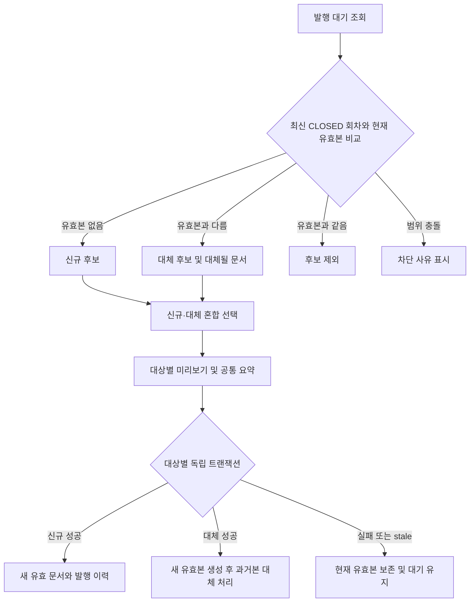
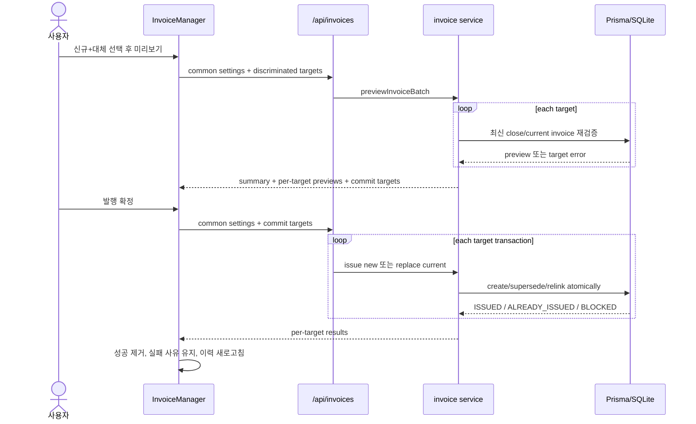

# 발행 대기 및 운영 화면 일관성 - Plan

## Goal Capsule

- **Objective:** 재마감으로 최신 확정 매출이 달라진 거래명세표를 신규 후보 화면에서도 대체발행할 수 있게 하고, 월마감·계약·매출·거래명세표의 사용자 노출 용어와 상태·시간 표현을 일관되게 정리한다.
- **Product authority:** 이 문서의 Product Contract가 통합 발행 대기 목록, 혼합 일괄 처리, 실패 보존, 명칭, 최종수정일, 다크모드 표현을 결정한다.
- **Technical authority:** Planning Contract의 KTD와 Implementation Units가 구현 경계와 순서를 결정하며, 충돌 시 Product Contract를 우선한다.
- **Execution profile:** 기존 Prisma 모델은 유지하고 거래명세표 후보·서비스·API·UI, 세 목록의 DTO와 표시, 사용자 문구·내보내기, 월마감 상태 스타일을 변경하는 Standard 코드 계획이다.
- **Stop conditions:** 대체발행 실패 전에 현재 유효본을 무효화하는 설계, 한 현장 실패로 다른 현장까지 롤백하는 설계, 내부 스키마 필드명을 일괄 변경하는 설계, 과거 계획·아이디어 문서를 현재 용어로 덮어쓰는 설계가 발견되면 구현을 중단하고 이 계획을 다시 확인한다.
- **Tail ownership:** U6가 전체 정적 검사·테스트·빌드, 네 가지 테마 조합의 브라우저 검증, 용어 잔존 검사와 문서 정리를 책임진다.
- **Open blockers:** 없음.

---

## Product Contract

### Summary

거래명세표의 상단 후보 영역을 `신규 발행`에서 `발행 대기`로 바꾸고, 최신 월마감 회차에 현재 유효 거래명세표가 없으면 `신규`, 현재 유효본과 최신 회차가 달라지면 `대체` 후보로 표시한다.
사용자는 신규와 대체 후보를 함께 선택해 공통 발행 설정으로 미리보기·발행할 수 있고, 실패한 현장만 사유와 함께 대기 목록에 남는다.

동시에 메뉴명은 `월마감`으로 단순화하고 사용자에게 보이는 `귀속일`, `귀속월`, `귀속기간`은 각각 `매출일`, `매출월`, `매출기간`으로 통일한다.
계약관리·매출원장·거래명세표 목록에는 기존 `updatedAt` 기반의 `최종수정일`을 정확한 형식으로 표시하며, 월마감의 마감 완료 행은 다크모드에서 선택·hover 상태처럼 보이지 않도록 조정한다.

### Problem Frame

현재 최신 마감 회차는 직접 연결된 거래명세표가 없으면 항상 신규 후보로 나타난다.
거래명세표 발행 후 재개방, 추가 매출 입력, 재마감을 수행한 경우에는 최신 회차의 확정 매출이 기존 유효본에 연결되어 있어 신규 발행 검증이 실패하고 `마감 회차의 확정 매출이 변경되었습니다`만 표시된다.
대체발행 기능은 발행 이력 행에만 있어 사용자는 오류를 본 뒤 별도 영역에서 원인을 찾아 다시 시작해야 한다.

또한 월마감 명칭과 매출 기준일 용어가 화면·도움말·내보내기에서 섞여 있고, 세 핵심 목록에서 마지막 변경 시각을 바로 확인할 수 없다.
마감 완료 행은 다크모드에서 밝은 초록 배경이 행 전체에 적용되어 선택 또는 hover 상태처럼 보여 실제 상호작용 상태와 구분이 어렵다.

### Key Decisions

- **서버 판정 발행 대기:** 후보 종류는 클라이언트가 추측하지 않고 최신 마감 회차와 현재 유효 거래명세표를 비교한 서버 결과를 사용한다.
- **혼합 선택:** 신규와 대체 후보를 같은 목록에서 선택하며 `전체 선택`은 현재 조회된 두 종류를 모두 포함한다.
- **공통 설정:** 발행일, 표시 방식, 출력 템플릿, 메모는 선택한 신규·대체 대상에 공통 적용한다.
- **현장별 부분 성공:** 미리보기와 최종 발행은 대상별 결과를 반환하며 한 대상의 오래된 상태나 충돌이 다른 대상의 성공을 롤백하지 않는다.
- **현재 유효본 보존:** 대체 대상의 검증 또는 생성이 실패하면 현재 유효 거래명세표와 매출 연결을 그대로 유지한다.
- **이력 진입 유지:** 발행 이력의 `대체 발행` 버튼과 기존 단건 API는 보조 진입점으로 계속 제공한다.
- **사용자 용어만 변경:** UI, 메시지, 도움말, 운영 문서, 엑셀 헤더의 용어를 바꾸고 `revenueDate`, `month`, `periodStart` 같은 내부 필드·DB·URL 이름은 유지한다.
- **기존 시각 권위 사용:** 최종수정일은 새 필드를 만들지 않고 각 모델의 `updatedAt`을 사용한다.
- **다크 상태 최소화:** 라이트모드의 마감 의미 색은 유지하고 다크모드에서는 행 전체의 밝은 채움을 제거해 배지와 hover가 각각 다른 역할을 갖게 한다.

### Actors

- A1. **매니저** — 신규·대체 발행 대기를 조회·선택하고 미리보기·발행한다.
- A2. **관리자** — 매니저와 같은 발행 권한을 가지며 월마감 재개방도 수행한다.
- A3. **조회 사용자** — 발행 대기와 이력, 최종수정일을 조회하지만 발행 작업은 수행하지 않는다.

### Requirements

**통합 발행 대기**

- R1. 거래명세표 후보 영역의 사용자 노출 제목은 `발행 대기`여야 한다.
- R2. 최신 CLOSED 마감 회차에 현재 유효 거래명세표가 없으면 해당 현장·매출월을 `신규` 후보로 표시해야 한다.
- R3. 최신 CLOSED 마감 회차의 확정 매출 집합 또는 금액이 현재 유효 거래명세표와 다르면 해당 대상을 `대체` 후보로 표시해야 한다.
- R4. 최신 회차와 현재 유효본이 같으면 중복 신규·대체 후보를 만들지 않아야 한다.
- R5. 대체 후보는 현재 유효 발행번호와 대체될 유효 문서 수 또는 목록을 사용자가 미리 알 수 있게 해야 한다.
- R6. 후보가 충돌하거나 안전하게 하나의 대체 범위로 결정되지 않으면 신규로 오분류하지 않고 명시적 차단 사유를 제공해야 한다.

**혼합 미리보기와 발행**

- R7. 사용자는 신규·대체 후보를 임의로 섞어 선택할 수 있어야 하며 전체 선택은 조회된 두 종류를 모두 포함해야 한다.
- R8. 선택한 모든 대상에는 하나의 발행일, 표시 방식, 템플릿, 메모가 공통 적용되어야 한다.
- R9. 미리보기는 전체·신규·대체 건수와 금액, 대상별 문서 내용, 대체될 현재 발행번호를 구분해 보여줘야 한다.
- R10. 미리보기의 대상별 검증 실패는 성공 가능한 다른 대상의 미리보기를 막지 않고 실패 대상과 이유를 함께 반환해야 한다.
- R11. 최종 발행은 현장 또는 대체 범위별 독립 트랜잭션으로 실행하고 성공·실패·기처리 결과를 대상별로 반환해야 한다.
- R12. 일부 실패 시 성공한 대상은 발행 이력으로 이동하고 실패한 대상은 최신 사유와 함께 발행 대기에 남아야 한다.
- R13. 대체발행은 새 문서 생성, 현재 유효 문서의 대체 처리, 매출의 현재 문서 연결 변경을 같은 트랜잭션에서 수행해야 한다.
- R14. 대체발행이 실패하면 기존 유효 문서의 상태와 매출 연결은 변경되지 않아야 한다.
- R15. 미리보기 이후 마감 회차, 확정 매출, 원본 문서 버전 또는 현재 유효 문서 구성이 바뀌면 해당 대상만 오래된 작업으로 거부해야 한다.
- R16. 발행 이력 행의 기존 `대체 발행` 진입과 단건 미리보기·대체 API는 유지해야 한다.

**용어·시간·상태 표현**

- R17. 주 메뉴와 관련 화면 링크·제목의 `월마감 관제실`은 `월마감`으로 표시해야 한다.
- R18. 현재 제품 UI, 사용자 메시지, 사용자·운영 가이드, 엑셀 헤더의 `귀속일`, `귀속월`, `귀속기간`은 각각 `매출일`, `매출월`, `매출기간`으로 표시해야 한다.
- R19. 내부 코드 식별자, Prisma 스키마, DB 컬럼, API 필드, URL query key는 이번 변경에서 이름을 바꾸지 않아야 한다.
- R20. 계약관리, 매출원장, 거래명세표 이력 표에 각 행의 `updatedAt`을 사용하는 `최종수정일` 열을 표시해야 한다.
- R21. 최종수정일은 Asia/Seoul 기준으로 `2026. 7. 12. PM 9:38:43` 형태를 정확히 사용해야 한다.
- R22. 월마감 완료 행은 기본·사과 테마의 다크모드에서 선택 또는 hover처럼 보이는 밝은 행 배경을 사용하지 않아야 한다.
- R23. 마감 완료 여부는 다크모드에서도 배지와 텍스트로 명확해야 하며 실제 hover·선택 상태는 구분되어야 한다.

### Key Flows

- F1. 발행 대기 조회
  - **Trigger:** A1-A3가 매출월과 현장을 선택해 후보를 조회한다.
  - **Steps:** 서버가 최신 CLOSED 회차와 현재 유효 문서를 일괄 조회하고 신규·대체·제외·차단 상태를 판정한다.
  - **Outcome:** 발행이 필요한 대상은 신규 또는 대체로, 안전하게 처리할 수 없는 대상은 차단 사유와 함께 보이며 변경 없는 현재본은 표시되지 않는다.
  - **Covered by:** R1-R6.

- F2. 혼합 미리보기
  - **Trigger:** A1 또는 A2가 신규·대체 후보를 함께 선택하고 발행 미리보기를 누른다.
  - **Steps:** 공통 설정을 검증하고 대상별 최신 상태를 다시 확인해 미리보기 또는 차단 결과를 만든다.
  - **Outcome:** 전체·신규·대체 요약과 대체될 발행번호, 대상별 오류를 한 화면에서 확인한다.
  - **Covered by:** R7-R10, R15.

- F3. 혼합 최종 발행
  - **Trigger:** A1 또는 A2가 검토한 미리보기를 확정한다.
  - **Steps:** 서버가 대상마다 독립 트랜잭션을 열고 신규 또는 대체 발행을 실행하며 직전 상태를 다시 검증한다.
  - **Outcome:** 성공 문서는 이력에 추가되고 실패 대상은 현재 유효본을 보존한 채 대기 목록에 남는다.
  - **Covered by:** R11-R15.

- F4. 운영 화면 일관성 확인
  - **Trigger:** 사용자가 월마감·계약관리·매출원장·거래명세표와 엑셀 내보내기를 사용한다.
  - **Steps:** 현재 사용자 용어와 공통 시간 포맷을 표시하고 테마에 맞는 마감 상태를 렌더링한다.
  - **Outcome:** 매출 기준 용어, 최종수정일, 마감 상태가 화면 간 일관된다.
  - **Covered by:** R17-R23.

### Acceptance Examples

- AE1. 재마감된 7월의 대체 후보
  - **Covers R1-R6.**
  - **Given:** 7월 마감·거래명세표 발행 후 재개방하여 추가 매출을 확정하고 7월을 다시 마감했다.
  - **When:** 사용자가 거래명세표에서 7월 후보를 조회한다.
  - **Then:** 해당 현장은 `대체`로 표시되고 현재 유효 발행번호와 변경된 공급가액을 확인할 수 있으며 신규 발행 오류를 먼저 겪지 않는다.

- AE2. 신규와 대체 혼합 미리보기
  - **Covers R7-R10.**
  - **Given:** 신규 두 현장과 대체 한 현장이 발행 대기에 있다.
  - **When:** 사용자가 전체 선택 후 공통 설정으로 미리보기를 연다.
  - **Then:** 전체 3건, 신규 2건, 대체 1건이 표시되고 대체될 현재 발행번호가 별도로 보인다.

- AE3. 혼합 발행의 부분 성공
  - **Covers R11-R15.**
  - **Given:** 선택한 신규 한 건과 대체 두 건 중 대체 한 건의 마감 상태가 미리보기 후 변경되었다.
  - **When:** 사용자가 최종 발행한다.
  - **Then:** 유효한 두 대상은 발행되고 변경된 대상만 실패 사유와 함께 대기에 남으며, 실패한 대상의 기존 유효본은 유지된다.

- AE4. 변경 없는 재마감
  - **Covers R3-R4.**
  - **Given:** 거래명세표 발행 후 재개방·재마감했지만 확정 매출 ID와 금액이 현재 유효본과 같다.
  - **When:** 후보를 조회한다.
  - **Then:** 해당 현장은 신규 또는 대체 후보로 중복 노출되지 않는다.

- AE5. 이력에서 단건 대체발행
  - **Covers R16.**
  - **Given:** 현재 유효 문서에 대체발행 필요 상태가 있다.
  - **When:** 사용자가 발행 이력 행의 `대체 발행`을 선택한다.
  - **Then:** 기존 단건 미리보기와 대체발행 흐름이 계속 동작한다.

- AE6. 최종수정일 표시
  - **Covers R20-R21.**
  - **Given:** 계약, 매출, 거래명세표의 `updatedAt`이 2026-07-12T12:38:43Z다.
  - **When:** Asia/Seoul 환경의 각 목록을 연다.
  - **Then:** `최종수정일`에 `2026. 7. 12. PM 9:38:43`이 표시된다.

- AE7. 사용자 용어 일관성
  - **Covers R17-R19.**
  - **Given:** 사용자가 메뉴, 월마감, 매출, 거래명세표, 도움말, 운영 가이드, 매출 엑셀을 확인한다.
  - **When:** 현재 기능의 사용자 노출 문구를 읽는다.
  - **Then:** `월마감`, `매출일`, `매출월`, `매출기간`이 사용되며 내부 식별자와 과거 계획 문서는 바뀌지 않는다.

- AE8. 두 테마의 다크모드 마감 행
  - **Covers R22-R23.**
  - **Given:** 기본 또는 사과 테마에서 다크모드를 사용한다.
  - **When:** 마감된 현장 행을 기본, hover, 선택 상태로 차례로 본다.
  - **Then:** 기본 마감 행은 밝은 면으로 채워지지 않고 마감 배지는 읽을 수 있으며 hover와 선택 상태는 별도로 식별된다.

### Success Criteria

- 재마감 후 변경된 현장이 발행 대기에서 `대체`로 판정되어 별도 이력 탐색 없이 미리보기할 수 있다.
- 신규·대체 혼합 발행에서 대상별 성공·실패가 실제 문서 상태와 일치하고 실패한 대체 대상의 현재 유효본이 보존된다.
- `전체 선택`과 미리보기 요약의 전체·신규·대체 수가 같은 후보 집합을 기준으로 계산된다.
- 세 핵심 목록이 동일한 `최종수정일` 형식을 사용한다.
- 현재 사용자 화면·메시지·가이드·엑셀 헤더에서 옛 매출 기준 용어가 남지 않는다.
- 기본·사과 테마의 다크모드에서 마감 완료 행과 hover·선택 상태가 시각적으로 구분된다.

### Scope Boundaries

- 외부 전자세금계산서 발행·연동·상태 관리는 포함하지 않는다.
- 거래명세표 템플릿 내용과 출력 레이아웃은 변경하지 않는다.
- Prisma 모델, DB 컬럼, API의 내부 날짜 필드명, URL query key를 새 용어로 rename하지 않는다.
- `createdAt`을 새로 노출하거나 기존 데이터를 migration하지 않는다.
- 기존 날짜 표시 전체를 새 포맷으로 일괄 교체하지 않고 이번에 추가하는 세 `최종수정일` 열만 공통 포맷을 사용한다.
- `docs/plans/**`, `docs/ideation/**`의 과거 의사결정 기록은 용어 치환 대상에서 제외한다.
- 발행 이력의 단건 대체발행을 제거하거나 대시보드·월마감·거래명세표 화면 전체를 재설계하지 않는다.
- 마감 완료 의미의 라이트모드 색상은 유지하며 전역 테마 토큰을 광범위하게 바꾸지 않는다.

### Dependencies / Assumptions

- 최신 발행 가능 근거는 기존 `MonthlyClose.state`, 최신 `MonthlyCloseCycle`, cycle snapshot과 fingerprint다.
- 현재 유효 거래명세표는 `InvoiceDocument.status = ISSUED`, 같은 현장·기간, `InvoiceRevenueLink`, `RevenueEntry.currentInvoiceDocumentId`를 함께 사용해 판정한다.
- `Contract`, `RevenueEntry`, `InvoiceDocument`에는 이미 `updatedAt @updatedAt`이 있어 스키마 변경이 필요 없다.
- 거래명세표 발행 권한은 기존 ADMIN/MANAGER 규칙을 유지한다.
- 현재 발행 문서는 월 단위가 일반적이며, 여러 월 또는 복수 유효본처럼 단일 후보로 안전하게 축약할 수 없는 과거 문서는 명시적 충돌 상태를 반환하고 이력 단건 흐름을 보존한다.
- 서버·브라우저의 locale 차이에 관계없이 정확한 AM/PM 형식을 만들기 위해 `Intl.DateTimeFormat(...).formatToParts()` 결과를 조합한다.

### Sources / Research

- `docs/plans/2026-07-12-004-feat-month-close-control-room-plan.md` — 최신 마감 회차, 현재 유효본 유지, 대체발행 필요 판정과 현장별 부분 성공의 기존 제품 계약
- `src/lib/invoices/service.ts` — 신규 후보가 cycle 직접 연결만 확인하는 현재 동작, 신규·대체 loader와 트랜잭션, 대체 필요 판정
- `src/lib/invoices/schemas.ts`와 `src/app/api/invoices/**` — 현재 신규 batch와 단건 대체 미리보기·발행 입력 경계
- `src/components/invoices/invoice-manager.tsx` — 신규 후보 선택, 전체 선택, 미리보기, 부분 결과, 이력 단건 대체발행의 현재 UI
- `prisma/schema.prisma` — `Contract.updatedAt`, `RevenueEntry.updatedAt`, `InvoiceDocument.updatedAt`과 invoice version/current/supersede 관계
- `src/app/(main)/contracts/page.tsx`, `src/app/(main)/revenues/page.tsx`, `src/app/(main)/invoices/page.tsx` — 세 목록의 Server Component 직렬화 경계
- `src/components/reports/month-close-control-room.tsx`와 `src/components/ui/table.tsx` — 마감 행의 light-only emerald 배경과 공통 hover/selected 배경 충돌
- `src/lib/excel/revenue-workbook.ts`, `USER_GUIDE.md`, `OPERATIONS_GUIDE.md`, `IMPLEMENTATION_PLAN.md` — 사용자 노출 매출 기준 용어의 현재 분포
- `src/lib/invoices/service.test.ts`, `src/components/workflow-contract.test.ts`, `src/components/theme-contract.test.ts` — 금융 workflow, UI 문구, 테마 계약의 기존 테스트 패턴
- 저장소의 최근 invoice/month-close 커밋 `d7e3366`부터 `3b480b7` — 대체발행 원자성, close-aware 최초 발행, 관제실 연결의 구현 순서

---

## Planning Contract

### Key Technical Decisions

- KTD1. **후보 조회가 발행 의도를 판정한다.** `getInvoiceCandidates`는 최신 CLOSED 회차와 현재 ISSUED 문서를 묶어 `NEW`, `REPLACEMENT`, `BLOCKED`를 결정하고, 변경 없는 현재본은 결과에서 제외한다. UI는 `currentInvoiceDocumentId`를 보고 종류를 재추론하지 않는다.
- KTD2. **혼합 batch 입력은 discriminated target을 사용한다.** 신규 target은 cycle ID·close version·fingerprint를, 대체 target은 원본 invoice ID·version과 미리보기에서 고정한 매출 ID 집합을 운반한다. 공통 설정은 batch 상단에 한 번만 둔다.
- KTD3. **미리보기와 발행 모두 대상별 결과 envelope를 반환한다.** 공통 공급자·템플릿 오류는 요청 전체 오류로, close/invoice stale·범위 충돌은 대상별 `BLOCKED`로 구분한다. preview가 반환한 commit target만 최종 요청에 사용한다.
- KTD4. **기존 신규·대체 도메인 loader와 트랜잭션을 합성한다.** 신규는 `loadIssueCycle`, 대체는 `loadReplacementContext`를 재사용하고 공통 draft/snapshot 생성만 공유한다. 대체 작업은 기존 `replaceInvoice`와 동일하게 새 문서 생성 후 활성 문서 대체와 current pointer 변경을 한 트랜잭션에서 끝낸다.
- KTD5. **복수 유효본은 대체 범위로 묶되 후보는 한 번만 노출한다.** 같은 현장·기간의 활성 문서를 하나의 replacement target으로 그룹화하고 미리보기에서 모두 표시한다. 기간 또는 current pointer가 다른 문서와 충돌하면 `BLOCKED`로 남겨 신규 오발행을 막는다.
- KTD6. **정확한 최종수정일 formatter를 작은 공통 모듈로 둔다.** Asia/Seoul 기준 date parts를 직접 조합해 locale·브라우저별 `오후`, 쉼표, zero-padding 차이를 제거하고 세 표만 이 helper를 사용한다.
- KTD7. **사용자 용어 sweep는 명시적 허용 범위를 검사한다.** 현재 UI·서비스 메시지·living guide·엑셀 헤더를 변경하고 내부 식별자와 역사 문서 경로는 제외한다. 테스트가 대상 파일의 금지 문자열 재유입을 막는다.
- KTD8. **다크 마감 행은 투명 기본면과 의미 배지를 사용한다.** 라이트의 미세한 emerald 배경은 유지하되 `dark:bg-transparent`와 별도 dark badge 색을 적용하여 공통 `hover:bg-muted/50`, selected 배경과 겹치지 않게 한다.
- KTD9. **기존 endpoint를 클라이언트에서 순서대로 호출하는 방식은 사용하지 않는다.** 그 방식은 하나의 선택 집합에 두 preview token과 두 오류 모델을 만들고 preview 이후 stale 상태를 일관되게 묶지 못한다. 서버 mixed-batch가 대상별 검증·결과를 소유하고 UI는 결과를 표시·재조정만 한다.
- KTD10. **별도 발행 대기 테이블을 만들지 않는다.** 대기는 최신 close와 current invoice의 파생 상태이므로 영속 queue를 추가하면 마감·발행 변경 때 동기화해야 할 두 번째 진실원이 생긴다. 감사 로그와 기존 invoice snapshot만 영속 기록으로 유지한다.

### High-Level Technical Design

후보 조회는 선택한 매출월의 최신 CLOSED cycle들을 먼저 읽고, 해당 현장·기간의 현재 ISSUED 문서와 revenue link를 batch 조회한다.
회차 snapshot과 현재 문서의 매출 ID union·subtotal이 같으면 제외하고, 현재본이 없으면 NEW, 다르면 REPLACEMENT로 만든다.
REPLACEMENT 후보에는 UI 표시용 현재 발행번호 목록과 실행용 source invoice ID/version이 포함된다.

미리보기 API는 공통 회사·템플릿 설정을 먼저 확인한 뒤 각 target을 별도로 검증한다.
성공 target에는 문서 draft와 최종 발행에 필요한 commit target을, 실패 target에는 안정된 error code/message를 반환한다.
최종 발행 API는 commit target마다 독립 `$transaction`을 열고 NEW 또는 REPLACEMENT 실행기를 호출한다.
한 target의 AuthError 또는 unique/stale 충돌은 그 target 결과로 변환하고 예상하지 못한 시스템 오류만 요청 전체 오류로 올린다.

### API and Result Contract

- 후보 DTO는 안정된 `targetKey`, `kind: NEW | REPLACEMENT | BLOCKED`, cycle/close snapshot, site·매출기간·금액, `currentInvoices[]`, 선택 가능 여부와 차단 사유를 포함한다.
- `POST /api/invoices/preview`와 `POST /api/invoices`는 기존 route를 유지하되 신규 mixed-batch schema와 결과 envelope를 사용한다.
- preview input의 target은 `NEW { cycleId, expectedCloseVersion, expectedRevenueFingerprint }` 또는 `REPLACEMENT { sourceInvoiceId, sourceVersion }`다.
- preview success는 `targetKey`, kind, document draft, replacement source 목록, issue 단계용 expected revenue IDs와 최신 version/fingerprint를 포함한다.
- issue result는 `targetKey`, kind와 `ISSUED | ALREADY_ISSUED | BLOCKED` outcome, 성공 document 또는 안정된 error code/message를 포함한다.
- `POST /api/invoices/[id]/replacement-preview`와 `POST /api/invoices/[id]/replace`는 발행 이력 단건 진입을 위해 유지하고 내부 실행 helper만 공유한다.
- 권한은 후보·이력 조회에 로그인 사용자, preview·issue·replace에 ADMIN/MANAGER라는 기존 계약을 유지한다.

### Sequencing

1. U1에서 후보 판정과 mixed schema·서비스를 먼저 고정해 UI가 사용할 안정된 계약을 만든다.
2. U2에서 기존 API route를 mixed batch로 연결하고 대상별 원자성·stale 결과를 검증한다.
3. U3에서 발행 대기 UI, 전체 선택, 요약, 실패 유지와 기존 이력 진입을 연결한다.
4. U4의 final-modified formatter와 DTO 전달은 invoice UI 변경과 충돌을 피하도록 U3 이후 적용한다.
5. U5에서 용어와 다크 스타일을 sweep하고, U6에서 전체 회귀와 브라우저 matrix를 수행한다.

### System-Wide Impact

- **Invoice domain:** 후보가 cycle 미발행 여부만 보던 방식에서 latest close 대 current document 비교 방식으로 확장된다.
- **API:** URL과 권한은 유지되지만 preview/issue body와 response는 mixed target envelope로 변경되므로 모든 내부 caller와 schema test를 함께 갱신한다.
- **Persistence:** migration은 없고 기존 invoice version, status, link, `updatedAt`을 사용한다.
- **Audit and sync:** 신규는 기존 ISSUE, 대체는 기존 REPLACE 감사 action을 유지하고 각 성공 target이 `invoice.changed`를 기록한다. 실패 target은 문서·감사·sync event를 남기지 않으며 응답 결과가 사용자 피드백을 담당한다.
- **Failure propagation:** target의 도메인 충돌은 해당 target outcome으로 끝나지만 company/template 해석 실패와 예상하지 못한 인프라 오류는 요청 전체 실패로 남긴다. 성공 transaction은 이후 다른 target의 실패와 무관하게 commit된다.
- **UI:** 거래명세표 상단이 발행 종류를 포함한 queue가 되고 이력의 단건 대체발행은 유지된다.
- **List DTOs:** RevenueEntry와 InvoiceDocument의 `updatedAt` 직렬화가 Client Component 경계를 새로 통과한다. Contract는 이미 전달하므로 표시만 추가한다.
- **Content/export:** 살아 있는 제품·운영 문서와 매출 workbook 헤더가 새 용어를 사용한다.
- **Theme:** month-close component의 상태 class만 바꾸며 전역 기본·사과 theme token은 유지한다.

### Rollout and Recovery

- DB migration과 데이터 backfill이 없으므로 배포 순서는 일반 application deploy를 따른다.
- 혼합 schema는 서버와 단일 Next.js client가 같은 build에 포함되므로 별도 호환 기간을 두지 않는다.
- 문제가 생기면 후보·mixed UI 변경을 되돌려 기존 신규 batch와 이력 단건 대체 흐름으로 복귀할 수 있으며 이미 성공한 문서는 정상 이력으로 남는다.
- 부분 성공 응답을 받은 뒤 client 재조회가 실패해도 서버 문서 상태가 권위이며, 재조회 시 이미 처리된 target은 후보에서 빠지거나 `ALREADY_ISSUED`로 결정된다.
- 배포 후 별도 queue 지표를 만들지 않고 기존 ISSUE/REPLACE 감사 로그, `invoice.changed` event, target outcome code를 사용해 실패 원인을 추적한다. 동일 error code가 반복되면 후보 판정과 commit 재검증의 불일치를 우선 점검한다.
- 스타일·문구·최종수정일 변경은 데이터에 영향을 주지 않아 독립적으로 되돌릴 수 있다.

### Risks and Mitigations

| Risk | Impact | Mitigation |
|---|---|---|
| 후보 조회에서 현장별 추가 query가 발생 | 매출월 현장이 많을 때 응답 지연 | close, active invoice, revenue link를 batch 조회하고 site+period map으로 비교하는 테스트·코드 리뷰를 둔다 |
| 하나의 현장·기간에 여러 ISSUED 문서가 존재 | 같은 대체 작업이 중복 노출되거나 일부만 대체 | period group당 target 하나와 `currentInvoices[]`를 만들고 commit에서 전체 active ID count를 다시 검증한다 |
| preview 후 close/invoice가 변경 | 오래된 내용으로 신규 또는 대체발행 | cycle fingerprint/version, source version, expected revenue IDs를 commit target에 고정하고 transaction 안에서 재검증한다 |
| batch 공통 오류와 대상 오류가 혼동 | 사용자가 모든 실패를 개별 문제로 오해 | company/template 같은 global error와 target outcome을 schema와 UI에서 분리한다 |
| timestamp locale 결과가 환경마다 다름 | 요구 형식과 스냅샷 테스트 불일치 | `formatToParts` 후 직접 문자열을 조합하고 timezone·AM/PM 경계 테스트를 둔다 |
| 표 열 추가로 좁은 화면이 답답해짐 | 관리 action 또는 금액 열 가독성 저하 | 기존 horizontal scroll을 유지하고 최종수정일을 nowrap/tabular text로 추가해 모바일 실기 검증한다 |
| 용어 일괄 치환이 내부 필드까지 번짐 | API/DB 호환성 회귀 | 명시적 파일 목록과 금지 문자열 contract test를 사용하고 schema/identifier rename을 scope 밖으로 둔다 |
| 다크 마감 행이 hover보다 우선 | 여전히 선택 상태처럼 보임 | dark 기본면은 transparent, hover는 공통 muted, 상태는 badge로 분리하고 두 테마에서 기본/hover를 직접 비교한다 |

---

## Implementation Units

### U1. 발행 대기 후보 판정과 혼합 계약

- **Goal:** 최신 마감 회차와 현재 유효 문서를 비교해 신규·대체·차단 후보를 결정하고 혼합 preview/issue 입력·결과 타입을 정의한다.
- **Requirements:** R1-R6, R15; AE1, AE4; KTD1-KTD3, KTD5, KTD10.
- **Files:**
  - Modify `src/lib/invoices/schemas.ts`.
  - Modify `src/lib/invoices/service.ts`.
  - Modify `src/lib/invoices/replacement-policy.ts` if a period grouping/comparison helper is needed.
  - Modify `src/lib/invoices/service.test.ts`.
  - Modify `src/lib/invoices/replacement-policy.test.ts`.
  - Modify `src/lib/invoices/template-snapshot.test.ts`.
- **Approach:**
  - `getInvoiceCandidates`가 최신 cycle의 직접 `invoiceDocument` 유무만 보지 않고 조회 월의 active invoice/revenue links를 batch로 비교하게 한다.
  - 후보는 `targetKey`와 discriminated `kind`를 가지며, replacement group에는 anchor source와 모든 `currentInvoices`를 제공한다.
  - 변경 없는 cycle/current union은 제외하고, 활성 문서 범위·pointer가 충돌하면 selectable 신규가 아닌 BLOCKED row로 반환한다.
  - preview schema와 issue schema를 분리하고 preview success가 발급하는 commit target에 expected revenue IDs와 버전 정보를 담는다.
  - candidate/type/schema 이름은 내부적으로 명확한 `InvoiceIssueTarget` 계열로 두되 DB 이름은 바꾸지 않는다.
- **Test Scenarios:**
  - invoice가 없는 최신 CLOSED cycle은 NEW다.
  - 재마감 cycle의 ID 집합 또는 금액이 current invoice와 다르면 REPLACEMENT이고 현재 발행번호가 포함된다.
  - 같은 ID 집합과 금액이면 후보에서 제외된다.
  - 같은 기간의 복수 current invoice가 한 replacement target으로 묶이고 중복 row가 생기지 않는다.
  - 다른 기간 current pointer 충돌은 BLOCKED이며 NEW로 내려가지 않는다.
  - 500 target 제한, 중복 targetKey, kind별 필수 version/fingerprint가 schema에서 검증된다.
- **Verification:** `npm test -- src/lib/invoices/service.test.ts src/lib/invoices/replacement-policy.test.ts src/lib/invoices/template-snapshot.test.ts`.
- **Dependencies:** 없음.

### U2. 대상별 원자적 혼합 미리보기와 발행

- **Goal:** 기존 신규·대체 로직을 하나의 batch API에서 대상별로 실행하면서 현재본 보존과 부분 성공을 보장한다.
- **Requirements:** R7-R16; AE2-AE5; KTD2-KTD5, KTD9.
- **Files:**
  - Modify `src/lib/invoices/service.ts`.
  - Modify `src/app/api/invoices/preview/route.ts`.
  - Modify `src/app/api/invoices/route.ts`.
  - Modify `src/app/api/invoices/[id]/replacement-preview/route.ts` only if shared helper signature changes.
  - Modify `src/app/api/invoices/[id]/replace/route.ts` only if shared helper signature changes.
  - Modify `src/lib/invoices/service.test.ts`.
  - Extend `src/components/workflow-contract.test.ts` for preserved route/entry contracts where appropriate.
- **Approach:**
  - 공통 company/template 설정 오류를 batch 시작 전에 검증하고 대상별 close/invoice 검증은 결과 envelope로 포착한다.
  - NEW 실행기는 기존 cycle unique와 null current pointer 보호를 유지한다.
  - REPLACEMENT 실행기는 source/current active set과 expected revenue IDs를 transaction 안에서 다시 읽고 새 snapshot 생성 후에만 기존 문서를 SUPERSEDED로 전환한다.
  - 각 target을 별도 `$transaction`으로 감싸고 AuthError/P2002를 `BLOCKED`/`ALREADY_ISSUED`로 변환한다.
  - 성공 target마다 기존 ISSUE 또는 REPLACE audit payload와 `invoice.changed` sync event를 transaction 안에서 기록하고 실패 target에는 둘 다 남기지 않는다.
  - 기존 단건 replacement 함수와 route는 같은 내부 prepare/commit helper를 호출하되 public contract와 버튼을 보존한다.
- **Test Scenarios:**
  - NEW와 REPLACEMENT가 섞인 preview가 성공 문서와 대상별 차단을 함께 반환한다.
  - 신규 한 건과 대체 두 건 중 하나가 stale이면 두 건은 발행되고 stale 대상만 BLOCKED다.
  - replacement create, active document supersede, current pointer reassignment 중 오류가 나면 전체 target transaction이 rollback되어 현재본이 유지된다.
  - preview 이후 close fingerprint, source version, active set 또는 expected revenue ID가 바뀌면 해당 target만 거부된다.
  - 동시 신규 요청은 문서 하나와 ALREADY_ISSUED를, 동시 대체 요청은 새 current 문서 하나와 stale/block 결과를 만든다.
  - mixed batch에서 성공 target만 audit/event를 하나씩 남기고 BLOCKED target은 문서·audit·event를 남기지 않는다.
  - 단건 history replacement preview/replace 회귀 테스트가 계속 통과한다.
- **Verification:** `npm test -- src/lib/invoices/service.test.ts src/components/workflow-contract.test.ts`.
- **Dependencies:** U1.

### U3. 통합 발행 대기 UI와 부분 결과

- **Goal:** 신규·대체를 같은 표에서 선택하고 공통 미리보기·발행·실패 재시도를 수행하게 한다.
- **Requirements:** R1, R5, R7-R12, R15-R16; AE1-AE5.
- **Files:**
  - Modify `src/components/invoices/invoice-manager.tsx`.
  - Modify `src/app/(main)/invoices/page.tsx`.
  - Modify `src/components/workflow-contract.test.ts`.
  - Add `src/components/invoices/invoice-issuance-state.ts` and `src/components/invoices/invoice-issuance-state.test.ts`.
- **Approach:**
  - 보이는 제목은 `발행 대기`로 바꾸되 기존 dashboard/month-close deep link 호환을 위해 `id="new-issue"` anchor는 유지한다.
  - 후보 표에 종류 badge, 매출월/기간, 현장, 확정 매출, 공급가액, 대체될 발행번호 또는 차단 사유를 표시한다.
  - 선택 state는 cycle ID가 아니라 안정된 targetKey를 사용하고 BLOCKED row는 선택 대상에서 제외한다.
  - 전체 선택, 종류별 count·amount, 발행 결과 이후 selection/error reconciliation은 작은 pure state helper에 두어 component와 test가 같은 규칙을 사용하게 한다.
  - 전체 선택은 현재 selectable NEW+REPLACEMENT를 선택하며 선택 요약과 버튼에 전체·신규·대체 건수와 금액을 표시한다.
  - preview dialog는 대상별 문서와 대체될 current invoice 목록, blocked reason을 보여주고 preview 성공 target만 최종 발행 대상으로 삼는다.
  - issue 후 성공·기처리 target을 선택과 후보에서 제거하고 blocked target은 오류를 붙여 남긴 뒤 후보와 history를 재조회한다.
  - 발행 이력의 `대체 발행` 버튼, 재출력, pagination은 현재 동작을 유지한다.
- **Test Scenarios:**
  - 전체 선택이 selectable 신규·대체를 모두 포함하고 해제한다.
  - BLOCKED 후보는 표시되지만 선택 수·금액에는 포함되지 않는다.
  - preview summary와 issue confirmation이 전체·신규·대체 수 및 대체될 번호를 정확히 표시한다.
  - 부분 성공 후 성공 target은 사라지고 실패 target의 selection/error context가 유지된다.
  - history `대체 발행`, `재출력`, 기존 `#new-issue` 링크가 회귀하지 않는다.
- **Verification:** `npm test -- src/components/invoices/invoice-issuance-state.test.ts src/components/workflow-contract.test.ts`와 VC5 발행 시나리오.
- **Dependencies:** U1, U2.

### U4. 최종수정일 포맷과 세 목록 전달

- **Goal:** 계약관리·매출원장·거래명세표 이력에 기존 `updatedAt`을 정확한 한국 시간 AM/PM 형식으로 표시한다.
- **Requirements:** R20-R21; AE6; KTD6.
- **Files:**
  - Add `src/lib/date-time.ts` and `src/lib/date-time.test.ts`.
  - Modify `src/components/contracts/contract-manager.tsx`.
  - Modify `src/app/(main)/revenues/page.tsx` and `src/components/revenues/revenue-manager.tsx`.
  - Modify `src/lib/invoices/service.ts`, `src/app/(main)/invoices/page.tsx`, and `src/components/invoices/invoice-manager.tsx`.
- **Approach:**
  - formatter는 Date/string 입력을 받아 `Asia/Seoul`의 year/month/day/hour/minute/second/dayPeriod를 추출하고 `YYYY. M. D. AM|PM h:mm:ss`로 조합한다.
  - ContractView는 이미 serialized `updatedAt`을 가지므로 열과 cell, empty-state colSpan만 조정한다.
  - RevenueView에 `updatedAt`을 추가하고 Server Component에서 ISO string으로 직렬화한다.
  - invoice list select와 InvoiceRow에 `updatedAt`을 추가하고 Server Component에서 직렬화한다.
  - 세 열은 nowrap과 tabular nums를 사용하며 기존 정렬·pagination·action 의미는 바꾸지 않는다.
- **Test Scenarios:**
  - `2026-07-12T12:38:43Z`가 `2026. 7. 12. PM 9:38:43`으로 표시된다.
  - 자정·정오에서 AM/PM과 12시가 정확하고 UTC 입력의 서울 날짜 rollover가 맞다.
  - revenue/invoice Client Component 경계에 Date 객체가 아닌 ISO string이 전달된다.
  - 편집·상태 전환·대체발행 후 재조회하면 변경된 `updatedAt`이 표시된다.
  - 권한에 따라 action 열이 빠져도 empty-state colSpan과 표 정렬이 깨지지 않는다.
- **Verification:** `npm test -- src/lib/date-time.test.ts src/components/workflow-contract.test.ts`와 VC5 세 목록 확인.
- **Dependencies:** U3.

### U5. 사용자 용어와 월마감 다크 상태 정리

- **Goal:** 현재 사용자 노출 용어를 매출 기준으로 통일하고 두 테마 다크모드의 마감 행을 hover/선택과 구분한다.
- **Requirements:** R17-R19, R22-R23; AE7-AE8; KTD7-KTD8.
- **Files:**
  - Modify `src/components/app-shell.tsx`.
  - Modify `src/app/(main)/reports/monthly/close/page.tsx`, `src/app/(main)/reports/monthly/page.tsx`, and `src/components/reports/month-close-control-room.tsx`.
  - Modify `src/components/invoices/invoice-manager.tsx`.
  - Modify `src/components/revenues/revenue-editor.tsx`, `src/components/revenues/revenue-manager.tsx`, `src/components/reports/monthly-report.tsx`.
  - Modify `src/components/smart-input/smart-input-dialog.tsx` and `src/lib/smart-input/parser.ts`.
  - Modify `src/lib/invoices/service.ts` user-facing errors and `src/lib/excel/revenue-workbook.ts` headers.
  - Modify `USER_GUIDE.md`, `OPERATIONS_GUIDE.md`, and `IMPLEMENTATION_PLAN.md`.
  - Modify `src/lib/reports/monthly.test.ts`, `src/lib/smart-input/parser.test.ts`, `src/lib/excel/revenue-workbook.test.ts`, `src/components/theme-contract.test.ts`, and `src/components/workflow-contract.test.ts`.
- **Approach:**
  - 현재 제품 surface의 `월마감 관제실`, `귀속일`, `귀속월`, `귀속기간`을 각각 `월마감`, `매출일`, `매출월`, `매출기간`으로 바꾸고 문장도 자연스럽게 조정한다.
  - 내부 변수·schema·query·DB 이름과 역사 문서는 유지하며 contract test의 scan allowlist/exclude를 명시한다.
  - workbook의 월 집계·원장 상세·메모 sheet 헤더를 새 용어로 바꾸고 header assertion을 갱신한다.
  - closed row는 light `bg-emerald-50/30` 의미를 유지하고 dark 기본면을 transparent로 명시하며 dark hover는 공통 muted 상태에 맡긴다.
  - closed badge에는 dark border/background/text variant를 추가하고 기본·사과 theme 모두 같은 상태 의미를 갖게 한다.
- **Test Scenarios:**
  - 대상 UI/메시지/docs/workbook에 금지 문자열이 남지 않고 내부 `revenueDate`, `month`, `periodStart`는 유지된다.
  - parser와 monthly report의 변경된 한국어 메시지 assertion이 통과한다.
  - workbook 세 sheet header가 매출일/매출월 용어를 사용한다.
  - closed row class에 dark transparent 기본면과 구분 가능한 hover가 있으며 closed badge는 dark variant를 가진다.
  - default light/dark, Sagwa light/dark에서 마감/열림/hover 행과 상태 배지를 육안 비교한다.
- **Verification:** `npm test -- src/lib/reports/monthly.test.ts src/lib/smart-input/parser.test.ts src/lib/excel/revenue-workbook.test.ts src/components/theme-contract.test.ts src/components/workflow-contract.test.ts`와 VC5 테마 matrix.
- **Dependencies:** U3.

### U6. 통합 회귀 검증과 문서 마감

- **Goal:** 금융 상태 보존, 표 직렬화, 용어, 테마, Next.js 경계를 전체 검증하고 계획 밖 변경을 제거한다.
- **Requirements:** 모든 R/F/AE; 모든 KTD.
- **Files:**
  - Update the targeted test and living documentation files listed in U1-U5 as final behavior requires.
  - Do not add migrations or modify historical `docs/plans/**` and `docs/ideation/**` artifacts.
- **Approach:**
  - 구현 전에 `node_modules/next/dist/docs/`의 현재 Next 16 Route Handler와 Server/Client Component 직렬화 관련 문서를 읽고 사용 API를 확인한다.
  - focused test 후 full test, lint, typecheck, production build, diff whitespace 검사를 수행한다.
  - 신규, 대체, 혼합 부분 성공, history 단건 대체, 세 목록 최종수정일을 실제 브라우저에서 검증한다.
  - 기본·사과 테마의 light/dark 네 조합에서 월마감 행 기본/hover를 비교하고 스크린샷 또는 체크리스트를 handoff에 남긴다.
  - 용어 잔존 검색 결과에서 허용된 내부 식별자·역사 문서만 남았는지 검토한다.
  - 구현 중 폐기한 schema, 임시 compatibility field, 중복 formatter, debug log와 fixture를 제거한다.
- **Test Scenarios:**
  - AE1-AE8이 자동 테스트 또는 브라우저 증거에 모두 연결된다.
  - 기존 month-close, invoice first issue/replacement, contract, revenue, Excel 테스트가 통과한다.
  - 실패한 replacement target의 기존 ISSUED/current pointer가 full regression 후에도 보존된다.
  - production build가 RSC 직렬화와 route schema 변경을 포함해 성공한다.
  - 최종 diff에 migration, 내부 identifier rename, history entry 제거가 없다.
- **Verification:** Verification Contract 전체와 `git diff --check`.
- **Dependencies:** U1-U5.

---

## Verification Contract

| ID | Gate | Command or Evidence | Proves |
|---|---|---|---|
| VC1 | invoice 도메인·schema | `npm test -- src/lib/invoices/service.test.ts src/lib/invoices/replacement-policy.test.ts src/lib/invoices/template-snapshot.test.ts` | 후보 분류, mixed target, stale 재검증, 신규·대체 원자성이 일치한다 |
| VC2 | UI state·문구·테마 | `npm test -- src/components/invoices/invoice-issuance-state.test.ts src/components/workflow-contract.test.ts src/components/theme-contract.test.ts` | 혼합 선택·부분 결과, 기존 이력 진입, 다크 상태 class 계약이 유지된다 |
| VC3 | 시간·용어·내보내기 | `npm test -- src/lib/date-time.test.ts src/lib/reports/monthly.test.ts src/lib/smart-input/parser.test.ts src/lib/excel/revenue-workbook.test.ts` | 정확한 Seoul AM/PM 포맷과 새 사용자 용어가 적용된다 |
| VC4 | 전체 회귀 | `npm test` | 기존 월마감, 계약, 매출, 거래명세표와 모든 targeted test가 통과한다 |
| VC5 | 정적·배포 검사 | `npm run lint`, `npm run typecheck`, `npm run build`, `git diff --check` | Next 16 경계, 타입, lint, production build와 diff 품질이 유효하다 |
| VC6 | 브라우저 발행 흐름 | 7월 재마감 대체 후보, 신규+대체 전체 선택, preview count, 한 대상 stale 부분 성공, history 단건 대체를 localhost에서 수행하고 결과를 기록한다 | 사용자 보고 버그와 혼합 발행의 성공·실패 보존이 실제 화면에서 동작한다 |
| VC7 | 브라우저 표시 matrix | 계약·매출·거래명세표 최종수정일을 확인하고 월마감을 default light/dark 및 Sagwa light/dark로 전환해 closed/open/hover 상태를 기록한다 | 정확한 시간 표시와 두 테마 상태 구분이 실제 렌더링에서 유효하다 |
| VC8 | 용어 잔존 검사 | `rg -n "월마감 관제실|귀속일|귀속월|귀속기간" src USER_GUIDE.md OPERATIONS_GUIDE.md IMPLEMENTATION_PLAN.md` 결과를 검토한다 | 허용한 내부 식별자·역사 문서 밖에 옛 사용자 용어가 남지 않는다 |

### Acceptance Traceability

| Acceptance Example | Automated Evidence | Browser Evidence |
|---|---|---|
| AE1 | candidate classification service tests | 7월 대체 badge와 현재 발행번호 |
| AE2 | mixed schema/state helper tests | 전체·신규·대체 preview 요약 |
| AE3 | per-target transaction/rollback tests | stale 한 건을 포함한 부분 성공 |
| AE4 | replacement comparison tests | 변경 없는 재마감 후보 제외 |
| AE5 | workflow contract와 기존 replacement service tests | 이력 행 단건 대체발행 |
| AE6 | date-time formatter tests와 DTO typecheck | 세 목록의 동일 최종수정일 |
| AE7 | terminology contract, parser, workbook tests | 메뉴·폼·가이드·엑셀 표본 확인 |
| AE8 | theme/workflow contract tests | 네 theme-mode 조합의 closed/hover 비교 |

Next.js 관련 코드를 작성하기 전에 구현자는 `node_modules/next/dist/docs/`에서 Route Handler와 Server/Client Component 직렬화에 해당하는 현재 버전 문서를 읽고 사용한 API가 Next 16.2.10 규칙과 일치하는지 확인한다.
이 계획은 데이터 migration을 포함하지 않으므로 Prisma migration gate는 추가하지 않는다.

---

## Definition of Done

### Global

- R1-R23, F1-F4, AE1-AE8이 구현 단위와 검증 증거에 추적된다.
- `artifact_readiness: implementation-ready` 상태에서 launch-blocking open question이 남지 않는다.
- 재마감 후 변경된 현장이 `대체` 후보로 노출되고 신규·대체를 함께 미리보기·발행할 수 있다.
- 대상별 발행 실패가 다른 대상의 성공을 롤백하지 않으며 실패한 대체 대상의 현재 유효본과 current pointer가 보존된다.
- 이력 단건 대체발행과 기존 deep link `#new-issue`가 유지된다.
- 계약관리·매출원장·거래명세표가 정확한 Seoul `최종수정일` 형식을 표시한다.
- 현재 사용자 surface가 `월마감`, `매출일`, `매출월`, `매출기간`을 사용하고 내부 이름·역사 문서는 유지된다.
- 두 테마의 다크모드 마감 행이 hover·선택 상태와 구분된다.
- VC1-VC8이 통과하고 수동 검증 결과가 handoff에 기록된다.
- 사용하지 않는 compatibility field, 중복 helper, debug log, 임시 fixture와 계획 밖 migration이 최종 diff에 남지 않는다.

### Per Unit

- **U1:** 후보 서비스가 NEW/REPLACEMENT/BLOCKED/제외를 결정론적으로 판정하고 mixed schema 테스트가 통과한다.
- **U2:** mixed preview/issue가 대상별 결과와 원자적 replacement rollback을 보장하며 단건 API가 회귀하지 않는다.
- **U3:** 발행 대기 UI가 혼합 선택, 요약, 부분 성공, 실패 유지를 제공하고 이력 action을 보존한다.
- **U4:** 세 목록이 기존 `updatedAt`을 정확한 공통 형식으로 직렬화·표시한다.
- **U5:** 사용자 용어와 workbook header가 통일되고 두 테마 dark closed state가 hover와 구분된다.
- **U6:** full test, lint, typecheck, build, diff check, 발행 브라우저 흐름과 theme matrix가 모두 완료된다.
