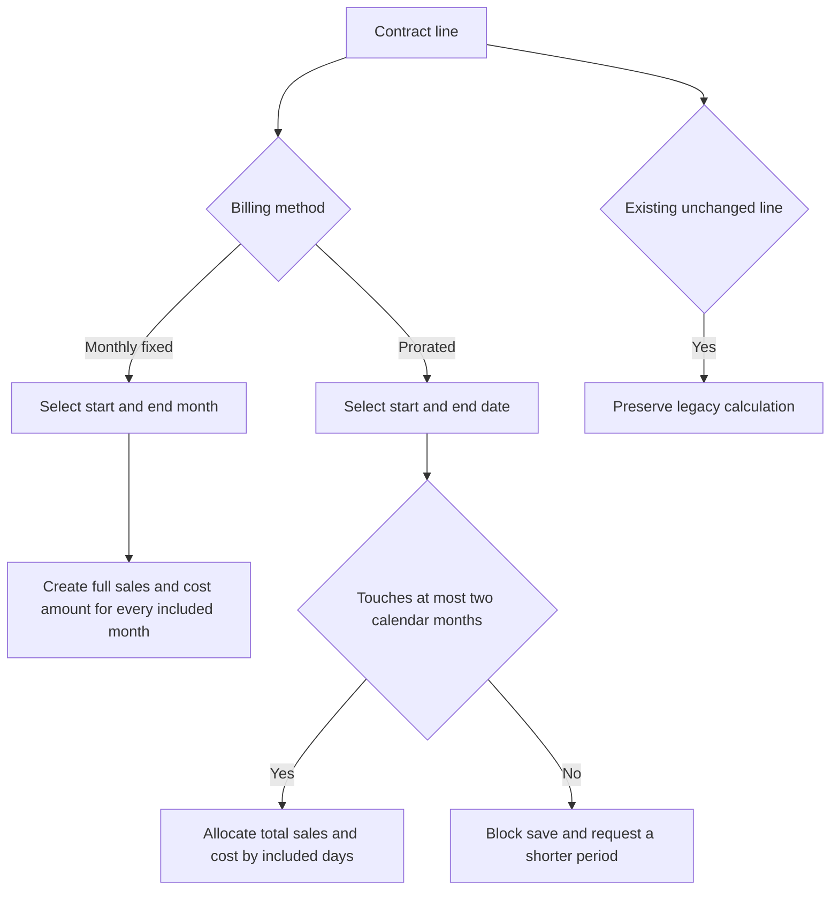
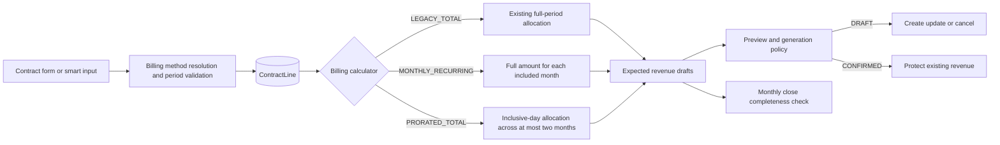

# Contract Line Billing Method - Plan

## Goal Capsule

- **Objective:** 계약 품목별로 월정액과 단기 일할청구를 선택해 실제 청구 방식대로 월 매출과 매입원가를 생성한다.
- **Product authority:** 사무실 매출·청구 담당자가 대부분의 계약을 월 단위로 청구하고 예외 요청만 일할계산한다는 운영 규칙.
- **Open blockers:** 없음.
- **Execution profile:** 계약 입력, 자동 매출 계산, 기존 계약 호환성을 함께 다루는 표준 규모의 코드 변경.
- **Stop conditions:** 세 달 이상 일할청구, 기존 계약 자동 변환, 확정 매출의 소급 변경이 필요해지면 별도 범위로 분리한다.

---

## Product Contract

### Summary

계약 품목마다 `월정액` 또는 `일할청구`를 선택한다.
월정액은 선택한 월마다 전액을 반복 발생시키고, 일할청구는 최대 두 개의 달에 걸친 총금액을 실제 일수로 배분한다.

### Problem Frame

현재 계약 품목의 `수량 × 단가`는 전체 계약기간의 총금액으로 해석되어 일수에 따라 월별 배분된다.
하지만 실제 계약 대부분은 CCTV 사용료처럼 같은 금액을 매월 청구하므로 장기 계약을 등록하면 의도한 월 매출보다 훨씬 적은 금액이 발생한다.
일할청구도 필요하지만 장기간 반복 청구를 일 단위 기간으로 표현하면 사용자가 월정액과 총액 배분을 혼동하기 쉽다.

### Key Decisions

- **청구 방식은 품목별로 선택한다.** 한 계약 안에서 CCTV 월 사용료와 일회성 설치비처럼 계산 성격이 다른 품목을 함께 등록할 수 있어야 한다.
- **신규 품목의 기본값은 월정액이다.** 대부분의 실무 계약이 월 단위 청구이므로 예외인 일할청구를 사용자가 의도적으로 선택하게 한다.
- **월정액은 월만 입력한다.** 일자를 노출하지 않아 첫 달이나 마지막 달의 의도하지 않은 일할계산을 막는다.
- **일할청구는 최대 두 달에만 걸칠 수 있다.** 기간의 총 일수와 관계없이 달력상 세 개의 달을 포함하면 등록을 허용하지 않는다.
- **기존 품목의 계산 의미는 보존한다.** 기존 품목은 현재 계산 결과를 유지하며 사용자가 청구 방식을 직접 변경하기 전에는 새 기본값이나 기간 제한을 소급 적용하지 않는다.
- **매출과 매입은 같은 청구 방식을 따른다.** 월정액은 매출과 매입을 매월 반복하고 일할청구는 두 금액을 같은 일수 비율로 배분한다.

### Requirements

**품목별 청구 방식과 입력**

- R1. 계약의 각 품목은 다른 품목과 독립적으로 `월정액` 또는 `일할청구` 방식을 가져야 한다.
- R2. 새 계약 품목의 기본 청구 방식은 `월정액`이어야 한다.
- R3. 월정액 품목은 시작월과 종료월만 입력받고 일자는 선택할 수 없어야 한다.
- R4. 일할청구 품목은 시작일과 종료일을 입력받아야 한다.
- R5. 일할청구 기간은 시작일과 종료일을 포함해 달력상 한 달 또는 연속된 두 달에만 걸칠 수 있어야 한다.
- R6. 시작월은 종료월보다 늦을 수 없고 시작일은 종료일보다 늦을 수 없어야 한다.
- R7. 하나의 계약은 월정액 품목과 일할청구 품목을 함께 포함할 수 있어야 한다.

**월정액 계산**

- R8. 월정액 품목은 시작월과 종료월을 모두 포함한 각 월에 `수량 × 적용 매출단가`의 매출을 발생시켜야 한다.
- R9. 월정액 품목은 각 대상 월에 `수량 × 적용 매입단가`의 매입원가를 발생시켜야 한다.
- R10. 월정액의 첫 달과 마지막 달도 일수와 관계없이 한 달 금액 전액을 발생시켜야 한다.
- R11. 월정액 자동 매출은 품목과 귀속월 조합마다 한 건만 생성되어야 한다.

**일할청구 계산**

- R12. 일할청구의 총 매출금액은 `수량 × 적용 매출단가`여야 한다.
- R13. 일할청구의 총 매입금액은 `수량 × 적용 매입단가`여야 한다.
- R14. 일할청구 금액은 시작일과 종료일을 모두 포함한 전체 일수로 나눈 뒤 각 달에 포함된 사용일수 비율로 배분해야 한다.
- R15. 월별 배분 과정에서 원 단위 처리가 필요해도 모든 월의 합계는 입력한 총금액과 정확히 같아야 한다.
- R16. 달력상 세 개 이상의 달에 걸친 일할청구는 저장 전에 차단하고 사용자가 기간을 수정할 수 있어야 한다.

**기존 계약과 변경 보호**

- R17. 기존 계약 품목은 배포 후에도 저장 당시의 계산 방식과 생성 금액을 유지해야 한다.
- R18. 기존 품목을 조회하거나 청구와 무관한 정보만 수정해도 새 청구 방식으로 자동 변환되어서는 안 된다.
- R19. 사용자가 기존 품목의 청구 방식을 변경할 때는 새 방식의 입력 규칙을 충족해야 저장할 수 있어야 한다.
- R20. 청구 방식, 기간, 수량 또는 단가 변경은 영향을 받는 미확정 자동 매출을 변경 영향 확인 대상으로 포함해야 한다.
- R21. 이미 확정된 매출은 계약 품목의 청구 방식이나 기간을 변경해도 자동으로 덮어쓰지 않아야 한다.

### Key Flows

- F1. 월정액 품목 등록
  - **Trigger:** 담당자가 새 계약 품목을 추가한다.
  - **Steps:** 기본 청구 방식인 월정액을 유지하고 시작월, 종료월, 수량, 매출단가와 매입단가를 입력한다.
  - **Outcome:** 포함된 모든 월에 동일한 월 매출과 매입원가가 생성될 수 있는 계약 품목이 저장된다.
  - **Covered by:** R1-R3, R8-R11
- F2. 단기 일할청구 품목 등록
  - **Trigger:** 현장에서 일부 기간만 사용한 금액을 일할로 청구해 달라고 요청한다.
  - **Steps:** 담당자가 일할청구를 선택하고 최대 두 달에 걸친 시작일과 종료일을 입력한다.
  - **Outcome:** 총 매출과 매입이 실제 사용일수 비율로 해당 월들에 배분된다.
  - **Covered by:** R4-R6, R12-R16
- F3. 혼합 계약 등록
  - **Trigger:** 한 계약에 반복 사용료와 일회성 비용이 함께 있다.
  - **Steps:** 담당자가 각 품목에 서로 다른 청구 방식을 선택하고 방식별 기간을 입력한다.
  - **Outcome:** 한 계약에서 품목별 규칙에 맞는 월 매출과 매입원가가 함께 생성된다.
  - **Covered by:** R1, R7-R16
- F4. 기존 계약 유지 또는 전환
  - **Trigger:** 담당자가 배포 전에 등록된 계약 품목을 조회하거나 수정한다.
  - **Steps:** 기존 계산 의미를 유지하거나 청구 방식을 직접 변경한 뒤 새 방식의 입력 규칙을 충족한다.
  - **Outcome:** 의도하지 않은 금액 변경 없이 기존 계약을 유지하거나 명시적으로 새 방식으로 전환한다.
  - **Covered by:** R17-R21

### Acceptance Examples

- AE1. **Covers R3, R8-R11.** A현장의 CCTV를 월 20,000원, 수량 2대, `2026-01`부터 `2028-12`까지 월정액으로 등록하면 36개월 각각 40,000원의 매출이 발생한다.
- AE2. **Covers R4-R6, R12-R15.** 총 매출금액 40,000원의 일할청구를 `2026-01-15`부터 `2026-02-08`까지 등록하면 총 25일 중 1월 17일분 27,200원과 2월 8일분 12,800원으로 배분된다.
- AE3. **Covers R5, R16.** `2026-01-31`부터 `2026-03-01`까지의 일할청구는 기간이 짧아도 세 개의 달에 걸치므로 등록할 수 없다.
- AE4. **Covers R1, R7.** 같은 계약에서 CCTV 사용료는 월정액으로, 설치비는 일할청구로 선택할 수 있다.
- AE5. **Covers R9, R13-R15.** 월정액과 일할청구 모두 적용 매입단가에 같은 기간 규칙을 적용하며 월별 매입원가 합계는 해당 방식의 총 매입금액과 일치한다.
- AE6. **Covers R17-R19.** 배포 전 등록된 세 달 이상 기간의 기존 품목은 조회와 비청구 정보 수정만으로 오류가 되지 않으며, 청구 방식을 직접 변경할 때만 새 기간 규칙을 적용받는다.
- AE7. **Covers R20-R21.** 계약 계산 조건을 변경하면 영향받는 미확정 자동 매출은 재계산 대상으로 표시되지만 확정 매출은 보호된다.

### Scope Boundaries

- 일할청구 기간을 세 개 이상의 달로 확장하지 않는다.
- 기존 계약 품목을 월정액으로 일괄 변환하지 않는다.
- 월정액에서 일부 월만 제외하거나 월별로 서로 다른 단가를 예약하는 기능은 포함하지 않는다.
- 확정 매출을 계약 변경으로 자동 취소하거나 재작성하지 않는다.
- 청구일, 지급기일, 입금과 미수금 관리는 이 기능에 포함하지 않는다.

### Dependencies and Assumptions

- 계약 기반 자동 매출은 계속 월 단위 원장 항목을 생성한다.
- 일수 계산은 시작일과 종료일을 모두 포함하는 달력 일수를 사용한다.
- 원 단위 배분 방식은 결정적으로 재현 가능해야 하며 마지막 합계가 총금액과 일치해야 한다.
- 기존 품목과 신규 품목을 구분할 수 있는 호환성 규칙이 필요하다.

### Sources and Research

- `prisma/schema.prisma` — 계약 품목 기간, 단가 snapshot, 자동 매출의 서비스 기간과 일할 필드.
- `src/lib/revenues/proration.ts` — 현재 계약 총금액을 전체 일수로 월별 배분하는 계산 규칙.
- `src/lib/revenues/generator.ts` — 계약 자동 매출 미리보기, 생성과 월마감 보호 흐름.
- `src/lib/revenues/generation-policy.ts` — 확정 매출 보호와 미확정 자동 매출 변경 정책.
- `src/components/contracts/contract-manager.tsx` — 현재 품목별 수량, 단가, 매출 시작일과 종료일 입력 흐름.
- `docs/plans/2026-07-11-001-feat-smart-input-token-editor-plan.md` — 계약 초안을 기존 등록 폼에 적용하고 최종 저장은 등록 폼이 소유한다는 인접 계약.

---

## Planning Contract

### Product Contract Preservation

Product Contract unchanged. 위 요구사항, 흐름, 수용 예시와 범위 경계는 구현 계획의 제품 기준이며 구현 편의를 이유로 변경하지 않는다.

R1의 월정액/일할청구 선택은 신규 품목과 명시적으로 전환하는 기존 품목의 공개 방식 계약이다. R17-R19에 따라 전환하지 않은 기존 품목은 공개 선택과 별개의 내부 legacy 호환 상태로 남으며, 이를 R1 위반으로 보고 자동 변환하지 않는다.

### Context and Research

- 애플리케이션은 Next.js 16 App Router, React 19, TypeScript strict, Prisma 7과 SQLite로 구성되어 있다. Route Handler는 얇게 유지하고 계약·매출·월마감 규칙은 `src/lib` 도메인 계층이 소유한다.
- `ContractLine`은 현재 매출 시작일·종료일과 적용 매출/매입 단가를 보관하지만 청구 방식은 없다. `RevenueEntry`는 자동 생성 key, 서비스 기간, 일할 일수와 금액 snapshot을 이미 보관한다.
- `src/lib/revenues/proration.ts`의 기존 계산은 `수량 × 단가`를 전체 계약기간 총액으로 보고 모든 포함 일수에 배분한다. 이 경로는 기존 품목 전용 호환 계산으로 보존한다.
- `src/lib/revenues/expected.ts`와 `src/lib/revenues/generator.ts`는 품목과 귀속월의 안정된 generated key를 기준으로 미확정 매출을 생성·갱신·취소하고 확정 매출을 보호한다. 새 방식도 이 수명주기를 재사용한다.
- `src/lib/monthly-close/service.ts`는 같은 기대 매출 계산기를 재사용하므로 계산기 분기와 월마감 누락 판정을 함께 검증해야 한다.
- 스마트 입력 파서는 이미 기간 정밀도를 `MONTH`와 `DAY`로 구분하지만 계약 적용 초안에서 이 정보가 사라진다. 계약 폼 적용과 직접등록 모두 청구 방식을 끝까지 전달해야 한다.
- SQLite의 additive column 변경과 Prisma의 expand-and-contract 지침에 따라 기존 행을 호환 상태로 backfill하고 기존 migration history는 수정하지 않는다. Prisma 7에서는 migration 뒤 client 생성을 명시적으로 실행한다.
- 관련 Next.js 16 문서인 Server/Client Components, Forms, Route Handlers 가이드를 확인했다. 이번 변경은 기존 Client Component와 얇은 Route Handler 경계를 유지하며 새로운 Next.js API를 도입하지 않는다.

### Key Technical Decisions

- KTD1. **계약 품목에는 내부 3상태 청구 방식을 저장한다.** `LEGACY_TOTAL`은 기존 전체기간 일수 배분, `MONTHLY_RECURRING`은 포함 월마다 전액 반복, `PRORATED_TOTAL`은 최대 두 달 총액 배분을 뜻한다. 제품 UI는 신규·전환 시 월정액과 일할청구만 제공하며 legacy 상태는 기존 의미 보존에만 사용한다. 이 구분이 없으면 장기 기존 계약에 새 최대 두 달 제한이나 월 반복 금액이 소급 적용된다. Covers R1-R5, R17-R19; F1, F2, F4; AE1-AE3, AE6.
- KTD2. **DB default는 legacy 보존용이고 신규 기본값은 애플리케이션이 소유한다.** 새 column은 기존 행을 안전하게 backfill하도록 legacy default를 사용한다. 신규 품목에서 방식이 없으면 월정액으로 해석하고, ID가 있는 기존 품목에서 방식이 없으면 저장된 값을 유지한다. 새·기존 payload를 동일 default로 처리해 생기는 암묵적 변환을 피한다. Covers R2, R17-R19; F1, F4; AE6.
- KTD3. **기존 기간 column을 방식별 canonical 표현으로 재사용한다.** 월정액의 시작월은 월초, 종료월은 월말로 정규화해 저장하고 서버가 경계를 검증한다. 일할청구와 legacy는 실제 날짜를 유지한다. 계약 헤더 기간, 월 겹침 조회와 generated key를 재설계하지 않으면서 UI는 월정액에서 월 입력만 노출할 수 있다. Covers R3-R6, R8-R10; F1, F2; AE1-AE3.
- KTD4. **기대 매출 계산기는 세 분기로 명시적으로 분리한다.** legacy는 현재 알고리즘을 그대로 호출하고, 월정액은 포함 월마다 매출·매입 기준금액 전액을 만들며, 새 일할은 기존 누적 반올림·마지막 월 잔여 보정 알고리즘을 최대 두 달에 한정해 사용한다. 매출과 매입이 동일 기간 분기를 공유하되 각 단가로 독립 계산되게 한다. Covers R8-R15; F1-F3; AE1, AE2, AE4, AE5.
- KTD5. **기존 자동 매출 수명주기와 보호 정책을 유지한다.** `contractLineId + YYYY-MM` generated key를 바꾸지 않고 미확정 동일 월은 갱신, 제외된 월은 취소, 확정 동일 월은 보호한다. 청구 방식은 계약 품목에 저장하고 `RevenueEntry`에는 별도 방식 snapshot을 추가하지 않으며 기존 금액·서비스기간·원본 품목 연결 snapshot을 사용한다. 방식 전환으로 현재 기대금액과 확정 snapshot이 달라지면 이를 정상 금액으로 가장하지 않고 PROTECTED 차이로 유지해 월마감 검토에 노출한다. 계약 audit에는 이전·이후 방식을 남겨 전환 사실을 추적한다. Covers R20-R21; F4; AE7.
- KTD6. **스마트 입력의 기간 정밀도를 청구 방식으로 연결한다.** `MONTH`는 월정액, `DAY`는 일할청구로 매핑하고 일할이 세 달력 월에 걸치면 폼 적용·직접등록 전에 동일한 도메인 검증으로 차단한다. 계약 폼 우회 경로가 다른 계산 의미를 만들지 않게 한다. Covers R1-R7, R16; F1-F3; AE3, AE4.
- KTD7. **사용자 설명과 금액 표시는 방식 인식형으로 바꾼다.** 계약 화면은 신규 월정액 기본, 방식별 월/일 입력, legacy 유지 상태를 보여준다. 혼합 계약에서 오해를 만드는 기존 `계약 총 매출`은 전체 계약기간 합계로 오인되지 않는 품목 기준금액 표현으로 정리하고, 매출 미리보기는 월정액과 일할 배분 근거를 구분한다. Covers R1-R4, R7-R16; F1-F4.

### High-Level Technical Design

이 그림은 책임 경계를 설명하기 위한 것이다. 구체적인 함수 모양보다 계약 저장 시 방식·기간을 canonical하게 만들고, 모든 후속 흐름이 하나의 기대 매출 계산 결과를 공유하는 것이 핵심이다.

### System-Wide Impact

- **Persistence:** `ContractLine`에 additive discriminator가 생긴다. 기존 `RevenueEntry` 행과 migration history는 수정하지 않는다.
- **Contract writes:** 생성·수정 서비스가 신규/기존 line을 같은 transaction 안에서 읽고 누락된 방식의 의미를 결정한다. 순수 기간 검증은 쓰기 전에 수행하되 저장 직전에는 최신 contract version과 기존 line 방식을 다시 확인한다.
- **Change preview:** 방식만 바뀌어도 계약 영향 분석이 변경 line과 기존·신규 기간 양쪽 영향 월을 포함해야 한다.
- **Revenue generation:** 계약 미리보기, 실제 생성과 월마감 completeness가 같은 방식 인식형 계산기를 사용한다. DRAFT와 CONFIRMED 처리 규칙은 유지한다.
- **Alternative entry points:** 계약 폼, 스마트 입력 폼 적용, 스마트 입력 직접등록이 같은 청구 방식과 검증 결과를 사용한다.
- **UI serialization:** Server Component는 enum과 canonical date string을 Client Component에 전달한다. Route Handler의 인증·오류 경계는 변경하지 않는다.
- **Operational rollout:** 배포 전 복원 가능한 SQLite backup을 만들고 복제본 dry-run에서 migration deploy, Prisma client generate와 전후 reconciliation을 수행한다. 운영 배포 뒤 smoke가 끝날 때까지 사용자 쓰기를 열지 않는다. 신규 방식 행이 생성되기 전 실패만 구버전 앱으로 되돌릴 수 있고, 생성 후에는 쓰기를 중단한 뒤 forward-fix를 기본으로 한다. 이후 입력 손실을 명시적으로 수용하는 경우에만 backup 복원을 사용하며 적용된 migration file은 수정하지 않는다.

### Risks and Dependencies

| Risk | Impact | Mitigation |
|---|---|---|
| 기존 장기 품목이 신규 일할 검증을 받음 | 조회·비청구 수정이 실패하거나 금액 의미가 바뀜 | legacy discriminator backfill, 기존 line 방식 유지 규칙과 장기 계약 characterization test |
| DB default가 신규 품목까지 legacy로 남음 | 신규 계약이 계속 기존 계산으로 생성됨 | UI와 서비스에서 신규 기본값을 명시하고 신규 생성 통합 테스트로 확인 |
| 방식 변경 후 이전 월 DRAFT가 남음 | 중복 또는 과다 매출 | stable generated key와 기존·신규 기간 union 영향 분석, 제외 월 CANCEL 테스트 |
| 계약 변경이 확정 매출을 덮어씀 | 발행·마감 이력 훼손 | 기존 PROTECTED 정책을 독립 회귀 게이트로 유지 |
| 매출과 매입 분기 또는 반올림이 달라짐 | 월 손익 불일치 | 두 금액을 같은 기간 segment로 계산하고 합계 불변식을 테스트 |
| 스마트 입력이 기간 정밀도를 버림 | 폼 등록과 직접등록의 계산 차이 | draft에 방식 또는 precision을 보존하고 두 진입점 parity 테스트 |
| 월정액 UI가 날짜 경계를 잘못 직렬화함 | 첫/마지막 월 누락 또는 추가 | month input 경계 정규화 helper와 Server/Client 직렬화 계약 테스트 |
| 배포 중 client와 schema가 어긋남 | enum/column runtime 오류 | backup 후 migration deploy와 client generate를 같은 배포 절차에서 실행하고 smoke test |
| preview 뒤 계약·월마감·매출 상태가 변경됨 | stale 결과로 부분 저장 또는 확정 매출 변경 | commit transaction 안에서 version, 기존 방식, mutable status와 month-open 상태를 재검증하고 충돌 시 audit/event 없이 전체 rollback |
| 신규 방식 생성 후 구버전 앱만 롤백함 | 월정액을 legacy 총액 일할로 계산해 과소청구 | 사용자 쓰기 재개 전 smoke, 신규 방식 생성 뒤 app-only rollback 금지와 forward-fix 원칙 |
| 방식 전환 뒤 과거 확정액과 현재 기대액이 다름 | 월마감에서 원인을 알 수 없는 지속 차이 | 확정 행은 PROTECTED로 유지하고 계약 audit의 이전·이후 방식과 서비스기간 snapshot을 근거로 차이를 명시적 검토 항목으로 노출 |
| DB legacy default가 새 write path에 사용됨 | 신규 장기 계약이 과소청구됨 | 계약 품목 생성 경로를 승인된 계약/legacy import 서비스로 제한하고 모든 create가 방식을 명시하는 정적 경계 테스트 추가 |

### Resolved During Planning

- 신규 품목의 누락된 청구 방식은 월정액으로 처리한다. 기존 ID가 있는 품목의 누락 값은 저장된 방식을 유지한다.
- legacy 상태는 신규 선택지로 노출하지 않고 기존 품목 표시와 명시적 전환에만 사용한다.
- 월정액 기간은 별도 startMonth/endMonth column 없이 기존 날짜 column의 월초·월말 canonical 값으로 저장한다.
- `RevenueEntry`에는 청구 방식 snapshot을 추가하지 않는다. 계약 품목 연결, 서비스 기간과 금액 snapshot을 유지한다.
- 스마트 입력의 `MONTH`/`DAY` 정밀도는 각각 월정액/일할청구로 연결한다.

### Deferred to Implementation

- 없음. 구현 중 발견되는 제품 범위 변경은 임의로 결정하지 않고 Product Contract로 되돌린다.

---

## Implementation Units

### U1. Add the billing discriminator and compatibility migration

- **Goal:** 기존 계약과 향후 legacy import의 계산 의미를 보존하는 영속성 경계를 만든다.
- **Requirements:** R1, R17-R19; F4; AE6; KTD1, KTD2.
- **Dependencies:** 없음.
- **Files:**
  - Modify `prisma/schema.prisma`.
  - Add `prisma/migrations/<timestamp>_contract_line_billing_method/migration.sql`.
  - Add `src/lib/contracts/billing-method-migration.test.ts`.
  - Add `src/lib/contracts/contract-line-write-boundary.test.ts`.
  - Modify `src/lib/migration/service.ts` and its related tests.
  - Regenerate tracked Prisma output under `src/generated/prisma/` through the repository command; do not hand-edit generated files.
- **Approach:** Prisma enum과 required field를 추가하되 DB default는 legacy 상태로 둔다. 새 migration은 기존 행을 legacy로 채우는 additive 변경만 수행하며 `ContractLine` rebuild, `RevenueEntry` 변경이나 과거 migration 수정은 금지한다. 배포 이후 legacy import도 방식을 명시적으로 기록한다.
- **Patterns to follow:** `src/lib/monthly-close/migration.test.ts`, `src/lib/invoices/replacement-migration.test.ts`, `prisma/migrations/20260710032138_phase4_contracts/migration.sql`.
- **Execution note:** 기존 DB fixture를 먼저 만들고 migration 전후 행 의미가 그대로인지 characterization한 뒤 schema 변경을 구현한다.
- **Test scenarios:**
  - 기존 `ContractLine` 행에 migration을 적용하면 legacy 값이 채워지고 날짜·수량·단가가 바뀌지 않는다.
  - migration SQL은 기존 매출 행 update/delete 또는 계약 table 파괴적 rebuild를 포함하지 않는다.
  - 배포 후 legacy import가 월정액 default가 아니라 legacy 방식으로 계약 품목을 만든다.
  - 저장소의 `ContractLine` create/upsert 경로는 승인된 계약 서비스와 legacy import에만 존재하고 모두 billing method를 명시한다.
- **Verification:** migration fixture test와 legacy migration service test가 통과하고 Prisma client가 새 enum/field를 생성한다.

### U2. Resolve billing methods and validate canonical periods

- **Goal:** 계약 저장 경계에서 신규 기본값, 기존 방식 보존, 월정액 정규화와 최대 두 달 일할 규칙을 일관되게 적용한다.
- **Requirements:** R1-R7, R16-R20; F1-F4; AE1, AE3, AE4, AE6, AE7; KTD1-KTD3.
- **Dependencies:** U1.
- **Files:**
  - Add `src/lib/contracts/billing-method.ts` and `src/lib/contracts/billing-method.test.ts`.
  - Modify `src/lib/contracts/schemas.ts`, `src/lib/contracts/service.ts`, `src/lib/contracts/period.ts`, and `src/lib/contracts/impact.ts`.
  - Add `src/lib/contracts/service.test.ts`.
  - Modify `src/lib/contracts/period.test.ts` and `src/lib/contracts/impact.test.ts`.
- **Approach:** 입력 schema는 공개 두 방식과 기존 line 식별자를 수용하고 서비스가 저장된 line과 병합해 유효 방식을 결정한다. 신규 누락 값은 월정액, 기존 누락 값은 저장값 유지로 처리한다. 월정액은 월초/월말 canonical date로 정규화하고, 새 일할은 시작·종료 포함 달력 월 개수가 2 이하인지 검증한다. legacy에는 새 기간 제한을 적용하지 않는다. 방식 변경도 impact diff에 포함하고 이전·이후 월 union을 계산한다.
- **Patterns to follow:** `src/lib/contracts/period.ts`, `src/lib/contracts/impact.ts`, `src/lib/contracts/service.ts`의 version conflict·transaction·audit/event 경계.
- **Execution note:** helper와 schema 테스트를 먼저 새 기대값으로 바꾸어 실패를 확인한 뒤 서비스 통합을 진행한다.
- **Test scenarios:**
  - 신규 line에 방식이 없으면 월정액이 되고 `2026-01`~`2028-12`가 월초/월말로 canonical 저장된다.
  - 기존 legacy line에 방식이 없고 비청구 필드만 바뀌면 legacy와 장기 기간이 유지된다.
  - 동일월과 인접 두 달 일할은 허용되고 `2026-01-31`~`2026-03-01`은 거부된다.
  - 사용자가 legacy line을 월정액 또는 일할로 명시 전환하면 해당 방식의 기간 검증이 적용된다.
  - 청구 방식만 변경해도 변경 line과 이전·이후 영향 월이 preview에 포함된다.
  - preview 뒤 다른 사용자가 계약을 수정하면 저장은 version conflict로 실패하고 line 일부와 audit/event가 남지 않는다.
- **Verification:** 계약 helper, period, impact와 service 관련 테스트가 방식 보존·전환·경계 오류를 관찰 가능하게 증명한다.

### U3. Generate monthly and prorated sales and cost safely

- **Goal:** 방식별 기대 매출·매입을 계산하고 기존 DRAFT 갱신·취소와 CONFIRMED 보호 수명주기에 연결한다.
- **Requirements:** R8-R15, R20-R21; F1-F4; AE1, AE2, AE4, AE5, AE7; KTD4, KTD5.
- **Dependencies:** U1, U2.
- **Files:**
  - Modify `src/lib/revenues/proration.ts`, `src/lib/revenues/expected.ts`, and `src/lib/revenues/generator.ts`.
  - Add `src/lib/revenues/generator.test.ts`.
  - Modify `src/lib/revenues/proration.test.ts`, `src/lib/revenues/expected.test.ts`, and `src/lib/revenues/generation-policy.test.ts`.
  - Modify `src/lib/monthly-close/service.ts`, `src/lib/monthly-close/evaluator.test.ts`, and `src/lib/monthly-close/service.test.ts` as required by the shared calculator contract.
- **Approach:** 기존 일수 배분 구현을 legacy/new-prorated가 공유하는 순수 helper로 유지하고 method dispatch를 추가한다. 월정액은 포함 월 목록마다 동일 기준금액을 생성한다. preview 표현에 필요한 방식 metadata는 비영속 draft에 포함할 수 있지만 Prisma write data에서는 분리한다. 기존 generated key와 generation policy를 유지해 DRAFT만 변경하고 CONFIRMED는 보호한다. 월마감은 같은 expected drafts를 사용한다.
- **Patterns to follow:** `src/lib/revenues/proration.ts`의 inclusive-day segmentation과 cumulative rounding, `src/lib/revenues/expected.ts`의 action 판정, `src/lib/revenues/generation-policy.ts`의 보호 규칙.
- **Execution note:** legacy characterization, 월정액 수용 예시, 두 달 일할 수용 예시 순서로 failing proof를 만들고 각 분기를 최소 구현한다.
- **Test scenarios:**
  - 수량 2, 매출단가 20,000원, `2026-01`~`2028-12` 월정액은 36개 draft를 만들고 각 월 매출이 40,000원이다.
  - 총 40,000원 `2026-01-15`~`2026-02-08` 일할은 27,200원과 12,800원이며 합계가 40,000원이다.
  - 매입단가도 같은 월 segment와 비율을 사용하며 월 합계가 기준 매입금액과 정확히 일치한다.
  - 기존 세 달 이상 legacy 계약은 현재 결과와 행 개수·반올림 합계를 유지한다.
  - 방식 변경 시 동일 generated key의 DRAFT는 update되고 제외 월은 cancel되며 CONFIRMED는 protected로 남는다.
  - 방식 변경으로 현재 기대액과 확정 snapshot이 달라지면 월마감은 이를 protected contract difference로 표시하고 확정 행을 수정하지 않는다.
  - preview 뒤 대상 DRAFT가 확정되면 실제 UPDATE/CANCEL predicate가 mutable status와 expected version을 요구해 transaction 전체가 실패하고 확정 행 snapshot은 완전히 유지된다.
  - preview 뒤 월이 닫히면 generate가 최신 month-open 상태를 다시 확인해 부분 write 없이 실패한다.
  - 닫힌 월에 영향을 주는 생성은 기존 month-open guard로 거부된다.
  - 월마감 evaluator가 월정액 기대 매출 누락을 해당 현장·월 예외로 탐지한다.
- **Verification:** 계산·expected·generation policy·월마감 집중 테스트가 세 계산 경로와 원장 보호 정책을 함께 통과한다.

### U4. Add method-aware contract and revenue UI

- **Goal:** 사용자가 품목별 청구 방식을 명확히 선택하고 방식에 맞는 기간과 매출 근거를 확인하게 한다.
- **Requirements:** R1-R7, R16-R21; F1-F4; AE1, AE3, AE4, AE6, AE7; KTD3, KTD5, KTD7.
- **Dependencies:** U2, U3.
- **Files:**
  - Modify `src/components/contracts/contract-manager.tsx`.
  - Modify `src/app/(main)/contracts/page.tsx`.
  - Modify `src/components/revenues/revenue-manager.tsx`.
  - Modify `src/components/workflow-contract.test.ts`.
- **Approach:** 신규 line은 월정액으로 초기화하고 월정액은 month input, 일할은 date input을 렌더링한다. 기존 legacy line은 `기존 계산 유지` 상태를 표시하고 저장 전에는 이 상태로 되돌릴 수 있으며, 명시 전환 뒤에는 공개 두 방식 중 하나를 저장한다. 일할/legacy에서 월정액으로 전환하면 기존 시작·종료일이 속한 월을 초기값으로 사용한다. 월정액에서 일할로 전환하면 선택 범위의 월초·월말을 날짜 초기값으로 보여 주되 최대 두 달 검증을 즉시 적용해 사용자가 날짜를 확정하게 한다. client-side 안내는 빠른 피드백을 제공하지만 server validation을 대체하지 않는다. 계약 요약은 `품목 기준금액 합계`로 표시하고 “월정액은 월별 금액, 일할·기존 계산은 배분 전 총액”임을 보조 설명한다. revenue preview는 월정액 전액, 새 일할 비율, legacy의 `기존 계산 · 전체기간 N일 배분` 근거를 구분하며 내부 enum 명칭은 노출하지 않는다.
- **Patterns to follow:** 현재 `contract-manager.tsx`의 line editor와 impact preview, `revenue-manager.tsx`의 generation preview dialog, `workflow-contract.test.ts`의 UI 계약 검사.
- **Execution note:** 사용자 상호작용 계약 테스트를 먼저 갱신하고 기존 공통 레이아웃·컴포넌트는 변경하지 않는다.
- **Test scenarios:**
  - 새 품목은 월정액이 선택되고 시작월·종료월 입력만 보인다.
  - 일할 선택 시 날짜 입력으로 전환되고 세 달력 월 기간은 저장 전에 오류가 보인다.
  - 한 계약에서 월정액과 일할 품목을 함께 편집·제출할 수 있다.
  - 기존 legacy 품목은 자동 선택 전환 없이 유지 상태를 표시하고 명시 전환 후에만 새 입력 규칙을 사용한다.
  - 기존 legacy 품목을 다른 방식으로 바꾼 뒤 저장 전 `기존 계산 유지`로 되돌릴 수 있다.
  - 일할/legacy→월정액은 기존 양 끝 날짜가 속한 월을, 월정액→일할은 월초·월말을 초기값으로 사용하며 세 달 이상이면 즉시 수정 안내가 보인다.
  - 계약 요약은 `품목 기준금액 합계`와 방식별 의미 설명을 표시한다.
  - revenue preview는 월정액 행에 일할 분모를 오표시하지 않고 새 일할에는 배분일수, legacy에는 `기존 계산 · 전체기간 N일 배분`을 보여준다.
- **Verification:** workflow contract test와 TypeScript 검사가 방식별 입력/표시·직렬화 계약을 확인하고 브라우저에서 계약 신규/수정·매출 preview를 점검한다.

### U5. Preserve billing intent through smart input

- **Goal:** 문장형 빠른 입력의 폼 적용과 직접등록이 일반 계약 등록과 같은 청구 방식을 저장하게 한다.
- **Requirements:** R1-R7, R16-R19; F1-F4; AE3, AE4, AE6; KTD2, KTD6.
- **Dependencies:** U2, U4.
- **Files:**
  - Modify `src/lib/smart-input/types.ts`, `src/lib/smart-input/draft.ts`, and `src/lib/smart-input/direct-registration.ts`.
  - Modify `src/lib/smart-input/draft.test.ts` and `src/lib/smart-input/direct-registration.test.ts`.
  - Modify `src/components/smart-input/smart-input-dialog.tsx` and `src/components/smart-input/smart-input-dialog.test.ts`.
- **Approach:** parser의 precision 또는 파생 billing method를 applied draft까지 보존한다. MONTH는 월정액, DAY는 일할로 일반 계약 payload에 전달하고 공통 validation 결과를 preview와 commit 양쪽에서 사용한다. 분석 화면에서 적용될 방식을 보여 주어 직접등록 전 의미를 확인할 수 있게 한다.
- **Patterns to follow:** `docs/plans/2026-07-11-001-feat-smart-input-token-editor-plan.md`, `src/lib/smart-input/draft.ts`, `src/lib/smart-input/direct-registration.ts`의 preview/commit parity.
- **Execution note:** MONTH/DAY payload parity test와 세 달 일할 거부 test를 먼저 실패시키고 두 진입점을 함께 수정한다.
- **Test scenarios:**
  - 월 단위 문장은 월정액 계약 payload와 canonical 월 범위를 만든다.
  - 일 단위 문장은 일할 계약 payload와 실제 날짜를 보존한다.
  - 세 달력 월에 걸친 DAY 기간은 폼 적용과 직접등록 모두 같은 이유로 거부된다.
  - preview에서 표시한 청구 방식과 commit된 계약 품목 방식이 일치한다.
- **Verification:** smart-input draft, direct-registration과 dialog 테스트가 MONTH/DAY parity와 invalid-period 실패 경로를 통과한다.

### U6. Align documentation and operational verification

- **Goal:** 운영 문서의 기존 “항상 일할” 설명을 새 품목별 방식과 배포 절차에 맞춘다.
- **Requirements:** R1-R21; F1-F4; AE1-AE7; KTD1-KTD7.
- **Dependencies:** U1-U5.
- **Files:**
  - Modify `IMPLEMENTATION_PLAN.md`의 계약 자동 매출·일할 공식·테스트 기준 관련 절.
  - Modify `USER_GUIDE.md`의 계약 품목 등록·매출 생성 안내 관련 절.
  - Modify `OPERATIONS_GUIDE.md` if the existing migration/deployment checklist needs the explicit backup, deploy, generate, smoke sequence.
- **Approach:** 기존 설계 문서가 모든 계약을 월일수 분모로 일할한다고 설명하는 부분을 품목별 월정액/일할/legacy 호환 규칙으로 교체한다. 사용자 문서는 공개 두 방식만 설명하고 내부 legacy enum 명칭은 노출하지 않는다. 운영 문서는 기존 backup·migration 절차를 재사용해 이번 additive migration 검증점을 추가한다.
- **Patterns to follow:** 각 문서의 기존 계약·매출·배포 절 구성과 사용자 용어.
- **Execution note:** 코드와 테스트가 확정된 뒤 실제 동작을 기준으로 문서를 갱신하고 금지된 구식 공식이 남는지 검색한다.
- **Test scenarios:**
  - 구현 문서가 월정액 반복, 최대 두 달 일할, legacy 보존과 확정 매출 보호를 설명한다.
  - 사용자 가이드가 월정액에는 월 입력, 일할에는 날짜 입력을 안내하고 내부 호환 상태를 선택지로 제시하지 않는다.
  - 운영 절차가 backup, migration deploy, client generate와 smoke 확인을 빠뜨리지 않는다.
- **Verification:** 관련 용어 검색과 문서 diff 검토에서 구식 “모든 계약 일할” 규칙과 새 동작 사이 모순이 없다.

---

## Verification Contract

| ID | Gate | Command or method | Expected evidence |
|---|---|---|---|
| VC1 | Prisma schema and migration | `npm run db:generate` then focused migration and write-boundary tests, followed by a backup-copy dry-run | 새 enum/client가 생성되고 전후 ContractLine count·핵심 column checksum·billing method 분포·RevenueEntry checksum·foreign key/index가 일치하며 모든 create가 방식을 명시하고 backup restore 가능성이 확인된다 |
| VC2 | Contract validation and impact | `npm test -- src/lib/contracts/billing-method.test.ts src/lib/contracts/period.test.ts src/lib/contracts/impact.test.ts src/lib/contracts/service.test.ts` | 신규 default, 기존 유지, 월 canonicalization, 최대 두 달 경계, 영향 월과 stale-write rollback이 통과한다 |
| VC3 | Billing calculations | `npm test -- src/lib/revenues/proration.test.ts src/lib/revenues/expected.test.ts src/lib/revenues/generation-policy.test.ts src/lib/revenues/generator.test.ts` | 월정액 36개월, 27,200/12,800 일할, legacy 보존, 실제 write predicate의 확정 보호와 stale preview 실패가 통과한다 |
| VC4 | Monthly close integration | `npm test -- src/lib/monthly-close/evaluator.test.ts src/lib/monthly-close/service.test.ts` | 월정액 기대 매출 누락과 보호 상태가 월마감에서 동일하게 판정된다 |
| VC5 | Smart input and UI contracts | `npm test -- src/lib/smart-input/draft.test.ts src/lib/smart-input/direct-registration.test.ts src/components/smart-input/smart-input-dialog.test.ts src/components/workflow-contract.test.ts` | 폼/직접등록 parity와 방식별 입력·표시가 통과한다 |
| VC6 | Static and full regression | `npm run lint`, `npm run typecheck`, `npm test`, `npm run build` | lint, strict type, 전체 Vitest와 production build가 모두 성공한다 |
| VC7 | Browser smoke | 계약 신규/수정과 매출 preview를 desktop/mobile에서 점검 | 월정액 month input, 일할 date input·오류, 혼합 계약과 preview 근거가 겹침 없이 표시된다 |
| VC8 | Diff hygiene | `git diff --check` and scoped review against this plan | whitespace 오류, 과거 migration 수정, 확정 매출 rewrite와 범위 밖 리팩터링이 없다 |

---

## Definition of Done

- 신규 계약 품목은 월정액이 기본이며 월만 선택해 포함된 각 월에 매출·매입 전액을 생성한다.
- 새 일할청구는 한 달 또는 인접한 두 달만 허용하고 시작·종료 포함 일수와 결정적 원 단위 보정으로 총액을 정확히 배분한다.
- 배포 전 계약과 배포 후 legacy import는 명시 전환 전까지 기존 전체기간 계산 결과와 장기 기간을 유지한다.
- 혼합 계약, 스마트 입력 폼 적용과 직접등록이 일반 계약 저장과 동일한 방식·기간 규칙을 사용한다.
- 방식·기간·수량·단가 변경은 미확정 자동 매출을 올바르게 update/cancel하지만 확정 매출과 닫힌 월 보호를 우회하지 않는다.
- 계약 화면과 매출 preview가 방식별 입력 및 계산 근거를 오해 없이 표시하며 desktop/mobile smoke를 통과한다.
- additive migration, Prisma client generation, 집중 테스트, 전체 lint/typecheck/test/build와 diff hygiene가 모두 통과한다.
- 구현·사용자·운영 문서가 실제 동작과 배포 안전 절차에 맞게 갱신된다.

---

## Sources and References

- `prisma/schema.prisma` — `ContractLine`과 `RevenueEntry` 영속성 경계.
- `src/lib/contracts/service.ts`, `src/lib/contracts/impact.ts`, `src/lib/contracts/period.ts` — 계약 저장, 변경 영향과 기간 집계 패턴.
- `src/lib/revenues/proration.ts`, `src/lib/revenues/expected.ts`, `src/lib/revenues/generator.ts`, `src/lib/revenues/generation-policy.ts` — 계산, 기대 매출, 생성과 확정 보호 패턴.
- `src/lib/monthly-close/service.ts`, `src/lib/monthly-close/evaluator.ts` — 기대 매출을 사용하는 월마감 completeness 경계.
- `src/components/contracts/contract-manager.tsx`, `src/components/revenues/revenue-manager.tsx` — 계약 편집과 매출 preview UI.
- `src/lib/smart-input/types.ts`, `src/lib/smart-input/draft.ts`, `src/lib/smart-input/direct-registration.ts` — 기간 precision과 계약 폼/직접등록 경계.
- [Prisma data migration guide](https://docs.prisma.io/docs/guides/database/data-migration) — expand-and-contract와 명시적 data migration 근거.
- [Prisma Migrate overview](https://docs.prisma.io/docs/orm/prisma-migrate) 및 [migration history guidance](https://www.prisma.io/docs/orm/prisma-migrate/understanding-prisma-migrate/migration-histories) — 새 migration 추가와 적용 이력 불변 원칙.
- [Prisma SQLite connector](https://docs.prisma.io/docs/orm/v6/overview/databases/sqlite) — SQLite/Prisma connector 제약.
- [SQLite ALTER TABLE](https://www3.sqlite.org/lang_altertable.html) — 기존 행이 있는 table의 required column default 제약.
- [Prisma CLI reference](https://docs.prisma.io/docs/orm/reference/prisma-cli-reference) — Prisma 7 migration 뒤 명시적 client generation 확인.
- `node_modules/next/dist/docs/01-app/02-guides/forms.md`, `node_modules/next/dist/docs/01-app/01-getting-started/05-server-and-client-components.md`, `node_modules/next/dist/docs/01-app/01-getting-started/15-route-handlers.md` — 저장소에 설치된 Next.js 16 기준 경계.
