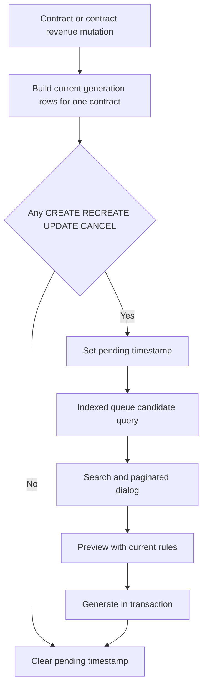
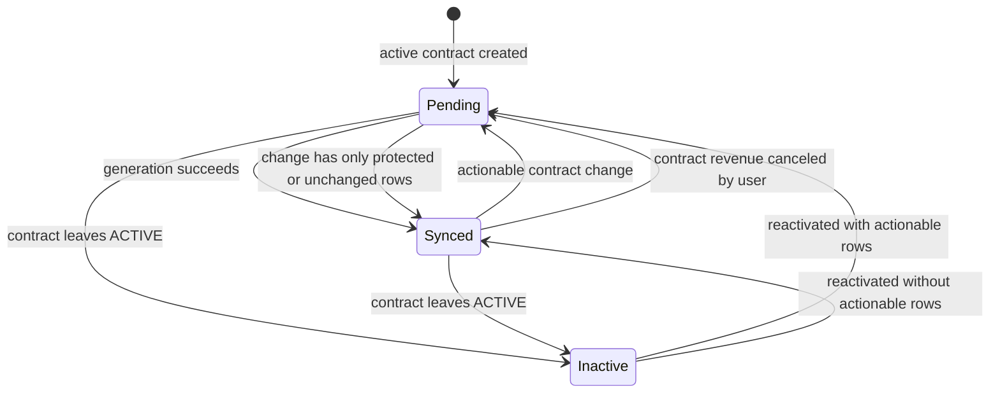

# Contract Revenue Generation Queue - Plan

## Goal Capsule

- **Objective:** 계약 매출 생성 화면을 처리 가능한 계약만 검색·페이지 단위로 보여주는 작업 대기함으로 전환한다.
- **Product authority:** 현장 100개와 현장별 수십 개 계약을 운영해도 이미 처리된 계약 때문에 생성 대상 탐색이 복잡해지지 않아야 한다.
- **Open blockers:** 없음.
- **Execution profile:** Prisma 영속 상태, 계약·매출 트랜잭션, Next.js Route Handler, 클라이언트 대화상자를 함께 변경하는 표준 규모의 코드 변경.
- **Stop conditions:** 계약 매출 일괄 생성, 월별 생성 범위 선택, 매출 계산 규칙 변경이 필요하면 별도 범위로 분리한다.

---

## Product Contract

### Summary

계약 매출 생성 화면은 모든 진행 계약을 한 번에 전달하지 않고, 신규 생성·재생성·갱신·자동취소 중 하나가 필요한 계약만 조회한다.
사용자는 현장과 계약번호·계약명으로 검색하고 한 페이지의 소수 후보만 검토한다.

### Problem Frame

현재 매출 원장 페이지는 모든 `ACTIVE` 계약을 서버에서 읽어 하나의 선택 목록으로 전달한다.
이미 계약 매출이 생성되어 미리보기 결과가 `UNCHANGED` 또는 `PROTECTED`뿐인 계약도 목록에 남지만 생성 버튼은 비활성화되므로 사용자가 아무 작업도 할 수 없다.
계약 수가 수천 건으로 증가하면 전체 계약과 선택 항목을 매 페이지 요청에 싣는 방식은 탐색성과 데이터 전송량 모두에서 확장되지 않는다.

### Requirements

**처리대기 상태**

- R1. 진행 계약 중 실제 생성 액션이 하나 이상 필요한 계약만 처리대기 상태여야 한다.
- R2. 실제 생성 액션은 기존 규칙의 `CREATE`, `RECREATE`, `UPDATE`, `CANCEL`이며 `UNCHANGED`, `PROTECTED`만 있는 계약은 처리대기가 아니어야 한다.
- R3. 계약 생성·수정, 계약 매출 사용자 취소, 계약 매출 생성 성공이 처리대기 상태를 같은 트랜잭션에서 갱신해야 한다.
- R4. 확정 매출 보호와 계약 매출 중복 방지 규칙은 변경하지 않아야 한다.
- R5. 기존 계약은 현재 미리보기 판정으로 한 번 동기화하여 이미 처리된 계약이 배포 직후 다시 노출되지 않아야 한다.

**후보 조회와 화면**

- R6. 후보 조회는 처리대기 중인 진행 계약만 대상으로 계약번호·계약명 검색, 현장 필터, 페이지 번호와 페이지 크기를 지원해야 한다.
- R7. 매출 원장 최초 렌더링은 모든 진행 계약과 그 관계 데이터를 읽거나 클라이언트에 전달하지 않아야 한다.
- R8. 생성 대화상자는 후보를 한 페이지씩 표시하고 전체 대기 건수와 현재 페이지를 알려야 한다.
- R9. 후보가 없으면 정상 완료 상태를 표시하고 미리보기·생성 동작을 비활성화해야 한다.
- R10. 계약 또는 매출 실시간 변경 이벤트가 발생하면 열린 후보 목록을 다시 조회해야 한다.

**검증과 권한**

- R11. 후보 상태가 오래되었더라도 미리보기와 생성 시점에는 기존의 정확한 계산·보호 규칙을 다시 적용해야 한다.
- R12. 후보 API와 미리보기·생성 API는 관리자와 매니저만 사용할 수 있어야 한다.

### Scope Boundaries

**In scope**

- 계약별 처리대기 시각과 조회 인덱스
- 기존 데이터의 정확한 일회성 동기화 스크립트
- 후보 검색·현장 필터·페이지 API
- 처리대기 목록 기반 계약 매출 생성 대화상자
- 계약·매출 생성 흐름의 상태 일관성 테스트

**Deferred to Follow-Up Work**

- 여러 계약의 매출을 한 번에 생성하는 배치 작업
- 월별 생성 대상 제한 또는 예약 실행
- 처리대기 건수의 대시보드 카드

**Out of scope**

- 일할계산, 월정액, 생성 키, 확정 매출 보호 정책 변경
- 직접·조정 매출 입력 방식 변경
- 계약 또는 매출 원장의 삭제 정책 변경

---

## Planning Contract

### Key Technical Decisions

- KTD1. **계약당 최대 한 행인 별도 처리대기 큐를 둔다.** 큐 행이 있으면 대기, 없으면 동기화 완료로 해석하고 대기 시각을 인덱싱한다. 큐 상태 변경이 `Contract.updatedAt`을 오염시키지 않으면서 수천 계약에서도 후보 조회가 전체 관계 스캔으로 바뀌지 않게 한다.
- KTD2. **대기 여부의 판정 권한은 기존 생성 판정 함수에 둔다.** 계약 수정 후 해당 계약 한 건만 다시 계산하여 별도 규칙이 미리보기 규칙과 어긋나지 않게 한다.
- KTD3. **기존 데이터는 애플리케이션 동기화 스크립트로 초기화한다.** SQL에서 일할계산과 보호 정책을 복제하지 않고, 배포의 DB 마이그레이션 흐름에서 현재 TypeScript 판정을 재사용한다.
- KTD4. **후보 조회를 별도 GET Route Handler로 분리한다.** 매출 원장 페이지는 후보를 선적재하지 않고 대화상자가 열릴 때 인증된 동적 요청으로 필요한 페이지만 가져온다.
- KTD5. **생성 API가 최종 권한을 유지한다.** 처리대기 필드는 탐색용 인덱스이며 금액 계산이나 쓰기 허용 판단을 대신하지 않는다.

### High-Level Technical Design

### Sequencing

영속 필드와 순수 액션 판정을 먼저 추가한 뒤 모든 쓰기 경계에서 상태를 유지한다.
그 다음 인덱스만 조회하는 후보 API를 만들고, 마지막으로 클라이언트 대화상자를 API 기반 탐색 UI로 교체한다.

### Risks and Mitigations

- 기존 데이터가 잘못 초기화되면 필요한 계약이 숨겨질 수 있으므로 SQL 휴리스틱 대신 현재 생성 판정을 사용하는 동기화 스크립트와 회귀 테스트를 둔다.
- 후보 조회와 실제 생성 사이에 계약이 바뀔 수 있으므로 생성 트랜잭션은 후보 필드를 신뢰하지 않고 미리보기를 다시 만든다.
- 계약 수정 또는 사용자 취소 경계 하나가 상태 갱신을 누락할 수 있으므로 각 진입점 테스트에서 처리대기 갱신 호출을 검증한다.

---

## Implementation Units

### U1. Persist and initialize the generation queue

- **Goal:** 계약별 처리대기 상태를 인덱싱하고 기존 계약을 현재 판정으로 초기화한다.
- **Requirements:** R1, R2, R5
- **Dependencies:** 없음
- **Files:** `prisma/schema.prisma`, `prisma/migrations/20260713*_contract_revenue_generation_queue/migration.sql`, `src/lib/revenues/generation-queue-migration.test.ts`, `scripts/sync-contract-revenue-generation-queue.ts`, `package.json`, generated Prisma client files
- **Approach:** 계약당 최대 한 행을 갖는 처리대기 큐 모델과 대기 시각 인덱스를 추가한다. 마이그레이션은 기존 테이블을 재작성하지 않고 큐 테이블만 추가하며, 동기화 스크립트가 활성 계약을 배치로 읽어 기존 생성 판정에 따라 큐 행을 생성하거나 제거한다.
- **Execution note:** 마이그레이션 테스트를 먼저 추가해 기존 계약·매출 행을 재작성하지 않는 경계를 증명한다.
- **Patterns to follow:** `src/lib/contracts/billing-method-migration.test.ts`, `scripts/prepare-sqlite.ts`, 기존 `db:migrate`·`db:deploy` 스크립트
- **Test scenarios:**
  - 기존 Contract·RevenueEntry를 재작성하지 않고 처리대기 큐와 조회 인덱스가 추가된다.
  - 기존 활성 계약의 생성 행이 모두 변경 없음 또는 보호됨이면 동기화 결과가 대기 아님이다.
  - 신규 생성 액션이 있는 활성 계약은 동기화 결과가 대기다.
  - 비활성 계약은 생성 행과 무관하게 대기가 아니다.
- **Verification:** 마이그레이션이 기존 데이터를 보존하고 새 스키마로 Prisma 클라이언트를 생성할 수 있다.

### U2. Maintain queue state at every mutation boundary

- **Goal:** 계약과 계약 매출 변경이 처리대기 상태를 트랜잭션 안에서 정확히 유지한다.
- **Requirements:** R1, R2, R3, R4, R11
- **Dependencies:** U1
- **Files:** `src/lib/revenues/expected.ts`, `src/lib/revenues/expected.test.ts`, `src/lib/revenues/generator.ts`, `src/lib/revenues/generator.test.ts`, `src/lib/contracts/service.ts`, `src/lib/contracts/service.test.ts`, `src/lib/migration/service.ts`, `src/lib/revenues/service.ts`, `src/lib/revenues/service.test.ts`
- **Approach:** 액션 가능한 행 판정을 순수 함수로 공유한다. 계약 생성·수정 후 한 계약을 재평가하고, 사용자 취소 후 대기로 전환하며, 생성 성공 후 동기화 완료로 전환한다. 레거시 계약 이관은 활성 계약을 대기로 만든다.
- **Execution note:** 각 쓰기 경계에 실패하는 테스트를 먼저 추가하고 구현한다.
- **Patterns to follow:** `buildGenerationRows`, `buildPreview`, 기존 Prisma 트랜잭션과 optimistic version guard
- **Test scenarios:**
  - 활성 계약 생성은 대기 상태가 되고 초안 계약 생성은 대기가 아니다.
  - 계약 수정 결과가 CREATE·UPDATE·CANCEL을 포함하면 대기 상태가 된다.
  - 계약 수정 결과가 UNCHANGED·PROTECTED만 포함하거나 비활성 상태면 대기가 해제된다.
  - 계약 자동 매출을 사용자가 취소하면 해당 계약이 다시 대기 상태가 된다.
  - 생성이 성공하면 같은 트랜잭션에서 대기 상태가 해제된다.
  - 생성 중 버전 충돌이나 월마감 오류가 발생하면 대기 상태가 유지된다.
- **Verification:** 모든 계약·계약 매출 쓰기 경계가 기존 감사·이벤트·보호 동작과 함께 원자적으로 상태를 갱신한다.

### U3. Add searchable paginated candidate API

- **Goal:** 전체 계약 관계를 읽지 않고 처리대기 계약만 검색·페이지 단위로 반환한다.
- **Requirements:** R6, R7, R11, R12
- **Dependencies:** U1, U2
- **Files:** `src/lib/contracts/schemas.ts`, `src/lib/contracts/schemas.test.ts`, `src/lib/revenues/generator.ts`, `src/lib/revenues/generator.test.ts`, `src/app/api/contracts/revenue-candidates/route.ts`
- **Approach:** 처리대기 큐를 시작점으로 ACTIVE 계약에 조인하여 계약번호·계약명·현장명 검색, 현장 필터, 안정적인 대기순 정렬과 페이지 정보를 제공한다. API는 관리자·매니저 권한을 요구한다.
- **Execution note:** 서비스 쿼리와 권한 있는 Route Handler 응답 계약을 테스트 우선으로 추가한다.
- **Patterns to follow:** `contractListQuerySchema`, `listContracts`, `src/app/api/invoices/candidates/route.ts`
- **Test scenarios:**
  - 검색어와 현장 조건이 처리대기 ACTIVE 기본 조건에 결합된다.
  - 페이지 크기는 허용 범위 밖 값을 거부하고 기본 20건을 사용한다.
  - 결과가 오래된 대기순으로 정렬되고 total·totalPages를 반환한다.
  - 대기 아님, 비활성 계약, 권한 없는 사용자는 후보를 조회할 수 없다.
- **Verification:** 후보 API의 응답 크기는 페이지 크기에 제한되고 전체 계약·품목·원장을 직렬화하지 않는다.

### U4. Replace the full contract select with a queue dialog

- **Goal:** 사용자가 현장과 검색어로 처리할 계약을 빠르게 찾고 생성 후 목록에서 즉시 제거되게 한다.
- **Requirements:** R7, R8, R9, R10, R11
- **Dependencies:** U3
- **Files:** `src/app/(main)/revenues/page.tsx`, `src/components/revenues/revenue-manager.tsx`, `src/components/workflow-contract.test.ts`, `USER_GUIDE.md`
- **Approach:** 페이지의 전체 ACTIVE 계약 쿼리와 contracts prop을 제거한다. 대화상자가 열릴 때 후보 API를 호출하고 필터·페이지·선택·빈 상태를 표시한다. 계약·매출 실시간 이벤트와 생성 성공 후 후보를 재조회한다.
- **Execution note:** 전체 계약 선적재가 사라지고 검색 API를 사용하는지 워크플로 계약 테스트를 먼저 강화한다.
- **Patterns to follow:** 매출 원장 필터 폼, 거래명세표 후보 목록의 로딩·빈 상태·페이지 정보, `useRealtimeRefresh`
- **Test scenarios:**
  - 매출 원장 페이지가 모든 ACTIVE 계약을 조회하거나 props로 전달하지 않는다.
  - 대화상자 열기와 검색 제출이 후보 API를 호출한다.
  - 후보 0건이면 완료 메시지가 보이고 미리보기가 비활성화된다.
  - 후보 선택 후 기존 미리보기와 생성 흐름을 그대로 실행한다.
  - 생성 성공과 실시간 계약·매출 변경이 후보 목록을 갱신한다.
  - 좁은 화면에서 필터와 후보 목록을 가로 스크롤 또는 적절한 줄바꿈으로 사용할 수 있다.
- **Verification:** 수천 계약을 가정해도 브라우저에는 한 페이지 후보만 렌더링되고 기존 미리보기·생성 안전장치가 유지된다.

---

## Verification Contract

| Gate | Applies to | Required outcome |
|---|---|---|
| Focused migration and queue tests | U1, U2 | 처리대기 스키마·초기화·상태 전이가 모두 통과한다. |
| Candidate schema and service tests | U3 | 검색·현장·페이지·기본 대기 조건이 통과한다. |
| Workflow contract tests | U4 | 전체 계약 선적재 제거와 API 기반 대화상자 흐름을 검증한다. |
| `npm test` | All | 전체 Vitest 회귀 테스트가 통과한다. |
| `npm run typecheck` | All | 생성된 Prisma 타입과 Next.js 컴포넌트 타입이 일치한다. |
| `npm run lint` | All | 새 Route Handler, 서비스, 클라이언트 코드에 lint 오류가 없다. |
| `npm run build` | All | Next.js 16 production build가 새 API 경로를 포함해 성공한다. |
| Browser verification | U4 | 데스크톱과 모바일 폭에서 검색·선택·빈 상태·생성 완료 흐름을 확인한다. |

---

## Definition of Done

- 이미 생성되어 변경 없음 또는 보호됨만 남은 계약은 계약 매출 생성 후보에 나타나지 않는다.
- 신규·갱신·재생성·자동취소가 필요한 진행 계약은 검색 가능한 대기 후보로 나타난다.
- 매출 원장 최초 렌더링이 전체 진행 계약 목록을 읽거나 직렬화하지 않는다.
- 후보 API는 검색·현장·페이지 조건과 편집 권한을 강제한다.
- 계약 생성·수정, 계약 매출 사용자 취소, 생성 성공이 처리대기 상태를 원자적으로 유지한다.
- 기존 데이터 동기화가 현재 생성 판정을 재사용하고 매출 행을 변경하지 않는다.
- 확정 매출 보호, 월마감, optimistic concurrency, 생성 키 규칙이 유지된다.
- 집중 테스트, 전체 테스트, 타입 검사, lint, production build와 브라우저 확인이 완료된다.
