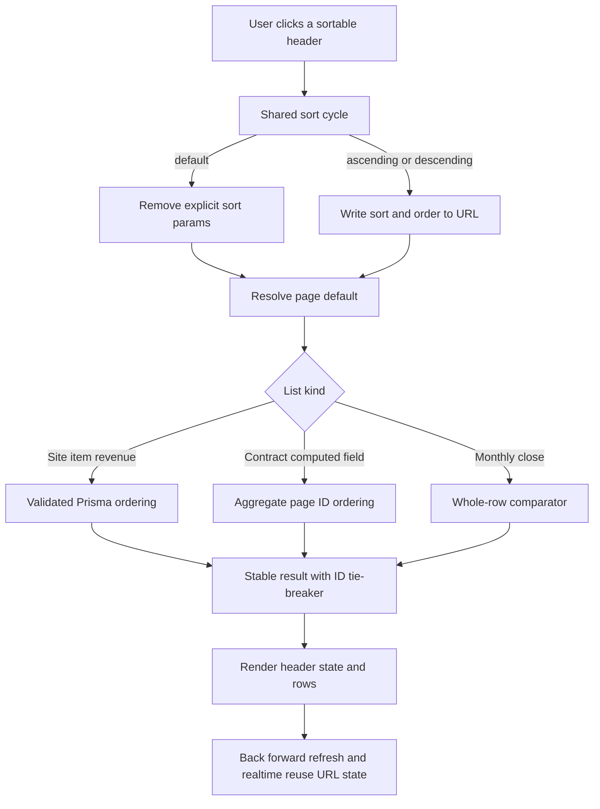

# Sortable Table Headers - Plan

## Goal Capsule

- **Objective:** 현장, 품목, 계약관리, 매출원장과 월마감의 주요 데이터 컬럼을 헤더 클릭으로 정렬하고 대량 데이터에서도 일관된 조회 순서를 제공한다.
- **Product authority:** 여러 현장과 다수 계약을 관리하는 실무 담당자가 필요한 레코드를 빠르게 찾고 최근 변경사항을 우선 확인해야 한다는 운영 요구.
- **Open blockers:** 없음.
- **Execution profile:** 다섯 개 목록 화면의 공통 상호작용, 전체 결과 정렬, URL 상태 유지와 페이지별 기본 순서를 함께 다루는 표준 규모의 코드 변경.
- **Stop conditions:** 다중 컬럼 정렬, 사용자별 저장 정렬, 컬럼 재배치 또는 보조 표까지 범위를 넓혀야 하면 별도 작업으로 분리한다.

---

## Product Contract

### Summary

현장, 품목, 계약관리, 매출원장과 월마감의 의미 있는 데이터 컬럼을 헤더 클릭으로 정렬한다.
현장, 품목, 계약관리와 매출원장은 최종수정일 최신순을 기본으로 하고 월마감은 기존 업무 우선순위를 유지한다.

### Problem Frame

현장 수가 늘고 각 현장에 수십 개 계약과 매출이 누적되면 고정된 목록 순서만으로 최근 변경 건이나 특정 조건의 레코드를 찾기 어렵다.
현재 화면마다 기본 순서와 데이터 로딩 방식이 달라 페이지를 넘길 때 정렬 기준을 예측하기 어렵고, 현장과 품목은 최종수정일을 화면에서 확인할 수도 없다.

### Key Decisions

- **전체 조회 결과를 정렬한다.** 현재 페이지 안에서만 행을 재배치하지 않고 검색과 필터가 적용된 전체 결과를 정렬한 뒤 페이지를 나눈다.
- **의미 있는 데이터 컬럼만 정렬한다.** 선택 체크박스, 관리·액션 컬럼과 복잡한 예외 상세문은 정렬 대상에서 제외한다.
- **페이지별 기본 순서를 보존한다.** 현장, 품목, 계약관리와 매출원장은 최종수정일 최신순을 사용하고 월마감은 기존 업무 우선순위를 사용한다.
- **정렬 상태를 URL에 유지한다.** 검색, 필터, 페이지 이동, 새로고침, 뒤로가기와 공유 링크에서도 같은 정렬 조건을 재현한다.
- **한 번에 한 컬럼만 정렬한다.** 사용자가 이해하기 쉬운 단일 컬럼 정렬만 제공하고 다중 컬럼 조합은 이번 범위에서 제외한다.

### Requirements

**정렬 대상과 범위**

- R1. 현장, 품목, 계약관리, 매출원장과 월마감의 메인 목록은 의미 있는 데이터 컬럼의 헤더를 눌러 정렬할 수 있어야 한다.
- R2. 정렬은 검색과 필터가 적용된 전체 결과에 먼저 적용되고 그 결과가 페이지 단위로 나뉘어야 한다.
- R3. 선택 체크박스와 관리·액션 컬럼은 정렬할 수 없어야 한다.
- R4. 월마감의 예외 상세문처럼 여러 문장과 동작을 포함한 내용 자체는 정렬하지 않고, 사용자에게 표시되는 예외 건수처럼 명확한 계산값을 기준으로 정렬해야 한다.
- R5. 계약의 품목 수와 품목 기준금액 합계, 매출원장의 금액, 월마감의 매출과 예외 건수처럼 화면에 표시되는 계산형 값도 의미 있는 정렬 기준에 포함해야 한다.
- R6. 동일한 정렬값을 가진 레코드가 있어도 페이지 이동 중 행이 중복되거나 누락되지 않도록 결과 순서가 일관되어야 한다.

**기본 순서와 최종수정일**

- R7. 현장 목록의 기본 순서는 최종수정일 최신순이어야 한다.
- R8. 품목 목록의 기본 순서는 최종수정일 최신순이어야 한다.
- R9. 계약관리 목록의 기본 순서는 최종수정일 최신순이어야 한다.
- R10. 매출원장 목록의 기본 순서는 최종수정일 최신순이어야 한다.
- R11. 현장과 품목 목록에는 각 레코드의 최종수정일을 사용자가 확인할 수 있는 컬럼을 추가해야 한다.
- R12. 현장과 품목에 표시하는 최종수정일은 해당 목록의 기본 정렬에 사용하는 값과 같아야 한다.
- R13. 월마감의 기본 순서는 열린 현장 우선, 마감 차단 예외가 많은 현장 우선, 전체 예외가 많은 현장 우선, 현장명 오름차순의 기존 업무 우선순위를 유지해야 한다.

**헤더 상호작용과 상태 유지**

- R14. 정렬 가능한 헤더를 반복해서 누르면 `페이지 기본 순서 → 오름차순 → 내림차순 → 페이지 기본 순서`로 순환해야 한다.
- R15. 사용자가 현재 어떤 컬럼과 방향으로 정렬하고 있는지 헤더에서 즉시 구분할 수 있어야 한다.
- R16. 키보드만으로도 정렬 가능한 헤더를 조작할 수 있고 보조기술이 현재 정렬 상태를 알 수 있어야 한다.
- R17. 정렬 기준이나 방향을 변경하면 현재 검색과 필터는 유지하되 결과 페이지는 첫 페이지로 이동해야 한다.
- R18. 선택한 정렬 기준과 방향은 페이지 이동, 검색, 필터 적용과 새로고침 후에도 유지되어야 한다.
- R19. 정렬 상태는 URL에 반영되어 브라우저 뒤로가기와 앞으로가기, 북마크와 공유 링크에서 같은 목록 상태를 재현해야 한다.
- R20. 사용자가 정렬을 페이지 기본 순서로 되돌리면 별도 정렬 조건은 해제되고 해당 화면의 기본 순서가 다시 적용되어야 한다.

### Key Flows

- F1. 기본 목록 확인
  - **Trigger:** 담당자가 현장, 품목, 계약관리 또는 매출원장에 처음 진입한다.
  - **Steps:** 목록이 최종수정일 최신순으로 열리고 현장과 품목에서는 각 행의 최종수정일을 함께 확인한다.
  - **Outcome:** 최근 변경된 레코드를 별도 조작 없이 먼저 확인한다.
  - **Covered by:** R7-R12
- F2. 컬럼 헤더 정렬
  - **Trigger:** 담당자가 비교하려는 데이터 컬럼의 헤더를 누른다.
  - **Steps:** 전체 필터 결과를 해당 컬럼의 오름차순으로 정렬하고 다시 누르면 내림차순, 한 번 더 누르면 페이지 기본 순서로 복귀한다.
  - **Outcome:** 현재 정렬 상태가 헤더에 표시되고 첫 페이지부터 일관된 순서로 조회된다.
  - **Covered by:** R1-R6, R14-R17, R20
- F3. 정렬된 결과 탐색
  - **Trigger:** 담당자가 정렬 후 검색, 필터 또는 페이지 이동을 수행한다.
  - **Steps:** 같은 정렬 조건을 유지한 채 조건에 맞는 전체 결과를 다시 정렬하고 URL을 갱신한다.
  - **Outcome:** 새로고침하거나 링크를 다시 열어도 같은 정렬 상태를 재현한다.
  - **Covered by:** R2, R6, R18-R19
- F4. 월마감 기본 순서 복귀
  - **Trigger:** 담당자가 월마감에서 임의 컬럼 정렬을 세 번째 클릭으로 해제한다.
  - **Steps:** 별도 컬럼 정렬을 제거하고 기존 업무 우선순위를 다시 적용한다.
  - **Outcome:** 우선 처리해야 할 열린 현장과 예외가 많은 현장이 다시 위에 표시된다.
  - **Covered by:** R13-R14, R20

### Acceptance Examples

- AE1. **Covers R7, R11-R12.** 현장 목록에 오늘 수정한 현장과 어제 수정한 현장이 있으면 오늘 수정한 현장이 먼저 표시되고 두 행 모두 최종수정일을 확인할 수 있다.
- AE2. **Covers R8-R10.** 품목, 계약관리와 매출원장에 처음 진입하면 각 화면의 최근 수정 레코드가 먼저 표시된다.
- AE3. **Covers R2, R6, R14, R17.** 계약관리 3페이지에서 계약번호 헤더를 누르면 검색과 필터는 유지된 채 전체 계약을 계약번호 오름차순으로 다시 정렬하고 1페이지로 이동한다.
- AE4. **Covers R14-R15, R20.** 같은 헤더를 첫 번째로 누르면 오름차순, 두 번째로 누르면 내림차순, 세 번째로 누르면 해당 화면의 기본 순서가 적용되며 헤더 표시도 그 상태와 일치한다.
- AE5. **Covers R4-R5.** 월마감의 예외 헤더를 누르면 예외 메시지 문장이 아니라 표시된 예외 건수를 기준으로 현장 행이 정렬된다.
- AE6. **Covers R13-R14, R20.** 월마감에서 현장명 정렬을 해제하면 현장명순을 유지하지 않고 열린 현장, 차단 예외 수, 전체 예외 수, 현장명 순의 기존 우선순위로 돌아간다.
- AE7. **Covers R18-R19.** 매출액 내림차순과 현장 필터가 적용된 매출원장 URL을 다른 사용자가 열면 같은 필터와 정렬 결과가 표시된다.
- AE8. **Covers R16.** 키보드로 정렬 헤더에 초점을 이동해 실행하면 마우스 클릭과 같은 순환이 동작하고 현재 방향이 보조기술에 전달된다.

### Scope Boundaries

- 여러 컬럼을 조합하는 다중 정렬은 포함하지 않는다.
- 사용자별 기본 정렬 저장과 개인화된 정렬 프리셋은 포함하지 않는다.
- 컬럼 순서 변경, 너비 조절과 표시 컬럼 선택은 포함하지 않는다.
- 계약 매출 생성, 가져오기 미리보기와 편집 팝업 안의 보조 표는 포함하지 않는다.
- 선택 체크박스, 관리 버튼과 예외 상세문 자체에는 정렬 동작을 추가하지 않는다.

### Dependencies and Assumptions

- `최종수정일순`은 가장 최근에 수정된 레코드가 먼저 표시되는 내림차순을 뜻한다.
- 최종수정일은 각 레코드에 기록된 수정 시각을 사용하며 화면 표시는 애플리케이션의 기존 날짜·시간 표현을 따른다.
- 페이지별 검색과 필터 조건은 정렬 조건과 함께 URL에서 재현할 수 있어야 한다.
- 월마감은 현재 제공하는 전체 현장 평가 결과 안에서 동일한 업무 우선순위를 계속 계산할 수 있다.

### Sources and Research

- `src/lib/masters/schemas.ts` — 현장과 품목 목록에 이미 존재하는 제한적 정렬 입력과 현재 기본값.
- `src/lib/masters/site-service.ts` — 현장 전체 결과 정렬과 페이지 처리 흐름.
- `src/lib/masters/item-service.ts` — 품목 전체 결과 정렬과 페이지 처리 흐름.
- `src/lib/contracts/service.ts` — 계약 목록의 현재 최종수정일 최신순과 페이지 처리 흐름.
- `src/lib/revenues/service.ts` — 매출원장의 현재 매출일 기준 기본 순서와 페이지 처리 흐름.
- `src/components/reports/month-close-control-room-state.ts` — 월마감의 기존 업무 우선순위 정렬 규칙.
- `src/components/masters/master-manager.tsx` — 현장과 품목의 현재 메인 표 컬럼.
- `src/components/contracts/contract-manager.tsx` — 계약관리의 현재 메인 표 컬럼과 최종수정일 표시.
- `src/components/revenues/revenue-manager.tsx` — 매출원장의 현재 메인 표 컬럼과 최종수정일 표시.
- `src/components/reports/month-close-control-room.tsx` — 월마감의 현재 메인 표 컬럼.

---

## Planning Contract

### Product Contract Preservation

Product Contract unchanged. 위 요구사항, 흐름, 수용 예시와 범위 경계는 구현 계획의 제품 기준이며 구현 편의를 이유로 정렬 대상이나 상태 유지 범위를 줄이지 않는다.

### Context and Research

- 애플리케이션은 Next.js 16.2.10 App Router, React 19, TypeScript strict, Prisma 7.8과 SQLite로 구성되어 있다. 목록 Route Handler는 query schema를 통과시킨 뒤 도메인 서비스에 위임한다.
- 현장과 품목은 이미 `sort`와 `order`를 받아 DB에서 정렬한 뒤 페이지를 나누지만 기본값이 이름 오름차순이고 UI는 별도 정렬 선택창을 사용한다.
- 계약과 매출원장은 페이지 단위 조회를 사용한다. 계약은 최종수정일 최신순, 매출원장은 매출일 최신순으로 고정되어 있다.
- 월마감은 대상 현장의 평가 결과 전체를 만들고 열린 상태, 차단 예외 수, 전체 예외 수와 현장명 순으로 클라이언트에서 정렬한다.
- 계약의 품목 수와 기준금액 합계는 저장된 계약 header 값이 아니라 활성 품목 행에서 계산된다. 전체 결과 정렬과 페이지 처리를 함께 만족하려면 계산값으로 먼저 계약 ID 순서를 정한 뒤 해당 페이지의 상세 행을 조회해야 한다.
- Next.js 16의 `searchParams` Page prop과 Native History API는 URL query를 서버 초기 조회와 클라이언트의 뒤로가기 가능한 상태에 연결하는 공식 경로다. 기존 client-fetch 목록 구조를 유지하면서 query state만 공통화한다.
- `docs/solutions/`와 `CONCEPTS.md`는 현재 없으므로 이 작업에 적용할 별도 학습 문서나 용어집은 없다.

### Key Technical Decisions

- KTD1. **공통 정렬 상태와 헤더 컴포넌트를 만든다.** 다섯 화면이 같은 `기본 → 오름차순 → 내림차순 → 기본` 전이, 아이콘, 키보드 동작과 `aria-sort` 표현을 공유하게 해 화면별 상호작용 차이를 막는다. Covers R1, R3-R5, R14-R16, R20; F2; AE4, AE8.
- KTD2. **URL에는 명시적 정렬만 기록한다.** 페이지 기본 순서에서는 `sort`와 `order`를 제거하고 명시적 오름차순·내림차순에서만 두 값을 기록한다. 검색, 필터, 페이지와 함께 `pushState`로 기록하고 `popstate`에서 다시 조회해 뒤로가기와 공유 링크를 재현한다. Covers R17-R20; F3; AE3, AE7.
- KTD3. **페이지 목록은 서버가 전체 결과를 정렬한 뒤 자른다.** 현장, 품목, 계약과 매출원장은 검증된 sort key를 서비스에서 DB 정렬 표현으로 매핑하고 마지막 기준에 고유 ID를 추가한다. 브라우저는 현재 페이지 행을 다시 정렬하지 않는다. Covers R2, R6-R10; F1-F3; AE1-AE3.
- KTD4. **계약 계산값은 집계 정렬용 ID query와 상세 조회를 분리한다.** 품목 수와 기준금액 합계 정렬은 활성 품목만 집계하고 UI와 같은 행별 원 단위 계산을 사용해 페이지 ID를 결정한다. sort key는 allowlist로 선택하고 값은 parameter binding해 임의 SQL 입력을 차단한 뒤 Prisma로 상세 관계를 조회해 ID 순서대로 복원한다. Covers R2, R5-R6, R9; F2; AE3.
- KTD5. **복합 컬럼의 정렬 의미를 화면 표시와 맞춘다.** 기간은 시작일 뒤 종료일, 별칭은 알파벳순 첫 별칭, 수량·단가는 수량 뒤 적용단가, 월마감 매출은 총매출 뒤 건수, 예외는 전체 건수 뒤 차단 건수를 사용한다. 값이 없으면 마지막에 두고 모든 정렬은 고유 ID로 안정화한다. Covers R4-R6; F2; AE5.
- KTD6. **상태는 도메인 순서를 사용한다.** Boolean이나 enum 저장 문자열의 우연한 순서가 아니라 화면의 업무 흐름 순서로 현장·품목 사용 상태, 계약 수명주기, 매출 상태와 월마감 상태를 비교한다. Covers R1, R5-R6, R13; F2, F4.
- KTD7. **월마감은 완성된 전체 평가 결과를 정렬한다.** 기존 업무 우선순위 comparator를 기본값으로 유지하고 명시적 현장·상태·매출·예외 정렬만 같은 전체 row 집합에 적용한다. 선택된 현장은 ID로 유지해 행 순서가 바뀌어도 선택 대상이 달라지지 않게 한다. Covers R2-R6, R13-R14, R20; F4; AE5-AE6.
- KTD8. **현장·품목의 별도 정렬 선택창을 제거한다.** 헤더를 유일한 정렬 조작부로 사용하고 기존 선택창과 헤더 상태가 충돌하는 이중 제어를 만들지 않는다. Excel 내보내기와 팝업 내부 표의 정렬은 그대로 둔다. Covers R1, R3, R15; F2.

### Sort Semantics

| 화면 | 정렬 가능한 헤더 | 대표 정렬값 |
|---|---|---|
| 현장 | 코드, 현장명, 거래처, 담당자, 운영 기간, 별칭, 상태, 최종수정일 | 기간은 시작일·종료일, 별칭은 첫 별칭, 상태는 사용 여부 |
| 품목 | 코드, 품목명, 단위, 표준 매출단가, 표준 매입단가, 별칭, 상태, 최종수정일 | 별칭은 첫 별칭, 상태는 사용 여부 |
| 계약관리 | 계약번호, 계약명, 현장, 매출기간, 품목, 품목 기준금액 합계, 상태, 최종수정일 | 기간은 시작일·종료일, 품목은 활성 품목 수, 합계는 화면과 같은 행별 금액 합계 |
| 매출원장 | 매출일, 현장, 출처, 내용, 수량·단가, 매출액, 매입액, 상태, 최종수정일 | 내용은 제목, 수량·단가는 수량·적용 매출단가, null은 마지막 |
| 월마감 | 현장, 상태, 매출, 예외 | 상태는 업무 상태, 매출은 총매출·건수, 예외는 전체·차단 건수 |

### High-Level Technical Design



```mermaid
stateDiagram-v2
  [*] --> Default
  Default --> Ascending: click header
  Ascending --> Descending: click same header
  Descending --> Default: click same header
  Ascending --> Ascending: click another header
  Descending --> Ascending: click another header
  Default: page-specific default order
  Ascending: explicit sort=key and order=asc
  Descending: explicit sort=key and order=desc
```

### System-Wide Impact

- **Query contracts:** 현장·품목 기본값을 최종수정일 최신순으로 바꾸고 계약, 매출원장과 월마감 query schema에 허용된 sort key와 방향을 추가한다. 잘못된 API 값은 기존 오류 경계에서 거부하고 Page 초기화는 안전한 기본값으로 복구한다.
- **Server rendering:** 다섯 Page가 `searchParams`를 해석해 새로고침과 공유 URL의 초기 데이터, 필터와 정렬 상태를 Client Component에 전달한다.
- **Client navigation:** 조회, 페이지 이동과 정렬은 하나의 committed query state를 사용한다. 일반 조작은 API 성공 후에만 새 history entry를 기록하고 실패하면 기존 행과 URL 상태를 유지한다. 뒤로가기·앞으로가기처럼 URL이 먼저 바뀌는 `popstate` 조회가 실패하면 해당 URL은 유지하고 기존 행과 함께 재시도 가능한 오류를 표시한다.
- **Realtime refresh:** 동기화 이벤트와 생성·수정 후 재조회는 현재 URL의 필터, 명시적 정렬과 페이지를 유지하되 새 history entry를 만들지 않는다.
- **Selection:** 매출원장의 현재 페이지 선택 보호 규칙은 유지하고 월마감 선택은 site ID로 유지한다. 정렬만으로 다른 레코드가 선택되어서는 안 된다.
- **Persistence:** 새 컬럼과 migration은 필요하지 않다. 기존 scalar, 관계와 계산값만 조회에 사용한다.

### Risks and Dependencies

| Risk | Impact | Mitigation |
|---|---|---|
| 계약 집계 정렬이 기존 검색·필터 의미와 달라짐 | 헤더 정렬 시 목록 대상 자체가 달라질 수 있음 | 집계 ID query에 같은 상태·현장·검색 조건을 적용하고 직접 scalar 정렬과 계산 정렬의 대상 ID 집합 일치 테스트를 둔다. |
| 계산값과 화면 표시 계산이 달라짐 | 합계가 같은데 예상과 다른 순서가 보임 | 활성 품목만 포함하고 행별 `수량 × 적용 매출단가` 원 단위 반올림을 한 곳에서 정의해 표시와 정렬이 공유한다. |
| URL과 로컬 상태가 분리됨 | 뒤로가기 후 헤더와 행이 다른 상태가 됨 | 일반 조작은 성공한 조회를 기준으로 URL을 갱신하고 popstate는 URL을 source of truth로 query, control state와 데이터를 함께 복원한다. popstate 조회 실패 시 기존 행을 보존하고 오류·재시도 상태를 노출하는 회귀 테스트를 둔다. |
| 동일값 또는 null 처리 차이 | 페이지 사이 행이 흔들리거나 null이 먼저 나타남 | null-last 규칙과 고유 ID 마지막 정렬을 모든 서비스와 comparator에 강제한다. |
| 현재 worktree의 매출 생성 큐 변경과 파일이 겹침 | 서로 다른 기능이 한 diff에 섞여 검토가 어려워짐 | 구현 전에 기존 변경을 보존하고, 겹치는 계약·매출 파일은 현재 diff를 기준으로 최소 patch를 적용하며 정렬 전용 신규 테스트를 분리한다. |

### Sequencing

공통 정렬 상태와 URL 계약을 먼저 확정한 뒤 페이지 목록별 서버 정렬을 연결한다. 현장·품목으로 공통 흐름을 증명하고 계약 집계 정렬, 매출원장, 월마감을 독립적으로 연결한 다음 다섯 화면의 통합 회귀와 문서를 마무리한다.

---

## Implementation Units

### U1. Shared sort state, URL history, and accessible header

- **Goal:** 다섯 화면이 재사용할 정렬 전이, URL 상태 복원과 접근 가능한 헤더 표현을 만든다.
- **Requirements:** R14-R20; F2-F3; AE4, AE7-AE8.
- **Dependencies:** 없음.
- **Files:** `src/lib/list-sorting.ts`, `src/lib/list-sorting.test.ts`, `src/components/use-list-query-state.ts`, `src/components/ui/sortable-table-head.tsx`, `src/components/sortable-table-contract.test.ts`.
- **Approach:** 기본 상태와 명시적 sort state를 구분하고 다른 헤더를 누르면 오름차순부터 시작하도록 순수 전이 함수를 둔다. 공통 URL hook은 query serialize, 성공 후 push, history 복원과 history를 남기지 않는 refresh를 분리한다. 헤더는 실제 button을 사용하고 정렬 방향, 기본 상태, 숫자 우측 정렬을 표현한다.
- **Patterns to follow:** `src/components/ui/table.tsx`의 semantic table wrapper, `src/components/ui/button.tsx`의 focus style, Next.js 16 Native History API 지침.
- **Test scenarios:**
  1. Covers AE4. 기본 상태에서 같은 key를 세 번 순환하면 오름차순, 내림차순, 기본 상태가 된다.
  2. 다른 key를 누르면 기존 방향과 관계없이 새 key 오름차순이 된다.
  3. 기본 상태를 serialize하면 sort/order가 제거되고 검색·필터는 유지된다.
  4. Covers AE7. 명시적 정렬과 페이지를 serialize한 URL을 parse하면 같은 state가 복원된다.
  5. Covers AE8. 정렬 가능한 헤더는 keyboard button과 현재 방향의 `aria-sort` 계약을 노출하고 비정렬 헤더에는 동작을 추가하지 않는다.
- **Verification:** 순수 상태 테스트가 통과하고 공통 헤더를 사용하는 화면이 자체 정렬 전이를 구현하지 않아도 같은 상호작용을 제공한다.

### U2. Site and item server sorting with final-modified columns

- **Goal:** 현장과 품목의 모든 대상 헤더를 전체 결과 기준으로 정렬하고 최종수정일 최신순 기본값과 표시를 적용한다.
- **Requirements:** R1-R3, R6-R8, R11-R12, R14-R20; F1-F3; AE1-AE4, AE7-AE8.
- **Dependencies:** U1.
- **Files:** `src/lib/masters/schemas.ts`, `src/lib/masters/schemas.test.ts`, `src/lib/masters/site-service.ts`, `src/lib/masters/item-service.ts`, `src/lib/masters/list-service.test.ts`, `src/app/(main)/masters/sites/page.tsx`, `src/app/(main)/masters/items/page.tsx`, `src/components/masters/master-manager.tsx`.
- **Approach:** master sort key를 화면별 allowlist로 확장하고 기본값을 최종수정일 내림차순으로 변경한다. scalar 값은 Prisma에서 안정 정렬하고 다중 별칭은 전체 필터 결과의 첫 별칭 값으로 정렬한 뒤 페이지를 결정한다. Page는 URL query를 초기값으로 사용하고 manager는 별도 정렬 select를 제거해 공통 헤더와 최종수정일 셀을 렌더링한다.
- **Execution note:** 서비스의 기존 검색·상태 필터를 characterization test로 고정한 뒤 정렬 key를 확장한다.
- **Patterns to follow:** 기존 `masterListQuerySchema`, `listSites`, `listItems`, `formatSeoulDateTime`과 API의 thin handler 경계.
- **Test scenarios:**
  1. Covers AE1. query가 없으면 현장과 품목이 최종수정일 내림차순이며 최종수정일 표시값과 같은 timestamp를 사용한다.
  2. 코드, 이름, 거래처·담당자·기간 또는 단위·단가, 별칭과 상태를 각각 오름차순·내림차순으로 정렬한다.
  3. 같은 값과 null이 섞이면 null은 마지막이고 ID tie-breaker가 페이지 순서를 고정한다.
  4. 검색과 상태 필터 뒤 정렬한 전체 결과의 1·2페이지에 중복이나 누락이 없다.
  5. Covers AE4, AE7. 헤더 세 번째 클릭과 공유 URL이 각각 기본 순서와 명시적 순서를 복원한다.
- **Verification:** 두 목록의 별도 정렬 select가 없어지고 최종수정일 컬럼, 헤더 상태, API 결과와 페이지 순서가 일치한다.

### U3. Contract scalar and aggregate sorting

- **Goal:** 계약의 scalar, 관계, 활성 품목 수와 기준금액 합계를 전체 필터 결과에서 안정적으로 정렬한다.
- **Requirements:** R1-R2, R5-R6, R9, R14-R20; F1-F3; AE2-AE4, AE7-AE8.
- **Dependencies:** U1.
- **Files:** `src/lib/contracts/schemas.ts`, `src/lib/contracts/schemas.test.ts`, `src/lib/contracts/list-order.ts`, `src/lib/contracts/list-order.test.ts`, `src/lib/contracts/service.ts`, `src/lib/contracts/list-service.test.ts`, `src/app/(main)/contracts/page.tsx`, `src/components/contracts/contract-manager.tsx`.
- **Approach:** contract query에 명시적 sort/order를 추가하고 기본은 최종수정일 내림차순으로 둔다. 직접 필드는 Prisma orderBy를 사용하고 품목 수·합계는 allowlist 기반 집계 query로 페이지 ID를 먼저 구한 뒤 기존 include로 상세 행을 조회하고 순서를 복원한다. 합계 계산 helper는 UI 표시도 공유한다.
- **Execution note:** 전체 필터 대상과 집계 대상의 동등성을 먼저 테스트한 뒤 query와 UI를 연결한다.
- **Patterns to follow:** `listContracts`의 Prisma where, `contractInclude`의 활성 품목 조건, 기존 계약 서비스의 transaction과 domain boundary.
- **Test scenarios:**
  1. Covers AE2. query가 없으면 최근 수정 계약이 먼저 표시된다.
  2. 계약번호, 계약명, 현장, 매출기간, 상태와 최종수정일이 전체 결과 기준으로 양방향 정렬된다.
  3. 활성 품목 수 정렬은 비활성 품목을 제외하고 같은 수에서는 ID tie-breaker를 사용한다.
  4. 기준금액 합계 정렬은 각 활성 행의 반올림 금액 합계와 화면 표시값을 동일하게 사용한다.
  5. Covers AE3. 3페이지에서 계약번호를 누르면 기존 필터를 유지하고 전체 결과를 다시 정렬한 1페이지를 반환한다.
  6. 임의 sort key가 집계 query에 전달되지 않고 schema에서 거부된다.
- **Verification:** 직접 필드와 계산 필드 모두 total·totalPages를 바꾸지 않고 정확한 page row를 반환하며 계약 편집과 매출 생성 흐름은 변하지 않는다.

### U4. Revenue ledger sorting and URL restoration

- **Goal:** 매출원장 대상 컬럼을 전체 필터 결과에서 정렬하고 기본 순서를 최종수정일 최신순으로 바꾼다.
- **Requirements:** R1-R3, R5-R6, R10, R14-R20; F1-F3; AE2, AE4, AE7-AE8.
- **Dependencies:** U1.
- **Files:** `src/lib/revenues/schemas.ts`, `src/lib/revenues/schemas.test.ts`, `src/lib/revenues/service.ts`, `src/lib/revenues/list-service.test.ts`, `src/app/(main)/revenues/page.tsx`, `src/components/revenues/revenue-manager.tsx`.
- **Approach:** revenue query allowlist를 화면 컬럼에 맞춰 확장하고 관계명, enum 업무순서, nullable 수량·단가와 금액을 안정된 Prisma order로 변환한다. 기존 Page의 searchParams 초기화를 공통 URL state와 연결하고 manager의 fetch, pagination, realtime refresh와 selection pruning이 현재 정렬을 유지하게 한다. Excel export는 기존 독립 순서를 유지한다.
- **Patterns to follow:** 현재 `revenueListQuerySchema`, `buildRevenueWhere`, `listRevenues`, Page의 Next.js 16 async `searchParams` 처리.
- **Test scenarios:**
  1. Covers AE2. query가 없으면 최종수정일이 최근인 매출이 먼저 표시된다.
  2. 매출일, 현장, 출처, 내용, 수량·단가, 매출액, 매입액, 상태와 최종수정일을 각 방향으로 정렬한다.
  3. 수량 또는 단가가 없는 직접 금액 행은 수량·단가 정렬에서 값이 있는 행 뒤에 안정적으로 위치한다.
  4. 검색·기간·현장·출처·상태·예외 필터와 sort를 함께 적용해도 totals는 같은 필터 집합의 합계를 유지한다.
  5. Covers AE7. 현장 필터와 매출액 내림차순 URL을 열거나 뒤로가면 control, header와 rows가 함께 복원된다.
  6. 정렬 후 현재 페이지에서 사라진 일괄확정 선택 ID는 기존 규칙대로 제거된다.
- **Verification:** 목록과 요약 합계, 현재 페이지 선택, 내보내기 링크, 생성·수정·실시간 재조회가 서로 다른 query state를 사용하지 않는다.

### U5. Monthly-close whole-result sorting

- **Goal:** 월마감 전체 현장을 현장, 업무 상태, 매출과 예외 기준으로 정렬하면서 기존 우선순위를 기본값으로 보존한다.
- **Requirements:** R1-R6, R13-R20; F2-F4; AE4-AE8.
- **Dependencies:** U1.
- **Files:** `src/lib/monthly-close/schemas.ts`, `src/lib/monthly-close/schemas.test.ts`, `src/lib/monthly-close/control-room-order.ts`, `src/lib/monthly-close/control-room-order.test.ts`, `src/lib/monthly-close/service.ts`, `src/components/reports/month-close-control-room-state.ts`, `src/components/reports/month-close-control-room-state.test.ts`, `src/app/(main)/reports/monthly/close/page.tsx`, `src/components/reports/month-close-control-room.tsx`.
- **Approach:** monthly close query와 Page 초기값에 month, view, sort, order를 포함한다. 전체 평가 row를 만든 뒤 공통 comparator에서 기본 업무 우선순위 또는 명시적 대표값을 적용하고 view filter는 그 순서를 보존한다. 헤더 정렬과 월·보기 변경은 URL을 갱신하고 선택 site ID는 유지 가능한 대상만 남긴다.
- **Patterns to follow:** 기존 `sortControlRoomRows`, `filterControlRoomRows`, query schema와 control-room API refresh 흐름.
- **Test scenarios:**
  1. Covers AE6. 기본 상태와 세 번째 클릭 복귀는 열린 현장, 차단 수, 예외 수, 현장명 순을 유지한다.
  2. 현장명은 한국어 비교, 상태는 업무 상태, 매출은 총매출·건수, 예외는 전체·차단 건수로 양방향 정렬된다.
  3. Covers AE5. 예외 메시지 문구가 달라도 예외 건수가 같은 행은 차단 수와 ID tie-breaker로 안정화된다.
  4. 예외만·전체 현장 전환은 현재 sort를 유지하고 filter 후 상대 순서를 바꾸지 않는다.
  5. 정렬 전 선택한 열린 현장은 정렬 후에도 같은 site ID로 선택되고 마감된 행은 선택 대상에서 제외된다.
  6. Covers AE8. 네 데이터 헤더만 keyboard 정렬을 제공하고 선택·관리 header는 비정렬 상태로 남는다.
- **Verification:** 기본 월마감 처리 우선순위와 마감·검토·되돌리기 동작은 그대로이며 명시적 정렬과 URL 복원이 전체 row 집합에서 일치한다.

### U6. Cross-screen regression contract and user guidance

- **Goal:** 다섯 화면의 공통 동작, 제외 범위와 사용자 사용법을 하나의 회귀 계약으로 고정한다.
- **Requirements:** R1-R20; F1-F4; AE1-AE8.
- **Dependencies:** U2, U3, U4, U5.
- **Files:** `src/components/sortable-table-workflow.test.ts`, `USER_GUIDE.md`.
- **Approach:** source-contract test는 각 메인 표가 공통 헤더를 쓰고 선택·관리·보조 표는 정렬 대상에서 제외되는지 확인한다. 사용자 가이드는 클릭 순환, 기본 순서, URL 공유, 현장·품목 최종수정일과 월마감 기본 복귀를 설명한다.
- **Test scenarios:**
  1. 다섯 메인 표가 공통 sortable header를 사용하고 대상 헤더 수가 제품 범위와 일치한다.
  2. 현장·품목에 최종수정일이 표시되고 별도 정렬 select가 남지 않는다.
  3. 계약 매출 생성, 가져오기 미리보기와 편집 팝업의 표에는 정렬 동작이 추가되지 않는다.
  4. 가이드는 네 페이지의 최종수정일 기본과 월마감 업무 우선순위 기본을 구분한다.
- **Verification:** 정적 회귀 계약과 사용자 문서가 실제 화면 동작 및 Product Contract의 범위 경계와 일치한다.

---

## Verification Contract

| Gate | Command or method | Proves |
|---|---|---|
| Sort-state unit tests | `npm test -- src/lib/list-sorting.test.ts` | 3단계 전이, URL serialize/parse와 기본 상태 제거 |
| Domain query tests | `npm test -- src/lib/masters src/lib/contracts src/lib/revenues src/lib/monthly-close` | allowlist, 기본값, 전체 결과 정렬, 계산값과 안정 tie-breaker |
| UI contract tests | `npm test -- src/components/sortable-table-contract.test.ts src/components/sortable-table-workflow.test.ts src/components/reports/month-close-control-room-state.test.ts` | 공통 헤더 접근성, 대상·제외 컬럼과 월마감 기본 복귀 |
| Full automated suite | `npm test` | 기존 계약, 매출, 월마감과 다른 업무 흐름의 회귀 부재 |
| Static quality | `npm run lint` and `npm run typecheck` | Next.js·React·TypeScript 계약과 미사용·타입 오류 부재 |
| Production integration | `npm run build` | Next.js 16 async searchParams, Client Component와 production rendering 경계 |
| Browser behavior | 현장, 품목, 계약, 매출원장, 월마감에서 각 대표 text·number·date·status header를 3회 누르고 검색·필터·페이지·새로고침·뒤로가기 수행 | 행 순서, indicator, URL, page reset, selection과 기본 복귀의 실제 사용자 흐름 |

브라우저 검증에서는 최소한 계약의 품목 합계, 매출원장의 매출액, 월마감의 예외 건수를 정렬해 현재 페이지 내부 재배치가 아니라 전체 결과 순서가 바뀌는지 확인한다. 키보드 Tab과 Enter 또는 Space로 같은 동작이 가능하고 screen-reader sort 상태가 방향과 일치해야 한다.

---

## Definition of Done

- U1-U6의 모든 요구사항, 흐름과 직접 연결된 수용 예시가 구현 및 테스트로 증명된다.
- 현장, 품목, 계약과 매출원장은 URL에 명시적 sort가 없을 때 최종수정일 최신순이다.
- 현장과 품목은 최종수정일을 서울 시간의 기존 형식으로 표시한다.
- 월마감은 명시적 정렬 해제 후 기존 업무 우선순위로 정확히 돌아간다.
- 모든 정렬 가능한 헤더가 동일한 3단계 순환, indicator, keyboard와 `aria-sort` 계약을 제공한다.
- 검색, 필터, 페이지, 새로고침, 뒤로가기와 공유 URL이 같은 정렬 결과를 재현한다.
- 페이지 목록은 전체 필터 결과를 먼저 정렬하고 동일값·null에서도 중복, 누락과 행 흔들림이 없다.
- 계약 품목 수와 기준금액 합계 정렬은 표시 계산과 일치하고 임의 query 입력을 SQL 표현으로 사용할 수 없다.
- 선택, 관리, 예외 상세문과 보조 표에는 정렬 동작이 추가되지 않는다.
- Excel 내보내기, CRUD, 계약 매출 생성, 월마감 처리와 realtime refresh의 기존 동작이 회귀하지 않는다.
- `npm run lint`, `npm run typecheck`, `npm test`와 `npm run build`가 통과한다.
- 브라우저에서 다섯 화면의 대표 컬럼, URL 복원과 키보드 동작을 확인한다.
- 구현 중 시도했다가 폐기한 helper, 중복 comparator, debug logging과 사용하지 않는 query key가 최종 diff에 남지 않는다.
